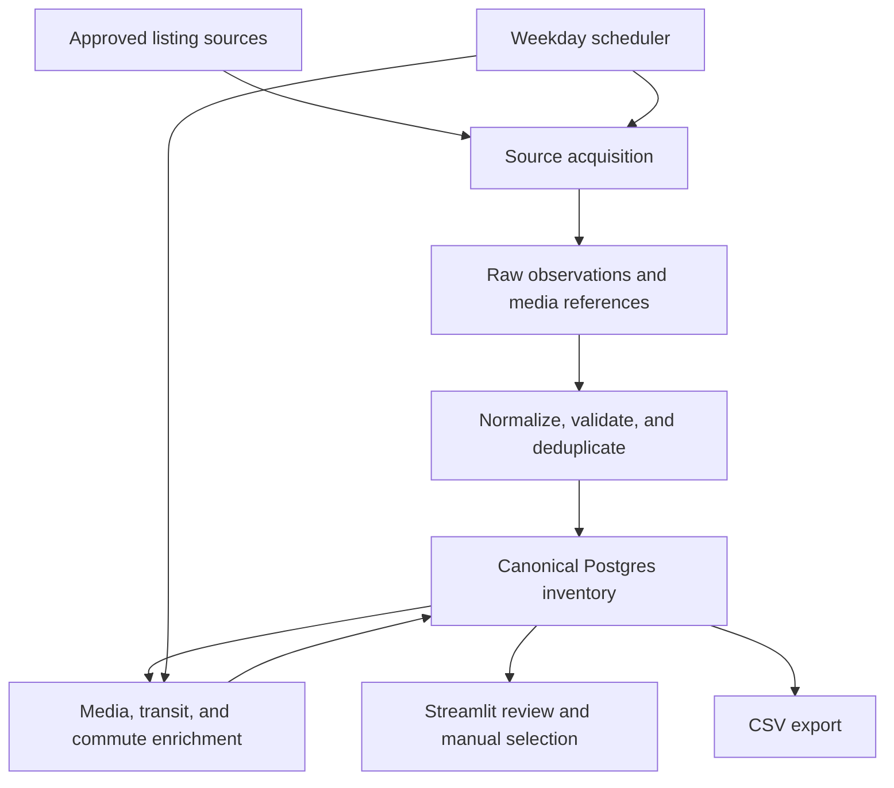

# NYC/NJ Rental Listing Agent — Project Overview

## 1. Document Purpose

This document defines the system boundary, governing decisions, high-level architecture, and documentation plan for the internal NYC/NJ Rental Listing Agent. It is the controlling overview for the detailed specifications in `/docs`.

The project is currently in the specification phase. Implementation must not begin until the dependent requirements, data, acquisition, enrichment, persistence, refresh, UI, and implementation documents are sufficiently complete and mutually consistent.

## 2. Product Summary

The Rental Listing Agent is an internal work tool that maintains a reviewable inventory of currently available Studio, 1BR, and 2BR rental apartments across:

- New York City
- Jersey City
- Hoboken
- Fort Lee

The system acquires listings from approved sources, normalizes and deduplicates them into a canonical Postgres/Supabase inventory, enriches them with media, floor-plan, location, transit, and commute information, and refreshes the inventory automatically every weekday on a fixed schedule.

The user reviews the inventory in an internal interface, likely Streamlit, and manually selects apartments for later marketing work. CSV is an export and review format, not the primary database.

## 3. Goals

The system must:

1. Discover and maintain available rental listings in the supported geography and unit types.
2. Represent duplicate source records as one canonical listing where identity can be established with sufficient confidence.
3. Preserve listing history and mark disappeared listings inactive instead of deleting them.
4. Detect material listing changes and re-enrich only new or affected records where practical.
5. Collect apartment photos and an available layout-appropriate floor plan.
6. Distinguish in-unit washer/dryer from building or shared laundry.
7. Provide geographically appropriate transit access, including subway, PATH, and useful buses.
8. Provide navigation-provider commute estimates to an approved registry of campuses and major destinations.
9. Cross-check routing and transit results with internal geographic/transit validation.
10. Give the user an efficient internal review and manual-selection workflow.
11. Produce CSV exports without making flat files the system of record.

## 4. Non-Goals and Explicit Exclusions

This phase does not include:

- A commercial, public, or multi-tenant product
- Broker, agent, landlord, leasing-office, phone, email, or other contact-data collection
- Ad writing, caption generation, or marketing-copy generation
- Automatic selection of apartments for marketing
- Client matching or recommendation features
- A commute score, neighborhood score, or aggregate ranking score
- A claim that a floor plan represents the exact listed unit unless the source explicitly establishes that relationship
- Adding location text to later generated marketing images

Later media composition may add monthly rent and `室内洗烘` to a marketing image when applicable. That later workflow is outside the acquisition system, but the database must preserve reliable inputs for it. The `室内洗烘` label may be used only when the normalized laundry classification establishes in-unit washer and dryer availability under rules defined in the data and media specifications.

## 5. Governing Product Decisions

### 5.1 Inventory and lifecycle

- Postgres/Supabase is the primary persistent system of record.
- A canonical listing may retain multiple source observations and source URLs.
- Source records are normalized before they affect canonical inventory.
- New listings are inserted and enriched.
- Changed listings retain history and trigger targeted re-enrichment when affected fields require it.
- Listings that disappear are marked inactive under a defined disappearance policy; they are not hard-deleted merely because they are no longer observed.
- Every refresh run must be auditable, including source outcomes, observation times, reconciliation decisions, enrichment status, and errors.

### 5.2 Listing scope

- Supported layouts are Studio, 1BR, and 2BR.
- Listings outside the geographic boundary or supported layouts are excluded from canonical marketing inventory.
- Contact information is neither a target field nor an enrichment target.
- Apartment photos are collected with source provenance.
- A floor plan may be associated at the building and layout-class level. It need not match the exact unit, but must correspond to the relevant Studio, 1BR, or 2BR category and must carry provenance and match-confidence metadata.

### 5.3 Laundry classification

Laundry must be normalized into explicit states that do not conflate unit and building amenities. At minimum, the detailed schema must distinguish:

- In-unit washer and dryer
- In-unit washer only or dryer only, if encountered
- Washer/dryer hookup only
- Shared or building laundry
- No laundry stated
- Conflicting evidence
- Unknown

Raw evidence and provenance must be retained so the normalized classification can be audited.

### 5.4 Transit and location intelligence

Transit enrichment must reflect the actual geography rather than forcing a subway-centric model:

- NYC: nearest useful MTA subway station, served line(s), walking distance, and walking time.
- Jersey City and Hoboken: PATH access where relevant, with station, service information, walking distance, and walking time.
- All supported areas: useful nearby bus stops, routes, walking distance, walking time, and meaningful connections.
- Fort Lee: prioritize useful bus access and connections. Do not imply that NYC subway access is locally walkable.

“Nearest” and “useful” are separate concepts. A geographically closest stop may not be the most useful service for common travel. The detailed location specification must define candidate generation, usefulness rules, and how multiple relevant options are stored.

### 5.5 Commute intelligence

Commute estimates must come from a navigation or routing service such as Google Maps or another selected provider. Provider results must be cross-checked by internal validation using geographic position, plausible access/egress, known transit topology, and other rules defined in the detailed specification.

The system must store provider, request context, mode, departure-time assumptions, result time, duration, and validation outcome. It must not convert commute results into a score.

The destination registry must support distinct campuses under the same institution. Initial required destinations include:

#### Universities and campuses

- NYU Washington Square
- NYU Tandon
- Columbia University
- Pratt Institute
- Parsons School of Design / The New School
- Fashion Institute of Technology (FIT)
- School of Visual Arts (SVA)
- Baruch College
- Hunter College
- Fordham University campuses, represented separately where relevant
- Stevens Institute of Technology
- Other major relevant colleges approved for the registry

#### Major NYC destinations

- West Village
- Central Park
- Union Square
- Times Square
- World Trade Center / Financial District
- Grand Central
- Williamsburg
- Downtown Brooklyn

Destinations must be represented by stable registry entries and routing anchors, not by ambiguous free-text names embedded in listing records.

## 6. High-Level System Boundary

The acquisition system consists of the following logical stages:

Logical separation is required even if the first implementation deploys several stages together. Source-specific acquisition, canonical inventory, enrichment, reconciliation, and UI concerns must not be collapsed into one inseparable script.

## 7. Data and Provenance Principles

Detailed schemas will be defined later, but all documents must preserve these principles:

1. **Raw observation versus normalized fact:** Retain source evidence separately from canonical normalized values.
2. **Provenance:** Important facts and media assets must be traceable to a source and observation time.
3. **Confidence and conflict:** Derived or inferred values must expose confidence/status and must not silently override conflicting evidence.
4. **Temporal history:** Price, availability, amenity, media, and status changes must be reconstructable.
5. **Idempotency:** Reprocessing the same source observation should not create duplicate canonical records or duplicate history events.
6. **Partial failure:** Failure of one source or enrichment must not corrupt the run or erase previously valid inventory.
7. **No fabricated precision:** Unknown values remain unknown. Routing or layout associations must state their assumptions.
8. **Source compliance:** Acquisition methods must be approved per source and respect applicable access, usage, rate, and retention constraints.

## 8. Scheduled Refresh Model

The system will run automatically every weekday on a fixed schedule. The exact time and operating time zone are unresolved configuration decisions; the default planning assumption is `America/New_York`.

Each scheduled cycle must support:

1. Run creation and source health initialization.
2. Acquisition from each enabled source.
3. Raw observation validation and persistence.
4. Normalization and canonical identity resolution.
5. New/changed/unchanged/disappeared reconciliation.
6. Targeted enrichment for new or affected listings.
7. Inactivity evaluation only when source-run health is sufficient.
8. Run summary, error reporting, and review visibility.

A failed or incomplete source fetch must not by itself mark all of that source’s listings inactive. The detailed refresh specification must define grace periods, consecutive-miss thresholds, and source-health gates.

## 9. Internal Review Workflow

The likely frontend is Streamlit. The UI is an operational review tool, not a public listing portal. It must ultimately support:

- Filtering by geography, layout, price, status, source recency, laundry type, transit access, and enrichment completeness
- Reviewing canonical listing details, source evidence, photos, floor plans, transit, and destination commutes
- Identifying data conflicts and enrichment failures
- Manually selecting or deselecting listings for later marketing work
- Exporting reviewed inventory or selected subsets to CSV
- Viewing scheduled-run status and source health at an appropriate operational level

The UI must not introduce business rules that exist nowhere else. Selection state, corrections, and review decisions must be persisted in the database.

## 10. Resolved Tensions and Interpretation Rules

The current requirements do not contain a direct contradiction. The following points could otherwise be misread and are resolved here:

| Apparent tension | Controlling interpretation |
| --- | --- |
| “Nearest transit” versus “useful transit” | Store geographically close candidates, but separately identify useful options using explicit rules; do not assume the closest stop is best. |
| Subway information for every area versus Fort Lee geography | Subway enrichment applies where locally relevant. Fort Lee emphasizes bus access and meaningful connections instead of presenting distant subway stations as nearby. |
| Floor plan collection versus exact-unit accuracy | A floor plan is an attributed marketing asset for the relevant layout class unless exact-unit provenance is explicitly available. |
| Automatic inventory versus manual marketing choice | Acquisition, refresh, and enrichment are automatic; marketing selection remains manual. |
| Postgres/Supabase versus CSV | Postgres/Supabase is authoritative; CSV is a generated export. |
| Navigation-provider estimates versus internal algorithm | The provider supplies commute results; the internal algorithm validates plausibility and flags anomalies, rather than replacing the provider or creating a score. |
| Later image text versus current ad-agent exclusion | Store accurate rent and laundry data now; do not implement image composition or content generation in this phase. |

## 11. Unresolved Architectural Decisions

These are specification tasks, not permission to expand product scope. Each must be resolved in the indicated document before implementation of the affected component.

| Decision | Why it matters | Resolution document |
| --- | --- | --- |
| Approved listing sources and permitted acquisition method per source | Determines adapters, coverage, rate limits, compliance, and failure modes | `03_LISTING_ACQUISITION.md` |
| Canonical identity and cross-source deduplication policy | Determines whether units/buildings are merged correctly | `02_LISTING_DATA_SCHEMA.md`, then `03_LISTING_ACQUISITION.md` |
| Address normalization and handling of withheld or approximate addresses | Affects deduplication, geocoding, and transit accuracy | `02_LISTING_DATA_SCHEMA.md`, `04_LOCATION_AND_TRANSIT_INTELLIGENCE.md` |
| Routing provider and fallback policy | Affects cost, quotas, modes, departure-time support, and reproducibility | `04_LOCATION_AND_TRANSIT_INTELLIGENCE.md` |
| Internal transit/geographic validation algorithm | Needed to flag implausible provider results without creating a score | `04_LOCATION_AND_TRANSIT_INTELLIGENCE.md` |
| Final campus and destination registry, anchors, and Fordham campus split | Prevents ambiguous or inconsistent routing targets | `04_LOCATION_AND_TRANSIT_INTELLIGENCE.md` |
| Floor-plan discovery, layout matching, licensing/retention, and confidence rules | Prevents misrepresentation and unsafe reuse | `05_MEDIA_AND_FLOORPLANS.md` |
| Exact weekday run time, holiday behavior, retry window, and time zone | Required for deterministic operations | `06_DATABASE_AND_REFRESH_PIPELINE.md` |
| Disappearance grace period and source-health threshold | Prevents false inactivation during source failure | `06_DATABASE_AND_REFRESH_PIPELINE.md` |
| Streamlit deployment/authentication approach | Affects access control and operations even for an internal tool | `07_INTERNAL_UI.md` |
| Human correction and override precedence | Determines how reviewed values survive future refreshes | `02_LISTING_DATA_SCHEMA.md`, `07_INTERNAL_UI.md` |

## 12. Documentation Dependency Order

The final drafting order is:

1. `00_PROJECT_OVERVIEW.md` — scope, system boundary, governing decisions, and document plan.
2. `01_PRODUCT_REQUIREMENTS.md` — actors, workflows, functional requirements, non-functional requirements, acceptance criteria, and explicit exclusions.
3. `02_LISTING_DATA_SCHEMA.md` — canonical entities, field definitions, enums, evidence/provenance, identity, history, validation, and manual overrides.
4. `03_LISTING_ACQUISITION.md` — source registry, adapter contract, compliant acquisition methods, normalization handoff, deduplication inputs, and acquisition failure behavior.
5. `04_LOCATION_AND_TRANSIT_INTELLIGENCE.md` — geocoding, transit candidates, usefulness rules, destination registry, routing-provider contract, and internal validation.
6. `05_MEDIA_AND_FLOORPLANS.md` — photo and floor-plan acquisition, asset provenance, layout association, deduplication, quality, retention, and review rules.
7. `06_DATABASE_AND_REFRESH_PIPELINE.md` — physical persistence model, jobs, reconciliation, history, schedules, inactivity rules, retries, observability, and exports.
8. `07_INTERNAL_UI.md` — Streamlit information architecture, filters, review flows, corrections, manual marketing selection, operations visibility, and CSV export.
9. `08_IMPLEMENTATION_PLAN.md` — build phases, dependencies, test strategy, deployment, rollout, and completion gates.

This order intentionally defines product behavior before data contracts, data contracts before acquisition/enrichment behavior, and all component specifications before the implementation plan.

## 13. Cross-Document Consistency Rules

- This overview controls product scope and exclusions.
- `01_PRODUCT_REQUIREMENTS.md` will assign stable requirement IDs. Later documents must reference those IDs instead of restating altered versions of requirements.
- `02_LISTING_DATA_SCHEMA.md` controls entity names, field meanings, enums, null semantics, provenance, and lifecycle terminology.
- Detailed documents may resolve an open decision but may not contradict an earlier controlling decision silently.
- When a requirement changes, every affected document must be updated in the same change set, and the change must be recorded in each affected document’s change log.
- No later document may add ad generation, contact-data collection, automatic marketing selection, or commute scoring without an explicit scope revision.
- Examples are illustrative and must not create requirements that conflict with normative text.

## 14. Specification Completion Gate

The specification phase is ready for implementation planning only when:

- All nine documents exist and use consistent terminology.
- Product requirements have testable acceptance criteria.
- Canonical entities, identity rules, temporal history, provenance, and override behavior are defined.
- Every enabled source has an approved acquisition approach and adapter contract.
- Transit, bus, PATH, commute, destination, and validation rules are deterministic enough to test.
- Media and floor-plan association rules prevent unsupported exact-unit claims.
- Refresh scheduling, source-health gating, inactivity, retry, and audit behavior are defined.
- The UI workflow covers review, conflict handling, manual selection, and export.
- All unresolved decisions that block Phase 1 implementation are closed or explicitly deferred with a safe default.

## 15. Change Log

| Date | Change |
| --- | --- |
| 2026-08-16 | Initial project overview created from the current Project decisions and constraints. |
| 2026-08-17 | Owner decisions closed three §11 items: listing source (StreetEasy via search-index discovery, `03` §5.4), routing/commute provider (no paid APIs; on-demand LLM web-research estimates, `04` §19A; §5.5 "navigation provider" language superseded accordingly), and model IDs (gpt-5.6-terra / gpt-5.6-sol, `08` §19.1). |
