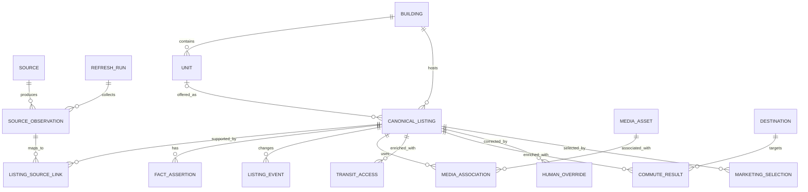

# NYC/NJ Rental Listing Agent — Listing Data Schema

## 1. Document Control

| Field | Value |
| --- | --- |
| Status | Draft specification |
| Owner | CJ |
| Controlling documents | `00_PROJECT_OVERVIEW.md`, `01_PRODUCT_REQUIREMENTS.md` |
| Primary dependents | `03_LISTING_ACQUISITION.md` through `08_IMPLEMENTATION_PLAN.md` |
| Primary datastore | PostgreSQL / Supabase |

This document defines the logical canonical data model, required fields, enumerations, identity rules, provenance, temporal history, conflict handling, and human overrides. It is implementation-oriented but does not lock the project into a particular ORM.

Physical indexes, partitions, retention jobs, and deployment-specific database configuration are finalized in `06_DATABASE_AND_REFRESH_PIPELINE.md`.

## 2. Requirement Traceability

This specification primarily satisfies:

- `PR-GEO-001` through `PR-GEO-003`
- `PR-ACQ-002` through `PR-ACQ-006`
- `PR-DATA-001` through `PR-DATA-004`
- `PR-LAUNDRY-001` and `PR-LAUNDRY-002`
- `PR-MEDIA-001` through `PR-MEDIA-003`
- `PR-LOC-001`
- `PR-TRANSIT-001` through `PR-TRANSIT-005`
- `PR-COMMUTE-001` through `PR-COMMUTE-005`
- `PR-REFRESH-002` through `PR-REFRESH-004`
- `PR-UI-004` and `PR-UI-005`
- `PR-EXPORT-001` and `PR-EXPORT-002`
- `PR-LLM-002` through `PR-LLM-005`
- `PR-NFR-003` through `PR-NFR-007`

## 3. Modeling Principles

### 3.1 Separate four data layers

The schema must keep these layers distinct:

1. **Source observation:** What one source exposed at one time.
2. **Canonical entity:** The system’s reconciled building, unit, and listing identity.
3. **Canonical fact:** The currently effective normalized value and its resolution status.
4. **Derived enrichment:** Transit, commute, media interpretation, or other computed information tied to explicit inputs and versions.

An observation is not overwritten to become a canonical record. A derived result is not represented as if the source stated it.

### 3.2 Stable identity versus mutable state

- Stable identity uses opaque UUID primary keys.
- Mutable source identifiers, URLs, prices, statuses, and descriptions are attributes or observations, never primary keys.
- Human-facing labels are not database identity.
- A listing lifecycle change does not create a new canonical listing unless the identity rules establish that it is a new rental offering.

### 3.3 Time semantics

Use timezone-aware timestamps stored in UTC. User-facing displays default to `America/New_York`.

Every temporal record must distinguish, where applicable:

- `observed_at`: when the source or provider result was observed.
- `retrieved_at`: when this system obtained it.
- `effective_at`: when the represented fact is believed to have become effective, if known.
- `recorded_at`: when the database stored it.

Unknown source-effective time must not be replaced with retrieval time without labeling that substitution.

### 3.4 Unknown and negative values

SQL `NULL` means no stored scalar value. It does not alone explain why a value is absent. Fields requiring semantic distinction use an accompanying status or a normalized enum.

The following concepts are distinct:

| Concept | Meaning |
| --- | --- |
| `UNKNOWN` | Evidence does not establish a value. |
| `NOT_STATED` | The source was checked and did not state the fact. |
| `NOT_APPLICABLE` | The field does not logically apply. |
| `CONFLICTING` | Available evidence supports incompatible values. |
| `NEGATIVE` | Evidence explicitly states the feature is absent. |
| `UNAVAILABLE` | A provider or calculation could not return a result. |

### 3.5 Source and model evidence

LLM output is a proposed interpretation, not self-authenticating evidence. A canonical fact derived by an LLM must reference:

- The source observation or media asset used
- Exact source evidence span or structured source field where possible
- Model/provider and version
- Prompt/schema version
- Generation time
- Confidence category
- Validation outcome

## 4. Entity Overview



This is a logical overview. Evidence, job, address, duplicate-candidate, and provider-request entities are defined below even when omitted from the diagram for readability.

## 5. Identifier and Naming Conventions

### 5.1 Primary keys

- Use UUID primary keys generated by the application or database.
- Primary-key names follow `<entity>_id`.
- Source-native identifiers are stored as text because their format may change or exceed numeric limits.

### 5.2 Enumerations

Normative enum values are uppercase `SCREAMING_SNAKE_CASE` in this specification. The implementation may use PostgreSQL enums, constrained text, or reference tables. Frequently changing provider/source values should use reference tables rather than database enums.

### 5.3 Money

- Store money in integer minor units: `monthly_rent_minor`.
- Store ISO 4217 `currency_code`; initial value is `USD`.
- Do not use floating-point types for money.
- Preserve source-formatted rent text in the observation.

### 5.4 Distances and durations

- Store distance as integer meters.
- Store duration as integer seconds.
- Store coordinates as PostGIS `geography(Point, 4326)` or equivalent longitude/latitude fields with range constraints.
- Display-unit conversion occurs outside canonical storage.

## 6. Source and Refresh Entities

### 6.1 `source`

Represents one approved listing source or data provider.

| Field | Type | Required | Description |
| --- | --- | --- | --- |
| `source_id` | UUID | Yes | Stable source identity. |
| `source_code` | text | Yes | Unique immutable code used by adapters. |
| `display_name` | text | Yes | Human-readable source name. |
| `source_type` | enum | Yes | `LISTING`, `GEOCODER`, `ROUTING`, `TRANSIT_DATA`, `MEDIA`, or `OTHER`. |
| `base_domain` | text | No | Canonical domain when applicable. |
| `access_method` | enum | Yes | `API`, `FEED`, `BROWSER`, `MANUAL_IMPORT`, or `OTHER_APPROVED`. |
| `enabled` | boolean | Yes | Whether production use is enabled. |
| `policy_version` | text | Yes | Version of approved acquisition/retention policy. |
| `configuration` | JSONB | No | Non-secret adapter configuration. |
| `created_at` | timestamptz | Yes | Creation time. |
| `updated_at` | timestamptz | Yes | Last metadata update. |

Secrets must not be stored in `configuration`.

### 6.2 `refresh_run`

Represents one complete scheduled or manual inventory cycle.

| Field | Type | Required | Description |
| --- | --- | --- | --- |
| `refresh_run_id` | UUID | Yes | Run identity. |
| `trigger_type` | enum | Yes | `SCHEDULED`, `MANUAL`, `REPLAY`, `RETRY`. |
| `scheduled_for` | timestamptz | No | Intended scheduled time. |
| `started_at` | timestamptz | Yes | Actual start. |
| `completed_at` | timestamptz | No | Terminal time. |
| `status` | enum | Yes | `PENDING`, `RUNNING`, `PARTIAL_SUCCESS`, `SUCCEEDED`, `FAILED`, `CANCELLED`. |
| `pipeline_version` | text | Yes | Deployed pipeline version. |
| `summary_counts` | JSONB | No | Validated summary counts for operational display. |
| `error_summary` | JSONB | No | Sanitized terminal error summary. |
| `created_at` | timestamptz | Yes | Record creation. |

### 6.3 `source_run`

Represents one source’s participation in a refresh.

| Field | Type | Required | Description |
| --- | --- | --- | --- |
| `source_run_id` | UUID | Yes | Source-run identity. |
| `refresh_run_id` | UUID FK | Yes | Parent refresh. |
| `source_id` | UUID FK | Yes | Listing source. |
| `started_at` | timestamptz | Yes | Source acquisition start. |
| `completed_at` | timestamptz | No | Source acquisition end. |
| `status` | enum | Yes | `PENDING`, `RUNNING`, `HEALTHY`, `DEGRADED`, `FAILED`, `BLOCKED`, `CANCELLED`. |
| `health_gate_passed` | boolean | No | Whether disappearance processing is permitted. Null until evaluated. |
| `expected_scope` | JSONB | No | Requested cities/layout/pages or feed partitions. |
| `counts` | JSONB | No | Retrieved, valid, rejected, unchanged, and error counts. |
| `error_summary` | JSONB | No | Sanitized errors. |
| `adapter_version` | text | Yes | Source-adapter version. |

Unique constraint: `(refresh_run_id, source_id)`.

### 6.4 `source_observation`

An immutable or append-only representation of a source listing observed during acquisition.

| Field | Type | Required | Description |
| --- | --- | --- | --- |
| `source_observation_id` | UUID | Yes | Observation identity. |
| `source_id` | UUID FK | Yes | Originating source. |
| `source_run_id` | UUID FK | Yes | Acquisition run. |
| `source_native_id` | text | No | Source’s listing ID when provided. |
| `source_url` | text | Yes | Canonicalized source URL. |
| `observed_at` | timestamptz | Yes | Source observation time or best labeled approximation. |
| `retrieved_at` | timestamptz | Yes | System retrieval time. |
| `content_hash` | text | Yes | Hash of normalized observation payload. |
| `raw_payload_ref` | text | No | Reference to policy-permitted retained raw payload. |
| `parsed_payload` | JSONB | Yes | Adapter-output contract before canonical resolution. |
| `parse_status` | enum | Yes | `VALID`, `PARTIAL`, `INVALID`, `BLOCKED`. |
| `validation_issues` | JSONB | No | Schema and source-contract issues. |
| `contact_redaction_status` | enum | Yes | `NOT_PRESENT`, `IGNORED`, `REDACTED`, `REVIEW_REQUIRED`. |
| `adapter_version` | text | Yes | Parser version. |
| `schema_version` | text | Yes | Observation-contract version. |
| `recorded_at` | timestamptz | Yes | Database insertion time. |

Recommended idempotency constraint: `(source_id, source_native_id, content_hash, observed_at)` when a native ID exists, with a documented URL-based alternative when it does not.

The parsed payload must not contain normalized broker/contact fields. Incidental contact material in raw payloads follows source retention policy and is never promoted or exported.

## 7. Address and Geography Entities

### 7.1 `address`

Stores a normalized physical or approximate listing location.

| Field | Type | Required | Description |
| --- | --- | --- | --- |
| `address_id` | UUID | Yes | Address identity. |
| `address_line_1` | text | No | Normalized street address. |
| `address_line_2` | text | No | Unit component only when appropriate. |
| `locality` | text | Yes | NYC borough/city municipality representation per normalization rules. |
| `administrative_area` | text | Yes | `NY` or `NJ`. |
| `postal_code` | text | No | Normalized ZIP code. |
| `country_code` | text | Yes | `US`. |
| `borough` | text | No | NYC borough when applicable. |
| `neighborhood` | text | No | Normalized neighborhood label, not an identity field. |
| `formatted_address` | text | Yes | Display-ready normalized form. |
| `address_fingerprint` | text | No | Deterministic normalized match key. |
| `location_point` | geography point | No | Validated coordinates. |
| `location_precision` | enum | Yes | See below. |
| `geocoder_source_id` | UUID FK | No | Provider that produced coordinates. |
| `geocoder_result_id` | text | No | Provider result identifier. |
| `geocoded_at` | timestamptz | No | Geocode time. |
| `geocode_input_hash` | text | No | Input/version cache key. |
| `geocode_status` | enum | Yes | `PENDING`, `VALID`, `WARNING`, `FAILED`, `MANUAL`. |
| `boundary_status` | enum | Yes | `IN_SCOPE`, `OUT_OF_SCOPE`, `UNRESOLVED`. |
| `created_at` | timestamptz | Yes | Creation time. |
| `updated_at` | timestamptz | Yes | Last effective change. |

`location_precision` values:

- `ROOFTOP_OR_ENTRANCE`
- `BUILDING`
- `PARCEL`
- `INTERPOLATED_ADDRESS`
- `STREET`
- `POSTAL_CODE`
- `NEIGHBORHOOD`
- `CITY`
- `UNKNOWN`

Only sufficiently precise locations, as defined in `04_LOCATION_AND_TRANSIT_INTELLIGENCE.md`, may produce exact-looking walking metrics.

### 7.2 `address_assertion`

Links raw address evidence to a normalized address and records match quality.

| Field | Type | Required | Description |
| --- | --- | --- | --- |
| `address_assertion_id` | UUID | Yes | Assertion identity. |
| `address_id` | UUID FK | Yes | Proposed normalized address. |
| `source_observation_id` | UUID FK | Yes | Supporting observation. |
| `raw_address_text` | text | No | Source address text. |
| `unit_text` | text | No | Raw source unit token. |
| `assertion_status` | enum | Yes | `SUPPORTED`, `APPROXIMATE`, `CONFLICTING`, `REJECTED`. |
| `match_method` | enum | Yes | `EXACT_NORMALIZED`, `GEOCODER`, `FUZZY`, `MANUAL`. |
| `confidence` | enum | Yes | `HIGH`, `MEDIUM`, `LOW`, `UNKNOWN`. |
| `recorded_at` | timestamptz | Yes | Creation time. |

## 8. Canonical Property Entities

### 8.1 `building`

Represents a physical rental building or property complex identity.

| Field | Type | Required | Description |
| --- | --- | --- | --- |
| `building_id` | UUID | Yes | Stable building identity. |
| `address_id` | UUID FK | Yes | Primary normalized building address. |
| `canonical_name` | text | No | Building name when useful; not an identity key alone. |
| `property_type` | enum | Yes | `APARTMENT_BUILDING`, `CONDO`, `COOP`, `TOWNHOUSE`, `MULTIFAMILY`, `OTHER`, `UNKNOWN`. |
| `identity_status` | enum | Yes | `CONFIRMED`, `PROVISIONAL`, `CONFLICTING`, `MANUALLY_RESOLVED`. |
| `created_at` | timestamptz | Yes | First canonical creation. |
| `updated_at` | timestamptz | Yes | Last canonical change. |

Building-level amenities must not be copied into unit-level fields without explicit semantic mapping.

### 8.2 `unit`

Represents a physical unit when unit identity is available or can be established.

| Field | Type | Required | Description |
| --- | --- | --- | --- |
| `unit_id` | UUID | Yes | Stable unit identity. |
| `building_id` | UUID FK | Yes | Parent building. |
| `canonical_unit_label` | text | No | Normalized unit label. |
| `unit_fingerprint` | text | No | Normalized matching key within building. |
| `floor_label` | text | No | Source/manual floor label when known. |
| `layout_class` | enum | Yes | `STUDIO`, `ONE_BEDROOM`, `TWO_BEDROOM`, `OUT_OF_SCOPE`, `UNKNOWN`, `CONFLICTING`. |
| `bedroom_count` | numeric | No | Exact count only when meaningful and supported. |
| `bathroom_count` | numeric | No | Allows half baths. |
| `identity_status` | enum | Yes | `CONFIRMED`, `PROVISIONAL`, `WITHHELD_LABEL`, `CONFLICTING`, `MANUALLY_RESOLVED`. |
| `created_at` | timestamptz | Yes | Creation. |
| `updated_at` | timestamptz | Yes | Last effective change. |

When a source withholds a unit label, the system may create a provisional unit or attach the listing only to a building. It must not invent a unit number.

### 8.3 `canonical_listing`

Represents a rental offering and its current reconciled state.

| Field | Type | Required | Description |
| --- | --- | --- | --- |
| `canonical_listing_id` | UUID | Yes | Stable listing identity. |
| `building_id` | UUID FK | Yes | Associated building. |
| `unit_id` | UUID FK | No | Associated physical unit when known. |
| `layout_class` | enum | Yes | Normalized supported/out-of-scope/unknown state. |
| `bedroom_count` | numeric | No | Current effective bedroom count. |
| `bathroom_count` | numeric | No | Current effective bathroom count. |
| `monthly_rent_minor` | bigint | No | Current asking rent in minor units. |
| `currency_code` | char(3) | Yes | Initially `USD`. |
| `available_from` | date | No | Effective move-in date when available. |
| `availability_status` | enum | Yes | See below. |
| `lifecycle_status` | enum | Yes | See below. |
| `laundry_type` | enum | Yes | Current effective normalized laundry state. |
| `indoor_laundry_badge_eligible` | boolean | Yes | Derived controlled value; true only for confirmed in-unit washer and dryer. |
| `description_current` | text | No | Current non-contact normalized description. |
| `first_seen_at` | timestamptz | Yes | Earliest supported observation. |
| `last_seen_at` | timestamptz | Yes | Most recent healthy-source observation. |
| `last_material_change_at` | timestamptz | Yes | Last material canonical change. |
| `inactive_at` | timestamptz | No | Time transitioned inactive. |
| `canonical_resolution_status` | enum | Yes | `RESOLVED`, `PROVISIONAL`, `CONFLICTING`, `REVIEW_REQUIRED`. |
| `enrichment_status` | enum | Yes | `NOT_STARTED`, `PENDING`, `PARTIAL`, `COMPLETE`, `STALE`, `FAILED`, `REVIEW_REQUIRED`. |
| `created_at` | timestamptz | Yes | Canonical creation. |
| `updated_at` | timestamptz | Yes | Last record update. |

`availability_status` values:

- `AVAILABLE`
- `AVAILABLE_FUTURE`
- `APPLICATION_PENDING`
- `NO_LONGER_AVAILABLE`
- `SOURCE_REMOVED`
- `UNKNOWN`
- `CONFLICTING`

`lifecycle_status` values:

- `CANDIDATE`: acquired but not fully admitted to inventory.
- `ACTIVE`: currently supported as available by sufficient healthy evidence.
- `MISSING`: absent from an expected healthy source observation but within grace policy.
- `INACTIVE`: no longer active under the disappearance or explicit-unavailability policy.
- `REAPPEARED`: returned after inactivity and awaiting/under revalidation.
- `EXCLUDED`: confirmed outside geography, layout, or rental scope.
- `MERGED`: superseded by another canonical listing following identity resolution.
- `REVIEW_REQUIRED`: cannot safely determine effective lifecycle state.

Database constraints:

- `monthly_rent_minor >= 0` when present.
- `indoor_laundry_badge_eligible = true` only when `laundry_type = 'IN_UNIT_WASHER_DRYER_CONFIRMED'`.
- An `ACTIVE` listing must not have `boundary_status = 'OUT_OF_SCOPE'` through its building address.
- A `MERGED` listing requires a successor relationship in `canonical_merge`.

### 8.4 `listing_source_link`

Maps a source observation/source listing identity to the canonical listing.

| Field | Type | Required | Description |
| --- | --- | --- | --- |
| `listing_source_link_id` | UUID | Yes | Link identity. |
| `canonical_listing_id` | UUID FK | Yes | Canonical listing. |
| `source_id` | UUID FK | Yes | Source. |
| `source_native_id` | text | No | Stable source ID where available. |
| `source_url` | text | Yes | Current canonicalized source URL. |
| `first_observation_id` | UUID FK | Yes | First linked observation. |
| `latest_observation_id` | UUID FK | Yes | Latest linked observation. |
| `first_seen_at` | timestamptz | Yes | First linked observation time. |
| `last_seen_at` | timestamptz | Yes | Latest healthy observation time. |
| `link_status` | enum | Yes | `ACTIVE`, `MISSING`, `REMOVED`, `SUPERSEDED`, `CONFLICTING`. |
| `identity_method` | enum | Yes | See identity methods below. |
| `identity_confidence` | enum | Yes | `HIGH`, `MEDIUM`, `LOW`, `MANUAL`. |
| `identity_rule_version` | text | Yes | Matching rules used. |

Recommended uniqueness:

- `(source_id, source_native_id)` where native ID is non-null and source semantics guarantee uniqueness.
- Otherwise a source-specific normalized URL/signature constraint.

### 8.5 `canonical_merge`

Preserves canonical-listing merges without deleting history.

| Field | Type | Required | Description |
| --- | --- | --- | --- |
| `canonical_merge_id` | UUID | Yes | Merge event. |
| `source_listing_id` | UUID FK | Yes | Superseded canonical listing. |
| `target_listing_id` | UUID FK | Yes | Surviving canonical listing. |
| `reason_code` | enum | Yes | `DUPLICATE_EXACT`, `DUPLICATE_PROBABILISTIC`, `MANUAL`. |
| `evidence` | JSONB | Yes | Match evidence and rule outputs. |
| `performed_by_type` | enum | Yes | `SYSTEM`, `LLM_PROPOSED_VALIDATED`, `HUMAN`. |
| `performed_by` | text | No | Actor/model/job identifier. |
| `performed_at` | timestamptz | Yes | Merge time. |
| `reversed_at` | timestamptz | No | Reversal time when applicable. |

## 9. Canonical Identity Resolution

### 9.1 Identity hierarchy

Identity resolution proceeds in this order:

1. Exact source-native listing continuity.
2. Exact normalized building plus exact normalized unit.
3. Strong multi-field match within a building.
4. Probabilistic candidate generation for review.
5. Human resolution when automatic evidence is unsafe.

### 9.2 Match methods

`identity_method` values:

- `SOURCE_NATIVE_CONTINUITY`
- `EXACT_ADDRESS_AND_UNIT`
- `EXACT_BUILDING_UNIT_LAYOUT`
- `STRONG_MULTI_FIELD`
- `PROBABILISTIC_REVIEWED`
- `MANUAL`
- `UNRESOLVED`

### 9.3 Strong match inputs

Potential inputs include:

- Normalized building address and geocode
- Normalized unit label
- Layout class, bedrooms, and bathrooms
- Price proximity and temporal overlap
- Description fingerprints
- Photo perceptual hashes
- Floor-plan association
- Available-from date
- Source-native continuity and redirect history

No single weak signal such as price, layout, building name, description similarity, or one shared stock photo may independently justify an automatic cross-source merge.

### 9.4 Duplicate candidates

`duplicate_candidate` stores unresolved potential matches.

| Field | Type | Required | Description |
| --- | --- | --- | --- |
| `duplicate_candidate_id` | UUID | Yes | Candidate identity. |
| `listing_a_id` | UUID FK | Yes | First listing. |
| `listing_b_id` | UUID FK | Yes | Second listing. |
| `candidate_score` | numeric | No | Internal identity-match probability/measure, not a user-facing listing or commute score. |
| `evidence` | JSONB | Yes | Feature-by-feature evidence. |
| `rule_version` | text | Yes | Resolver version. |
| `status` | enum | Yes | `PENDING`, `AUTO_MERGED`, `CONFIRMED_DUPLICATE`, `CONFIRMED_DISTINCT`, `DEFERRED`. |
| `resolved_by` | text | No | Human/job identifier. |
| `resolved_at` | timestamptz | No | Resolution time. |

The identity candidate score is strictly an internal deduplication mechanism. It must not be exposed as a listing-quality, recommendation, neighborhood, transit, or commute score.

## 10. Facts, Assertions, and Evidence

### 10.1 `fact_assertion`

Stores evidence-backed candidate values for canonical fields or structured facts.

| Field | Type | Required | Description |
| --- | --- | --- | --- |
| `fact_assertion_id` | UUID | Yes | Assertion identity. |
| `entity_type` | enum | Yes | `BUILDING`, `UNIT`, `LISTING`, `MEDIA`, `TRANSIT_ACCESS`, `COMMUTE_RESULT`. |
| `entity_id` | UUID | Yes | Target entity ID. |
| `fact_key` | text | Yes | Registered fact key, such as `laundry_type`. |
| `value_json` | JSONB | No | Typed value encoded under fact registry. |
| `value_status` | enum | Yes | `ASSERTED`, `UNKNOWN`, `NOT_STATED`, `NOT_APPLICABLE`, `NEGATIVE`, `CONFLICTING`. |
| `derivation_type` | enum | Yes | `SOURCE_STRUCTURED`, `SOURCE_TEXT`, `LLM_DERIVED`, `RULE_DERIVED`, `PROVIDER_DERIVED`, `HUMAN`. |
| `source_observation_id` | UUID FK | No | Supporting observation. |
| `media_asset_id` | UUID FK | No | Supporting media asset. |
| `provider_request_id` | UUID FK | No | Supporting provider request. |
| `evidence_text` | text | No | Minimal exact evidence span where applicable. |
| `evidence_locator` | JSONB | No | JSON path, DOM locator, image region, or other locator. |
| `confidence` | enum | Yes | `HIGH`, `MEDIUM`, `LOW`, `UNKNOWN`. |
| `validation_status` | enum | Yes | `PENDING`, `PASSED`, `WARNING`, `FAILED`, `NOT_APPLICABLE`. |
| `model_execution_id` | UUID FK | No | Required for LLM-derived assertions. |
| `asserted_at` | timestamptz | Yes | Assertion creation time. |
| `superseded_at` | timestamptz | No | When no longer current evidence. |

### 10.2 `fact_resolution`

Records which assertion or resolution decision supplies the effective canonical value.

| Field | Type | Required | Description |
| --- | --- | --- | --- |
| `fact_resolution_id` | UUID | Yes | Resolution identity. |
| `entity_type` | enum | Yes | Target entity type. |
| `entity_id` | UUID | Yes | Target entity. |
| `fact_key` | text | Yes | Registered fact. |
| `effective_assertion_id` | UUID FK | No | Chosen assertion when one exists. |
| `resolution_status` | enum | Yes | `RESOLVED`, `UNKNOWN`, `CONFLICTING`, `MANUAL_OVERRIDE`, `REVIEW_REQUIRED`. |
| `resolution_method` | enum | Yes | `SOURCE_PRIORITY`, `RECENCY`, `CONSENSUS`, `RULE`, `LLM_PROPOSED_VALIDATED`, `HUMAN`. |
| `resolution_rule_version` | text | Yes | Rule/version used. |
| `resolved_at` | timestamptz | Yes | Resolution time. |
| `superseded_at` | timestamptz | No | End of effective period. |

Unique current-resolution constraint: only one non-superseded resolution per `(entity_type, entity_id, fact_key)`.

Canonical columns such as `monthly_rent_minor` are materialized current values for efficient query and UI use. Their effective fact resolution remains the audit source.

## 11. LLM Execution Records

### 11.1 `model_execution`

Records any model call that can affect canonical or review data.

| Field | Type | Required | Description |
| --- | --- | --- | --- |
| `model_execution_id` | UUID | Yes | Execution identity. |
| `job_id` | UUID FK | No | Parent enrichment/workflow job. |
| `provider_code` | text | Yes | Model provider. |
| `model_id` | text | Yes | Exact model/version identifier. |
| `model_tier` | enum | Yes | `LOCAL`, `DEFAULT_HOSTED`, `FLAGSHIP_ESCALATION`. |
| `task_type` | text | Yes | Registered task type. |
| `prompt_version` | text | Yes | Prompt/instruction version. |
| `output_schema_version` | text | Yes | Structured-output contract. |
| `input_hash` | text | Yes | Cache/idempotency input signature. |
| `input_refs` | JSONB | Yes | Observation/media/tool-result references, not uncontrolled payload duplication. |
| `output_ref` | text or JSONB | Yes | Validated structured output or protected reference. |
| `confidence` | enum | Yes | Model-reported/normalized confidence. |
| `validation_status` | enum | Yes | `PENDING`, `PASSED`, `WARNING`, `FAILED`. |
| `escalated_from_id` | UUID FK | No | Prior execution that triggered escalation. |
| `input_tokens` | bigint | No | Provider-reported usage. |
| `output_tokens` | bigint | No | Provider-reported usage. |
| `cost_minor` | bigint | No | Cost in minor billing units under a documented currency precision. |
| `currency_code` | char(3) | No | Billing currency. |
| `started_at` | timestamptz | Yes | Start. |
| `completed_at` | timestamptz | No | Completion. |
| `status` | enum | Yes | `PENDING`, `SUCCEEDED`, `FAILED`, `CACHED`, `ESCALATED`. |

Cache uniqueness must include `task_type`, `input_hash`, `prompt_version`, `output_schema_version`, and `model_id` unless a documented cross-model reuse policy applies.

## 12. Laundry Model

### 12.1 Normative `laundry_type`

| Value | Meaning | `indoor_laundry_badge_eligible` |
| --- | --- | ---: |
| `IN_UNIT_WASHER_DRYER_CONFIRMED` | Installed washer and dryer are both inside the unit. | `true` |
| `IN_UNIT_WASHER_ONLY` | Washer confirmed inside unit; dryer not confirmed. | `false` |
| `IN_UNIT_DRYER_ONLY` | Dryer confirmed inside unit; washer not confirmed. | `false` |
| `IN_UNIT_HOOKUP_ONLY` | Hookups/connections exist; installed equipment is not confirmed. | `false` |
| `BUILDING_SHARED_LAUNDRY` | Laundry is shared or located in the building/common area. | `false` |
| `OFFSITE_OR_NEARBY_LAUNDRY` | Laundry is described only as nearby/offsite. | `false` |
| `NO_LAUNDRY_STATED` | Source was evaluated and did not state laundry. | `false` |
| `EXPLICITLY_NO_LAUNDRY` | Evidence explicitly states no laundry availability. | `false` |
| `CONFLICTING` | Material evidence conflicts. | `false` |
| `UNKNOWN` | Available evidence cannot determine state. | `false` |

### 12.2 Precedence and conflict rules

- Unit-specific evidence takes semantic precedence over building-level evidence for the unit field, but both facts are retained.
- A listing can have confirmed in-unit equipment while the building also offers shared laundry; these are not inherently conflicting.
- “Laundry in building,” “laundry room,” or similar language cannot establish in-unit equipment.
- “Hookups,” “connections,” or “washer/dryer ready” cannot establish installed equipment.
- A photo-only inference is not sufficient for `IN_UNIT_WASHER_DRYER_CONFIRMED` unless the later media specification defines and validates an acceptable visual-evidence policy.
- When high-quality evidence directly conflicts, the effective value is `CONFLICTING` until resolved.

### 12.3 Badge invariant

`indoor_laundry_badge_eligible` is a derived database value, not a freeform model output. It is true only when:

```text
laundry_type = IN_UNIT_WASHER_DRYER_CONFIRMED
AND effective laundry fact validation_status IN (PASSED, NOT_APPLICABLE where human-confirmed)
AND effective laundry resolution_status IN (RESOLVED, MANUAL_OVERRIDE)
```

Later image workflows may map this boolean to `室内洗烘`. They must not infer the label independently.

## 13. Amenities

### 13.1 `amenity_definition`

Controlled registry of normalized amenities.

| Field | Type | Required | Description |
| --- | --- | --- | --- |
| `amenity_definition_id` | UUID | Yes | Amenity identity. |
| `amenity_code` | text | Yes | Stable code. |
| `display_name` | text | Yes | UI label. |
| `scope` | enum | Yes | `UNIT`, `BUILDING`, `EITHER`. |
| `active` | boolean | Yes | Registry status. |

### 13.2 `amenity_assertion`

| Field | Type | Required | Description |
| --- | --- | --- | --- |
| `amenity_assertion_id` | UUID | Yes | Assertion. |
| `canonical_listing_id` | UUID FK | Yes | Listing. |
| `amenity_definition_id` | UUID FK | Yes | Normalized amenity. |
| `asserted_scope` | enum | Yes | `UNIT`, `BUILDING`, `UNKNOWN`. |
| `presence_status` | enum | Yes | `PRESENT`, `ABSENT`, `UNKNOWN`, `CONFLICTING`. |
| `fact_assertion_id` | UUID FK | Yes | Evidence and derivation. |
| `effective` | boolean | Yes | Whether currently effective. |

Laundry remains a dedicated normalized field and is not replaced by a generic amenity tag.

## 14. Media Entities

### 14.1 `media_asset`

Represents a distinct acquired or referenced media object.

| Field | Type | Required | Description |
| --- | --- | --- | --- |
| `media_asset_id` | UUID | Yes | Asset identity. |
| `source_id` | UUID FK | Yes | Origin source. |
| `source_observation_id` | UUID FK | No | Origin observation. |
| `source_url` | text | Yes | Original media URL/reference. |
| `storage_ref` | text | No | Approved persistent object reference. |
| `retrieved_at` | timestamptz | No | Retrieval time. |
| `availability_status` | enum | Yes | `REFERENCED`, `STORED`, `EXPIRED`, `REMOVED`, `FAILED`, `POLICY_RESTRICTED`. |
| `media_type` | enum | Yes | `UNIT_PHOTO`, `BUILDING_PHOTO`, `AMENITY_PHOTO`, `NEIGHBORHOOD_PHOTO`, `FLOOR_PLAN`, `MAP`, `LOGO`, `OTHER`, `UNKNOWN`. |
| `mime_type` | text | No | Detected MIME type. |
| `width_px` | integer | No | Pixel width. |
| `height_px` | integer | No | Pixel height. |
| `byte_size` | bigint | No | Asset size. |
| `content_hash` | text | No | Exact-file hash. |
| `perceptual_hash` | text | No | Visual-similarity signature. |
| `classification_status` | enum | Yes | `UNCLASSIFIED`, `MODEL_CLASSIFIED`, `RULE_CLASSIFIED`, `HUMAN_CONFIRMED`, `CONFLICTING`. |
| `model_execution_id` | UUID FK | No | Model classification record. |
| `policy_version` | text | Yes | Retention/usage policy. |
| `created_at` | timestamptz | Yes | Creation. |
| `updated_at` | timestamptz | Yes | Last status change. |

### 14.2 `media_association`

Associates an asset to building, unit, listing, and/or layout.

| Field | Type | Required | Description |
| --- | --- | --- | --- |
| `media_association_id` | UUID | Yes | Association identity. |
| `media_asset_id` | UUID FK | Yes | Asset. |
| `building_id` | UUID FK | No | Building association. |
| `unit_id` | UUID FK | No | Unit association. |
| `canonical_listing_id` | UUID FK | No | Listing association. |
| `layout_class` | enum | No | Relevant layout class. |
| `association_level` | enum | Yes | See below. |
| `association_status` | enum | Yes | `CONFIRMED`, `PROVISIONAL`, `CANDIDATE`, `REJECTED`, `CONFLICTING`. |
| `confidence` | enum | Yes | `HIGH`, `MEDIUM`, `LOW`, `UNKNOWN`. |
| `display_order` | integer | No | Source or reviewed order. |
| `is_primary_candidate` | boolean | Yes | Review aid; not an automatic marketing decision. |
| `evidence` | JSONB | No | Source statements/model/rule evidence. |
| `created_at` | timestamptz | Yes | Creation. |

`association_level` values:

- `EXACT_UNIT_SOURCE_CONFIRMED`
- `SOURCE_UNIT_TYPE_CONFIRMED`
- `BUILDING_LAYOUT_CLASS`
- `BUILDING_GENERAL`
- `LISTING_SOURCE_ASSOCIATED`
- `UNCERTAIN_CANDIDATE`

For a floor plan used under the project’s marketing-asset rule, `BUILDING_LAYOUT_CLASS` is acceptable. The UI and later exports must not label it as the exact unit.

## 15. Transit Entities

### 15.1 `transit_stop`

Normalized transit stop/station registry.

| Field | Type | Required | Description |
| --- | --- | --- | --- |
| `transit_stop_id` | UUID | Yes | Internal identity. |
| `provider_source_id` | UUID FK | Yes | Transit dataset/provider. |
| `provider_stop_id` | text | Yes | Provider-native stop ID. |
| `parent_stop_id` | UUID FK | No | Station complex/parent. |
| `operator_code` | text | Yes | MTA, PATH, NJ Transit, etc. |
| `stop_name` | text | Yes | Display name. |
| `mode` | enum | Yes | `SUBWAY`, `PATH`, `BUS`, `RAIL`, `FERRY`, `OTHER`. |
| `location_point` | geography point | Yes | Stop/entrance position. |
| `active_status` | enum | Yes | `ACTIVE`, `TEMPORARILY_CLOSED`, `INACTIVE`, `UNKNOWN`. |
| `dataset_version` | text | Yes | Source transit-data version. |

Unique constraint: `(provider_source_id, provider_stop_id, dataset_version)` or a maintained current-record pattern defined in the physical schema.

### 15.2 `transit_route`

| Field | Type | Required | Description |
| --- | --- | --- | --- |
| `transit_route_id` | UUID | Yes | Internal route identity. |
| `provider_source_id` | UUID FK | Yes | Dataset/provider. |
| `provider_route_id` | text | Yes | Native route ID. |
| `operator_code` | text | Yes | Operator. |
| `route_short_name` | text | No | e.g., subway line or bus number. |
| `route_long_name` | text | No | Human-readable route. |
| `mode` | enum | Yes | `SUBWAY`, `PATH`, `BUS`, `RAIL`, `FERRY`, `OTHER`. |
| `dataset_version` | text | Yes | Dataset version. |

### 15.3 `transit_access`

Represents one listing-to-stop access option.

| Field | Type | Required | Description |
| --- | --- | --- | --- |
| `transit_access_id` | UUID | Yes | Access-result identity. |
| `canonical_listing_id` | UUID FK | Yes | Origin listing. |
| `transit_stop_id` | UUID FK | Yes | Stop/station. |
| `mode` | enum | Yes | Stop mode. |
| `straight_line_distance_m` | integer | No | Geographic candidate distance. |
| `walking_distance_m` | integer | No | Routed distance. |
| `walking_duration_s` | integer | No | Routed walking time. |
| `route_provider_request_id` | UUID FK | No | Walking-route request. |
| `proximity_rank` | integer | No | Rank strictly by defined proximity metric. |
| `usefulness_status` | enum | Yes | `USEFUL`, `CANDIDATE`, `NOT_USEFUL`, `UNRESOLVED`. |
| `usefulness_reasons` | JSONB | No | Non-score explanatory attributes. |
| `meaningful_connections` | JSONB | No | Structured connection references pending normalized link model if needed. |
| `validation_status` | enum | Yes | `PENDING`, `PASSED`, `WARNING`, `FAILED`, `UNABLE_TO_VALIDATE`. |
| `validation_reasons` | JSONB | No | Rule outcomes. |
| `input_location_hash` | text | Yes | Origin and precision/version signature. |
| `dataset_version` | text | Yes | Transit dataset version. |
| `calculated_at` | timestamptz | Yes | Calculation time. |
| `expires_at` | timestamptz | No | Freshness expiration. |

### 15.4 `transit_access_route`

Many-to-many mapping between access options and routes served.

| Field | Type | Required | Description |
| --- | --- | --- | --- |
| `transit_access_id` | UUID FK | Yes | Access option. |
| `transit_route_id` | UUID FK | Yes | Served route. |
| `direction_or_headsign` | text | No | Direction context when applicable. |
| `service_status` | enum | Yes | `SCHEDULED`, `ACTIVE`, `TEMPORARILY_CHANGED`, `UNKNOWN`. |

No field in the transit model is a commute or listing score. `proximity_rank` is a deterministic ordering of candidates by a named proximity metric, not an assessment of listing quality.

## 16. Destination and Commute Entities

### 16.1 `destination`

Controlled registry of campuses and major destinations.

| Field | Type | Required | Description |
| --- | --- | --- | --- |
| `destination_id` | UUID | Yes | Stable destination identity. |
| `destination_code` | text | Yes | Immutable registry code. |
| `destination_type` | enum | Yes | `UNIVERSITY_CAMPUS`, `MAJOR_DESTINATION`. |
| `institution_name` | text | No | Parent institution for campuses. |
| `display_name` | text | Yes | UI label. |
| `routing_anchor_name` | text | Yes | Human-reviewed anchor description. |
| `routing_anchor_point` | geography point | Yes | Approved routing coordinate. |
| `address_id` | UUID FK | No | Normalized anchor address. |
| `active` | boolean | Yes | Registry status. |
| `registry_version` | text | Yes | Destination-registry version. |
| `created_at` | timestamptz | Yes | Creation. |
| `updated_at` | timestamptz | Yes | Last registry change. |

Required initial codes must include distinct entries for all destinations in `PR-COMMUTE-003` and `PR-COMMUTE-004`. Fordham campuses must not share one ambiguous anchor.

### 16.2 `provider_request`

Auditable request metadata for geocoding, walking, transit, or other external provider calls.

| Field | Type | Required | Description |
| --- | --- | --- | --- |
| `provider_request_id` | UUID | Yes | Request identity. |
| `source_id` | UUID FK | Yes | Provider. |
| `request_type` | enum | Yes | `GEOCODE`, `WALKING_ROUTE`, `TRANSIT_ROUTE`, `OTHER`. |
| `request_hash` | text | Yes | Cache/idempotency key. |
| `request_parameters` | JSONB | Yes | Sanitized normalized parameters. |
| `provider_result_id` | text | No | Provider request/result identifier. |
| `response_ref` | text or JSONB | No | Policy-permitted normalized response/reference. |
| `status` | enum | Yes | `PENDING`, `SUCCEEDED`, `FAILED`, `CACHED`, `RATE_LIMITED`. |
| `requested_at` | timestamptz | Yes | Request time. |
| `completed_at` | timestamptz | No | Completion. |
| `expires_at` | timestamptz | No | Cache expiration. |
| `error_code` | text | No | Sanitized normalized error. |

### 16.3 `commute_result`

One commute result for a listing, destination, mode, and time assumption.

Owner decision B7 (2026-08-17): results may be **web-researched estimates**
rather than provider routes. Additional/revised fields:

| Field | Type | Required | Description |
| --- | --- | --- | --- |
| `result_type` | enum | Yes | `PROVIDER_ROUTE` or `RESEARCHED_ESTIMATE`. |
| `provider_request_id` | UUID FK | No (was Yes) | Required only for `PROVIDER_ROUTE`. |
| `model_execution_id` | UUID FK | No | Required for `RESEARCHED_ESTIMATE`; links the web-research execution. |
| `duration_min_s` | integer | No | Low end of researched duration range. |
| `duration_max_s` | integer | No | High end of researched duration range. |
| `sources` | JSONB | No | Cited web sources (URL, title, accessed time); required for `RESEARCHED_ESTIMATE`. |
| `confidence` | enum | Yes for estimates | `HIGH`, `MEDIUM`, `LOW`, `UNKNOWN`. |

Constraints: a `RESEARCHED_ESTIMATE` requires `model_execution_id` and non-empty
`sources`; a `PROVIDER_ROUTE` requires `provider_request_id`. Research results
expire 14 days after `calculated_at` unless invalidated earlier.

`listing_source_link` gains `discovery_method` (`DIRECT`, `SEARCH_INDEX`,
`MANUAL_IMPORT`, `UNKNOWN`) so snippet-discovered listings remain identifiable
(owner decision B3). Search-index links cannot support disappearance evidence.

| Field | Type | Required | Description |
| --- | --- | --- | --- |
| `commute_result_id` | UUID | Yes | Result identity. |
| `canonical_listing_id` | UUID FK | Yes | Origin listing. |
| `destination_id` | UUID FK | Yes | Destination. |
| `provider_request_id` | UUID FK | Yes | Authoritative routing request. |
| `travel_mode` | enum | Yes | Initially `PUBLIC_TRANSIT`; other modes require specification. |
| `time_basis` | enum | Yes | `DEPART_AT`, `ARRIVE_BY`, `CURRENT_OR_PROVIDER_DEFAULT`. |
| `requested_local_datetime` | timestamptz | No | Time assumption with zone. |
| `duration_s` | integer | No | Provider duration. |
| `distance_m` | integer | No | Provider distance if supplied. |
| `transfer_count` | integer | No | Provider-derived when supported. |
| `route_summary` | JSONB | No | Structured route legs/operators/lines. |
| `result_status` | enum | Yes | `AVAILABLE`, `NO_ROUTE`, `UNAVAILABLE`, `PROVIDER_ERROR`. |
| `validation_status` | enum | Yes | `PENDING`, `PASSED`, `WARNING`, `FAILED`, `UNABLE_TO_VALIDATE`. |
| `validation_reasons` | JSONB | No | Internal validation outcomes. |
| `input_location_hash` | text | Yes | Origin coordinate/precision signature. |
| `destination_registry_version` | text | Yes | Anchor version. |
| `calculated_at` | timestamptz | Yes | Result time. |
| `expires_at` | timestamptz | No | Freshness expiration. |

Constraints:

- `duration_s >= 0`, `distance_m >= 0`, and `transfer_count >= 0` when present.
- `result_status = 'AVAILABLE'` requires `duration_s`.
- A commute result has no `score` field.
- Validation failure does not overwrite provider duration; it changes validation status and review behavior.

## 17. Listing History and Events

### 17.1 `listing_event`

Append-only material event history.

| Field | Type | Required | Description |
| --- | --- | --- | --- |
| `listing_event_id` | UUID | Yes | Event identity. |
| `canonical_listing_id` | UUID FK | Yes | Listing. |
| `event_type` | enum | Yes | See below. |
| `event_time` | timestamptz | Yes | Effective event time. |
| `recorded_at` | timestamptz | Yes | Database time. |
| `refresh_run_id` | UUID FK | No | Causing run. |
| `source_observation_id` | UUID FK | No | Causing observation. |
| `before_values` | JSONB | No | Changed canonical fields before event. |
| `after_values` | JSONB | No | Changed canonical fields after event. |
| `reason_codes` | JSONB | No | Reconciliation reasons. |
| `idempotency_key` | text | Yes | Prevents duplicate events. |

`event_type` values:

- `CREATED`
- `ACTIVATED`
- `MATERIAL_CHANGE`
- `PRICE_CHANGED`
- `AVAILABILITY_CHANGED`
- `MEDIA_CHANGED`
- `LAUNDRY_CHANGED`
- `ADDRESS_CHANGED`
- `MISSING_STARTED`
- `REAPPEARED`
- `INACTIVATED`
- `EXCLUDED`
- `MERGED`
- `MANUAL_OVERRIDE_APPLIED`
- `MANUAL_OVERRIDE_REMOVED`

A single reconciliation may emit one general `MATERIAL_CHANGE` plus specific events only if the downstream use justifies both and idempotency prevents duplication. The pipeline specification will choose the final convention.

### 17.2 `listing_field_history`

Optional normalized field-level temporal history for queryable high-value fields.

| Field | Type | Required | Description |
| --- | --- | --- | --- |
| `listing_field_history_id` | UUID | Yes | History identity. |
| `canonical_listing_id` | UUID FK | Yes | Listing. |
| `field_name` | text | Yes | Registered canonical field. |
| `value_json` | JSONB | No | Historical typed value. |
| `valid_from` | timestamptz | Yes | Effective start. |
| `valid_to` | timestamptz | No | Effective end. |
| `fact_resolution_id` | UUID FK | No | Supporting resolution. |
| `listing_event_id` | UUID FK | Yes | Causing event. |

The physical design may use event reconstruction for low-value fields and normalized field history for price, availability, lifecycle, rent, laundry, layout, and move-in date.

## 18. Human Review and Overrides

### 18.1 `human_override`

| Field | Type | Required | Description |
| --- | --- | --- | --- |
| `human_override_id` | UUID | Yes | Override identity. |
| `entity_type` | enum | Yes | Supported target type. |
| `entity_id` | UUID | Yes | Target entity. |
| `field_name` | text | Yes | Registered overridable field. |
| `override_value` | JSONB | No | Typed replacement value. |
| `override_status` | enum | Yes | `ACTIVE`, `SUPERSEDED`, `REVOKED`, `INVALIDATED`. |
| `reason_code` | enum | Yes | `SOURCE_ERROR`, `IDENTITY_CORRECTION`, `CLASSIFICATION_CORRECTION`, `GEOGRAPHY_CORRECTION`, `MEDIA_CORRECTION`, `OTHER`. |
| `reason_text` | text | Yes | Human explanation. |
| `created_by` | text | Yes | Authenticated actor ID. |
| `created_at` | timestamptz | Yes | Creation. |
| `superseded_at` | timestamptz | No | End of precedence. |
| `review_on_new_conflict` | boolean | Yes | Whether new conflicting evidence creates review issue. Default true. |

### 18.2 Override precedence

Effective-value precedence is:

1. Active human override
2. Human-confirmed assertion/resolution
3. Validated authoritative structured source or provider result under fact-specific rules
4. Validated LLM/rule-derived resolution
5. Unresolved evidence producing unknown/conflict/review state

An active override does not delete or suppress incoming source assertions. New conflicting evidence creates a review issue when configured. Refresh cannot silently remove an override.

### 18.3 `review_issue`

| Field | Type | Required | Description |
| --- | --- | --- | --- |
| `review_issue_id` | UUID | Yes | Issue identity. |
| `entity_type` | enum | Yes | Target type. |
| `entity_id` | UUID | Yes | Target. |
| `issue_type` | enum | Yes | `CONFLICT`, `LOW_CONFIDENCE`, `DUPLICATE_CANDIDATE`, `STALE`, `VALIDATION_FAILURE`, `SOURCE_FAILURE`, `MEDIA_ASSOCIATION`, `OTHER`. |
| `severity` | enum | Yes | `INFO`, `WARNING`, `BLOCKING`. |
| `status` | enum | Yes | `OPEN`, `ACKNOWLEDGED`, `RESOLVED`, `DISMISSED`. |
| `details` | JSONB | Yes | Structured issue detail. |
| `created_at` | timestamptz | Yes | Creation. |
| `resolved_at` | timestamptz | No | Resolution. |
| `resolved_by` | text | No | Actor. |
| `resolution_note` | text | No | Explanation. |

## 19. Manual Marketing Selection

### 19.1 `marketing_selection`

Stores the user’s manual selection state for later marketing work. It does not generate content.

| Field | Type | Required | Description |
| --- | --- | --- | --- |
| `marketing_selection_id` | UUID | Yes | Selection record. |
| `canonical_listing_id` | UUID FK | Yes | Selected listing. |
| `selection_status` | enum | Yes | `SELECTED`, `NOT_SELECTED`, `REMOVED`. |
| `selected_by` | text | Yes | Authenticated actor ID. |
| `selected_at` | timestamptz | Yes | Selection time. |
| `updated_at` | timestamptz | Yes | Latest state change. |
| `note` | text | No | Internal review note. |
| `listing_snapshot` | JSONB | No | Optional compact snapshot for later audit, not a replacement for canonical data. |

Initial unique current-state constraint: one current selection record per canonical listing, with state-change history preserved through an audit table or append-only events.

Automatic jobs must never set `selection_status = 'SELECTED'`.

## 20. Enrichment and Workflow Jobs

### 20.1 `job`

Generic persisted work item for acquisition follow-up and enrichment.

| Field | Type | Required | Description |
| --- | --- | --- | --- |
| `job_id` | UUID | Yes | Job identity. |
| `refresh_run_id` | UUID FK | No | Parent refresh. |
| `canonical_listing_id` | UUID FK | No | Target listing. |
| `job_type` | enum | Yes | `NORMALIZE`, `IDENTITY_RESOLVE`, `RECONCILE`, `LLM_EXTRACT`, `MEDIA_FETCH`, `MEDIA_CLASSIFY`, `FLOORPLAN_MATCH`, `GEOCODE`, `TRANSIT_ENRICH`, `COMMUTE_ENRICH`, `VALIDATE`, `EXPORT`. |
| `input_hash` | text | Yes | Dependency/cache signature. |
| `dependency_version` | text | Yes | Rule/dataset/prompt/provider version bundle. |
| `status` | enum | Yes | `PENDING`, `RUNNING`, `SUCCEEDED`, `FAILED_RETRYABLE`, `FAILED_TERMINAL`, `BLOCKED`, `CANCELLED`, `CACHED`. |
| `priority` | integer | Yes | Queue priority, not listing quality. |
| `attempt_count` | integer | Yes | Attempts. |
| `max_attempts` | integer | Yes | Retry ceiling. |
| `next_attempt_at` | timestamptz | No | Retry schedule. |
| `started_at` | timestamptz | No | Current/last start. |
| `completed_at` | timestamptz | No | Terminal completion. |
| `error_code` | text | No | Sanitized normalized error. |
| `error_detail` | JSONB | No | Non-secret diagnostic data. |
| `created_at` | timestamptz | Yes | Creation. |
| `updated_at` | timestamptz | Yes | Update. |

Recommended idempotency uniqueness: `(job_type, canonical_listing_id, input_hash, dependency_version)` for active/successful jobs under job-specific rules.

## 21. Canonical Change and Re-Enrichment Dependencies

At minimum, the following field changes trigger these dependency invalidations:

| Changed input | Required invalidation/re-enrichment |
| --- | --- |
| Address or location precision | Geocoding as applicable, transit access, all commute results, geographic boundary validation |
| Building/unit identity | Media associations, floor-plan matching, duplicate candidates, potentially all listing facts |
| Layout class | Scope validation, floor-plan association, exports, review state |
| Description or structured amenities | LLM extraction, laundry and amenity resolution |
| Laundry evidence | Laundry resolution and `indoor_laundry_badge_eligible` |
| Price | Price history, UI/export; no transit recomputation |
| Availability/move-in date | Lifecycle/history/UI; routing recomputation only if routing-time policy depends on it |
| Media source set | Media fetch/classification/deduplication and floor-plan matching |
| Destination anchor/version | Commute results for that destination |
| Transit dataset/version | Transit access and internal commute validation as specified |
| Prompt/schema/model version | Only affected model-derived tasks, according to migration policy |

Unchanged observations update freshness but do not invalidate unrelated enrichments.

## 22. Validation Rules

### 22.1 Admission validation

A listing may become `ACTIVE` only when:

- It is supported as a rental offering.
- Geography is `IN_SCOPE` at acceptable precision or explicitly human-approved.
- Layout is `STUDIO`, `ONE_BEDROOM`, or `TWO_BEDROOM`.
- Canonical identity is at least provisional without a blocking duplicate conflict.
- At least one current source link supports availability under lifecycle policy.

Full enrichment is not required for activation; incomplete enrichment must remain visible.

### 22.2 Cross-field invariants

- `layout_class = STUDIO` normally implies `bedroom_count = 0` or null with supported studio evidence.
- `layout_class = ONE_BEDROOM` normally implies `bedroom_count = 1`.
- `layout_class = TWO_BEDROOM` normally implies `bedroom_count = 2`.
- Conflicts do not get coerced merely to satisfy these expectations; they create validation/review states.
- Listing city/municipality derives from normalized geography, not free-text neighborhood.
- Exact-unit floor-plan claims require `association_level = EXACT_UNIT_SOURCE_CONFIRMED`.
- `室内洗烘` eligibility follows the badge invariant only.
- No contact fields may enter canonical, export, search-index, or marketing-selection schemas.

### 22.3 Validation recording

Validation must produce machine-readable codes and human-readable summaries. A boolean alone is insufficient for provider-result and LLM-output validation.

## 23. CSV Export Contract

The database remains authoritative. CSV is a point-in-time projection.

### 23.1 Core export

The initial flat listing export should include:

- `canonical_listing_id`
- Canonical address and geography fields
- `layout_class`, bedrooms, bathrooms
- Monthly rent in dollars plus currency
- Availability and lifecycle status
- Laundry type and `indoor_laundry_badge_eligible`
- First/last seen and last material change times
- Enrichment and review status
- Marketing-selection status
- Primary source URLs or a documented multi-value representation
- Counts/summary flags for photos, floor plans, transit options, commute results, conflicts, and warnings

### 23.2 Relational companion exports

Transit options, commute results, media assets, price/history events, and source observations should use companion CSVs keyed by `canonical_listing_id` rather than lossy concatenation when full detail is requested.

### 23.3 Export exclusions

Exports must exclude:

- Contact information
- Secrets and provider credentials
- Raw unrestricted provider responses
- Internal chain-of-thought or hidden model reasoning
- Raw source payloads not explicitly approved for export
- Signed or temporary storage URLs not intended for the operator

## 24. Data Retention and Deletion Semantics

- Canonical listings are not hard-deleted because they disappear.
- Inactivation retains identity, history, source links, and review state.
- Raw observations, provider responses, and media bytes follow source/provider policy defined in later documents.
- Expired or policy-removed media retains a metadata tombstone where permitted so history does not falsely imply the asset was never observed.
- Merge operations preserve superseded IDs and redirects.
- Destructive administrative deletion, if ever required, must be separately authorized and audited.

## 25. Security and Access Boundaries

- Row-level security or equivalent access controls must prevent unauthorized access even though the tool is internal.
- Application roles must separate normal review actions from administrative source/configuration changes.
- Secrets live in the deployment secret manager/environment, never schema data.
- Model inputs must contain only information needed for the registered task.
- Contact material incidentally present in raw observations must not be promoted into model tasks unless required solely for redaction.
- Logs and error records must be sanitized.

## 26. Deferred Physical-Design Decisions

The following are intentionally assigned to `06_DATABASE_AND_REFRESH_PIPELINE.md`:

- PostgreSQL enum versus constrained-text/reference-table implementation
- Exact indexes and PostGIS strategy
- Partitioning of observations, model executions, provider requests, and events
- Object-storage bucket layout and signed URL policy
- Queue technology and worker-claim semantics
- Transaction boundaries and outbox/event pattern
- Retention durations and archive jobs
- Backup, restore, migration, and disaster-recovery procedures
- Supabase RLS policies and application roles
- Exact disappearance grace and source-health rules

## 27. Schema Acceptance Tests

Before implementation planning is complete, schema tests must demonstrate:

1. Two observations from one source can update freshness without duplicating a listing or event.
2. Cross-source observations can attach to one canonical listing while retaining separate provenance.
3. Ambiguous identity produces a duplicate candidate rather than an unsafe merge.
4. A manual split/merge decision persists across refresh.
5. A price change creates temporal history without recomputing unrelated transit data.
6. A source failure cannot directly convert all linked listings to inactive.
7. In-unit and building laundry can coexist without conflation.
8. Hookup-only and building-laundry evidence cannot set `indoor_laundry_badge_eligible`.
9. A layout-class floor plan can attach without being labeled exact-unit.
10. An address change invalidates transit and commute results.
11. Provider duration survives validation failure while the failure is surfaced.
12. Separate NYU and Fordham campus entries retain separate route results.
13. An active human override survives a conflicting source refresh and creates a review issue.
14. Marketing selection remains manual and survives listing inactivation as historical state.
15. CSV export contains no contact information and preserves unknown/conflict semantics.
16. LLM-derived facts are traceable to input evidence, model, prompt/schema version, and validation.
17. Cached model calls do not re-bill unchanged inputs under the same execution contract.
18. No schema field implements a commute, neighborhood, or listing-quality score.

## 28. Change Log

| Date | Change |
| --- | --- |
| 2026-08-16 | Initial logical listing data schema created from the project overview and product requirements. |
| 2026-08-17 | Owner decisions B3/B7: `commute_result` gains `result_type` (`RESEARCHED_ESTIMATE`), duration range, `sources`, `confidence`, optional `provider_request_id`, `model_execution_id`; `listing_source_link` gains `discovery_method`. |
