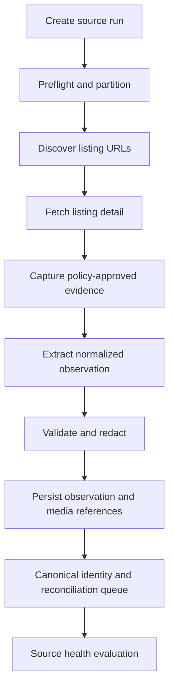

# NYC/NJ Rental Listing Agent — Listing Acquisition

## 1. Document Control

| Field | Value |
| --- | --- |
| Status | Draft specification |
| Owner | CJ |
| Controlling documents | `00_PROJECT_OVERVIEW.md`, `01_PRODUCT_REQUIREMENTS.md`, `02_LISTING_DATA_SCHEMA.md` |
| Primary dependents | `04_LOCATION_AND_TRANSIT_INTELLIGENCE.md`, `05_MEDIA_AND_FLOORPLANS.md`, `06_DATABASE_AND_REFRESH_PIPELINE.md`, `08_IMPLEMENTATION_PLAN.md` |

This document defines how approved rental-listing sources are registered, queried, observed, parsed, validated, and handed to canonical identity resolution. It does not grant permission to acquire from any particular source. Production enablement requires a completed source-policy record.

## 2. Requirement Traceability

This specification primarily satisfies:

- `PR-GEO-001` through `PR-GEO-003`
- `PR-ACQ-001` through `PR-ACQ-006`
- `PR-DATA-002` through `PR-DATA-004`
- `PR-LAUNDRY-001` and `PR-LAUNDRY-002`
- `PR-MEDIA-001` and `PR-MEDIA-002`
- `PR-REFRESH-001` through `PR-REFRESH-004`
- `PR-LLM-001` through `PR-LLM-005`
- `PR-NFR-002` through `PR-NFR-008`

## 3. Acquisition Objectives

The acquisition subsystem must:

1. Discover eligible Studio, 1BR, and 2BR rental listings in the supported geography.
2. Preserve source evidence and observation time before canonical reconciliation.
3. Avoid intentional collection of broker/contact data.
4. Collect listing text, core facts, apartment-photo references, and floor-plan candidates when available.
5. Produce a versioned normalized observation contract independent of source layout.
6. Detect unchanged and changed source observations efficiently.
7. Surface parser uncertainty instead of inventing missing facts.
8. Isolate source-specific failures.
9. Prevent failed or incomplete acquisition from causing false mass inactivation.
10. Support fixed weekday automation and safe manual replay.

## 4. Acquisition Boundaries

### 4.1 In scope

- Publicly accessible or otherwise explicitly authorized rental inventory
- Approved APIs, feeds, exports, public search/result pages, and listing-detail pages
- Browser automation where approved for the source
- Source metadata required to identify, revisit, and audit a listing
- Listing facts, descriptions, structured amenities, photos, and floor-plan references
- Evidence required to establish geography, layout, availability, laundry, price, and media associations

### 4.2 Out of scope

- Broker, agent, landlord, leasing-office, phone, email, or lead-contact extraction
- Contacting listing providers or submitting inquiry forms
- Account creation solely to evade public access limitations
- CAPTCHA bypass, anti-bot circumvention, fingerprint evasion, or access-control bypass
- Automated login with personal credentials unless the source is explicitly approved for authenticated acquisition
- Paywall bypass
- Collecting client, tenant, or applicant information
- Ad writing, image composition, or marketing publication
- Treating search-engine snippets as authoritative listing observations

### 4.3 Source policy controls

The acquisition implementation must honor each source’s approved:

- Access method
- Authentication boundary
- Query scope
- Rate and concurrency limit
- Retrieval window
- Raw-content retention policy
- Media storage/reference policy
- Required attribution
- Prohibited fields
- Disable/kill-switch procedure

If the permitted method or policy is uncertain, the source remains disabled until reviewed.

## 5. Initial Source Strategy

### 5.1 Coverage strategy

The initial system should use a small complementary source set rather than many brittle adapters. The selected set must collectively cover:

- NYC borough inventory
- Jersey City and Hoboken inventory
- Fort Lee inventory
- Smaller-building and direct-property inventory where practical
- Building-level media and layout assets where source policy permits

No single source is assumed complete. Cross-source coverage is expected, and the canonical schema is designed to retain multiple source observations.

### 5.2 Candidate source registry

The following are candidate categories for source-policy review. They are not enabled by this document.

| Candidate | Likely value | Geographic role | Proposed acquisition preference | Initial status |
| --- | --- | --- | --- | --- |
| StreetEasy | High NYC rental coverage and structured building/unit pages | NYC | **Search-index discovery** (owner decision 2026-08-17, see §5.4): bounded `site:streeteasy.com` queries through a configurable search provider; no direct site scraping | `APPROVED (search-index discovery only)` |
| Zillow Rentals | Broad NYC/NJ inventory and cross-market coverage | All supported areas | Approved API/feed or policy-approved browser acquisition | `PROPOSED` |
| Apartments.com | Broad managed-building inventory and media | All supported areas | Approved feed or policy-approved browser acquisition | `PROPOSED` |
| RentHop | Additional NYC inventory and smaller listings | Primarily NYC | Approved feed or policy-approved browser acquisition | `PROPOSED` |
| Realtor.com Rentals | Supplemental rental inventory | NYC/NJ | Approved API/feed or policy-approved browser acquisition | `PROPOSED` |
| Property/building sites | Direct availability, layout-class floor plans, and building media | Targeted buildings in all supported areas | Public page acquisition or explicit direct authorization | `PROPOSED` |
| Manual approved import | Recovery/bootstrap for authorized CSV/JSON exports | All supported areas | File import | `PROPOSED` |

Before implementation, a versioned source-registry configuration or database seed must resolve which candidates are enabled. A source may be rejected without changing the canonical schema or adding another specification document.

### 5.4 StreetEasy search-index discovery (owner decision 2026-08-17)

StreetEasy inventory is discovered through a web-search index rather than direct
site scraping:

1. Run bounded `site:streeteasy.com` queries (geography/layout partitions) through
   a **configurable search provider** kept behind the `SearchProvider` adapter
   interface; the provider is replaceable configuration.
2. Extract listing URLs, titles, snippets, prices, layouts, and addresses from the
   returned search results only.
3. Exclude broker/contact information from extraction (PR-ACQ-005 applies fully).
4. Snippet-derived observations are `PARTIAL` parse status; their source links are
   marked `discovery_method = SEARCH_INDEX`, and the resulting listings surface as
   discovered-from-search / partially enriched until additional evidence arrives.
5. **Absence from search results is never disappearance evidence.** A search-index
   source can support discovery and freshness but cannot satisfy the healthy-scope
   absence requirements in §23; disappearance processing remains disabled for
   search-discovered links until a directly-verifiable source supports them.

### 5.3 Recommended initial enablement sequence

Subject to policy review:

1. One broad primary inventory source with NYC and NJ coverage.
2. One NYC-specialized source if the primary source has insufficient NYC depth.
3. Direct building/property sites for floor plans and authoritative availability on manually prioritized buildings.
4. One supplemental source only after deduplication performance is validated.

The MVP should not start with all candidates simultaneously. Each adapter adds failure, duplication, and monitoring costs.

## 6. Source Registry Contract

Each `source` with `source_type = LISTING` must have a corresponding versioned acquisition-policy record.

### 6.1 Required source-policy fields

| Field | Required | Description |
| --- | --- | --- |
| `source_code` | Yes | Stable adapter identifier. |
| `display_name` | Yes | Human-readable name. |
| `approval_status` | Yes | `PROPOSED`, `UNDER_REVIEW`, `APPROVED`, `SUSPENDED`, `REJECTED`. |
| `access_method` | Yes | `API`, `FEED`, `BROWSER`, `MANUAL_IMPORT`, `OTHER_APPROVED`. |
| `entry_points` | Yes | Approved domains/endpoints/import definitions. |
| `allowed_geographies` | Yes | Supported city/borough/municipality scope. |
| `allowed_layouts` | Yes | Studio/1BR/2BR query constraints. |
| `authentication_mode` | Yes | `NONE`, `API_KEY`, `OAUTH`, `APPROVED_SESSION`, `NOT_APPLICABLE`. |
| `query_strategy` | Yes | Search partitions and pagination rules. |
| `rate_limit_policy` | Yes | Requests/actions per interval and concurrency. |
| `content_retention_policy` | Yes | What raw content may be stored and for how long. |
| `media_policy` | Yes | Reference-only versus download/storage rules. |
| `contact_exclusion_rules` | Yes | Source-specific selectors/fields to ignore or redact. |
| `health_expectations` | Yes | Expected ranges and structural markers. |
| `adapter_version` | Yes | Deployed adapter version. |
| `policy_version` | Yes | Approved policy version. |
| `approved_by` | Yes for approval | Reviewer identity. |
| `approved_at` | Yes for approval | Approval timestamp. |
| `kill_switch` | Yes | Immediate disable configuration. |

### 6.2 Enablement invariant

A source may run in the production schedule only when:

```text
source.enabled = true
AND approval_status = APPROVED
AND adapter_version is approved under policy_version
AND required credentials/session configuration passes preflight
AND kill_switch = false
```

## 7. Adapter Architecture

### 7.1 Adapter interface

Each source adapter must implement the logical interface below. Exact language signatures are deferred to implementation planning.

```text
preflight(context) -> SourcePreflightResult
plan_partitions(context) -> list[AcquisitionPartition]
discover(partition, cursor?) -> DiscoveryPage
fetch_detail(discovered_item) -> RawListingCapture
extract(capture) -> ParsedSourceObservation
validate(observation) -> ObservationValidation
discover_media(capture, observation) -> list[RawMediaReference]
checkpoint(state) -> AdapterCheckpoint
summarize(run_state) -> SourceRunSummary
```

The adapter must not write canonical building, unit, or listing records directly. It writes source observations and acquisition artifacts; downstream normalization and identity resolution perform canonical mutations.

### 7.2 `SourcePreflightResult`

Must include:

- Adapter and policy version match
- Authentication/session readiness where applicable
- Entry-point reachability
- Expected structural marker checks
- Rate-limit configuration
- Storage/retention configuration
- Kill-switch status
- Result: `READY`, `DEGRADED`, or `BLOCKED`

`BLOCKED` prevents acquisition. `DEGRADED` may proceed only when the policy explicitly permits it and disappearance processing remains disabled unless later health gates pass.

### 7.3 `AcquisitionPartition`

A partition is a deterministic, retryable unit of discovery. It should include:

- Source code
- Geography partition
- Layout partition
- Price band or pagination partition only when needed for source result limits
- Stable partition key
- Query parameters
- Cursor/checkpoint state
- Expected coverage metadata

Partitioning must prevent source result caps from silently omitting inventory. Overlapping partitions are permitted when deduplication at observation identity is reliable.

### 7.4 `DiscoveryPage`

Must include:

- Discovered source-native ID when available
- Listing-detail URL
- Search-card facts needed for triage and later validation
- Pagination/cursor state
- Page retrieval metadata
- Structural health markers
- Whether the result set appears truncated or capped

Search-card data is discovery evidence. Listing-detail data normally controls canonical extraction when the two conflict, unless source-specific rules state otherwise.

### 7.5 `RawListingCapture`

The capture must contain or reference only policy-permitted acquisition material:

- Final canonicalized URL and redirect chain where relevant
- Retrieval time and response/page status
- Structured data blocks used for extraction
- Relevant visible listing content
- Relevant network/API response only when explicitly approved
- Content hash
- Screenshot or rendered-page reference only when required and permitted
- Source structural signature

Contact sections must be excluded from targeted capture where practical. If unavoidable in a retained page artifact, they must not be parsed, indexed, exported, or passed downstream except to a redaction process.

## 8. Normalized Observation Contract

### 8.1 Required envelope

Every adapter outputs a `ParsedSourceObservation` with:

```json
{
  "schema_version": "string",
  "source_code": "string",
  "source_native_id": "string|null",
  "source_url": "string",
  "observed_at": "RFC3339 timestamp",
  "retrieved_at": "RFC3339 timestamp",
  "source_status": "AVAILABLE|FUTURE|PENDING|UNAVAILABLE|UNKNOWN",
  "identity": {},
  "pricing": {},
  "layout": {},
  "availability": {},
  "description": {},
  "amenities": [],
  "laundry": {},
  "media_references": [],
  "evidence": [],
  "extraction": {},
  "validation": {}
}
```

The JSON example defines shape, not storage duplication. The database representation follows `source_observation.parsed_payload` and associated evidence/media records.

### 8.2 Identity block

Must support:

- Raw and normalized address candidates
- Source-provided building name
- Raw unit label and normalized unit candidate
- Source building/property ID if available
- Listing/native ID
- Geographic labels supplied by source
- Identity evidence locators

The adapter may normalize syntax but must not decide cross-source canonical identity.

### 8.3 Pricing block

Must support:

- Source-formatted price text
- Parsed monthly rent in minor units
- Currency
- Whether price appears net-effective, gross, a range, “starting at,” or exact
- Concession text where available
- Parsing evidence and uncertainty

The canonical initial price should represent the advertised monthly asking rent under rules finalized in this document’s price section. Net-effective and gross rent must not be silently conflated.

### 8.4 Layout block

Must support:

- Raw layout text
- Source bedroom/bathroom fields
- Proposed normalized layout class
- Convertible/flex/alcove/railroad/home-office qualifiers
- Confidence and evidence
- Scope status

### 8.5 Description block

Must support:

- Non-contact listing description text
- Structured sections when distinguishable
- Content hash
- Redaction/ignore status
- Language where detected

### 8.6 Amenity and laundry blocks

Must support:

- Structured source amenity labels
- Extracted amenity assertions
- Scope: unit, building, or unknown
- Presence status
- Exact supporting evidence
- Proposed normative `laundry_type`
- Conflict/unknown status

The adapter or model may propose laundry classification; the canonical resolver enforces the invariant defined in `02_LISTING_DATA_SCHEMA.md`.

### 8.7 Media-reference block

Must support:

- Media URL/reference
- Source order
- Source label/caption/alt text when permitted
- Proposed type
- Source association: listing, unit, building, layout, or unknown
- Whether it appears to be a floor plan
- Retrieval/retention policy status

Media download, classification, deduplication, and final association are specified in `05_MEDIA_AND_FLOORPLANS.md`.

### 8.8 Extraction metadata

Must include:

- Adapter version
- Extraction path(s): structured data, DOM, browser accessibility tree, LLM, or combination
- Prompt/schema/model references for LLM extraction
- Extraction confidence
- Fields requiring review
- Unsupported or missing structural markers

## 9. Acquisition Workflow



### 9.1 Stage ordering

1. Create `source_run` in `PENDING` then `RUNNING`.
2. Execute preflight.
3. Generate deterministic partitions.
4. Discover listing-detail candidates.
5. Deduplicate discovery items within source.
6. Decide whether detail retrieval is required based on freshness and source policy.
7. Capture detail evidence.
8. Extract the normalized observation.
9. Validate schema, scope signals, and contact exclusion.
10. Persist observation and media references transactionally where practical.
11. Queue normalization/identity resolution.
12. Evaluate source health after all required partitions reach terminal status.
13. Permit disappearance reconciliation only if the health gate passes.

### 9.2 Concurrency

Concurrency is configured per source and partition. It must respect approved limits and should include jitter/backoff where appropriate. Global worker capacity must not override a more restrictive source policy.

### 9.3 Checkpointing

Long source runs must checkpoint:

- Completed partitions/pages
- Cursor state
- Discovered-item keys
- Successfully persisted observation IDs
- Retryable failures
- Rate-limit state when relevant

A replay from checkpoint must be idempotent.

## 10. LLM-Assisted Acquisition

### 10.1 Role of the default hosted model

The default hosted model may:

- Interpret structurally variable listing pages
- Map source language to the observation schema
- Extract evidence-backed layout, availability, amenity, and laundry facts
- Identify likely photo versus floor-plan references from labels or multimodal inputs
- Compare conflicting page sections
- Decide which approved adapter tool to call next
- Produce a structured failure/review explanation

It must not invent page content, coordinates, commute times, source IDs, stored media, or database write success.

### 10.2 Model tiering

The balanced model policy is:

1. Use deterministic structured extraction when the source exposes stable authoritative fields.
2. Use the capable default hosted model for routine unstructured or multimodal interpretation and orchestration.
3. Escalate to the flagship model only on documented triggers.
4. Use the local model only for task types where it has passed the task-specific evaluation threshold.
5. Send unresolved cases to human review rather than repeatedly generating indefinitely.

This is not a rule that deterministic extraction must replace the LLM. It prevents spending model tokens to copy already reliable structured values and provides grounding for the LLM.

### 10.3 Escalation triggers

Escalate from the default hosted model when one or more apply:

- Output fails the observation JSON schema twice under the retry policy.
- High-quality source evidence materially conflicts.
- Layout remains ambiguous between in-scope and out-of-scope classes.
- Laundry evidence could incorrectly enable `室内洗烘`.
- Address/unit identity evidence is ambiguous and consequential.
- The page requires multi-step tool recovery beyond the default model’s validated workflow.
- Multimodal floor-plan/media interpretation remains unresolved.
- Deterministic validation returns a blocking failure attributable to interpretation rather than source outage.

### 10.4 Model execution contract

Every canonical-affecting model call must:

- Use a registered task type
- Use versioned instructions and output schema
- Reference source inputs rather than uncontrolled copied context
- Return evidence locators/spans
- Support `UNKNOWN`, `CONFLICTING`, and `REVIEW_REQUIRED`
- Record model execution metadata from `02_LISTING_DATA_SCHEMA.md`
- Pass schema and business-rule validation
- Be cacheable by normalized input and execution versions

### 10.5 Retry limits

Do not repeatedly regenerate the same failed interpretation without changing model tier, instructions, tool evidence, or human input. Recommended initial policy:

- One initial default-model call
- One repair call only for syntactic/schema failure
- One flagship escalation when a documented trigger applies
- Human review or terminal unresolved state afterward

Exact values remain configuration but must be bounded.

## 11. Listing Discovery and Query Partitioning

### 11.1 Geographic partitions

At minimum, source planning must distinguish:

- NYC, with borough or source-supported subarea partitions as needed
- Jersey City
- Hoboken
- Fort Lee

Source-provided “New York metro” or radius results must be filtered through normalized geographic boundaries before admission.

### 11.2 Layout partitions

Where the source supports layout filters, query separately or explicitly for:

- Studio
- 1 bedroom
- 2 bedrooms

If the source mixes layouts, discovery may be broader but canonical admission remains restricted. The system must monitor whether result caps cause one layout to crowd out others.

### 11.3 Price partitions

Price bands may be introduced only to avoid result caps or improve completeness. They must:

- Cover the configured range without gaps
- Use documented inclusive/exclusive boundaries
- Permit overlap when needed to avoid edge omissions
- Be deduplicated by source identity

The user has not yet specified a global rent range, so the initial specification must not invent one.

### 11.4 Pagination and result caps

Adapters must detect or flag:

- Maximum result counts
- Page limits
- Repeated cursors/pages
- Sort-order instability
- Missing expected pagination controls
- Suspiciously constant or abruptly reduced inventory

If completeness cannot be established, the source run is `DEGRADED` and cannot support disappearance inactivation.

## 12. Detail Fetch and Freshness Strategy

### 12.1 Detail-fetch decisions

A detail page should be fetched when:

- The listing is newly discovered.
- Search-card material fields changed.
- The prior detail observation is stale under source policy.
- Media references appear changed.
- The listing reappeared.
- A previous extraction was partial/failed.
- A human requested refresh.

An unchanged search result may reuse a valid recent detail observation only when source-specific tests show the search-card signal is sufficient to detect material changes.

### 12.2 Conditional retrieval

Where supported and approved, use ETag, Last-Modified, source version fields, or response hashes to reduce redundant transfer. A “not modified” response updates check/freshness metadata without fabricating a new changed observation.

### 12.3 URL normalization

Canonicalization may remove documented tracking parameters and normalize safe URL variants. It must not remove parameters that identify a unit, listing, layout, locale, or version.

Redirect history should be retained when it assists source continuity.

## 13. Extraction Precedence

### 13.1 Evidence priority within one source

Default priority, subject to source-specific rules:

1. Explicit structured listing-detail field
2. Explicit visible listing-detail text
3. Source-provided structured data embedded in the detail page
4. Source search-card field
5. LLM interpretation of ambiguous visible content
6. Image-derived interpretation under the media policy

Higher priority does not automatically erase conflicting lower-priority evidence. Material conflicts are retained and may require resolution.

### 13.2 Listing-detail versus building pages

- Unit/listing pages control unit-specific price, availability, unit label, and unit amenities when explicit.
- Building pages may control building-level amenities and layout-class floor-plan candidates.
- Building laundry cannot be promoted to in-unit laundry.
- A building floor plan may be associated to layout class without exact-unit claims.

### 13.3 Search-card conflicts

If search card and detail page conflict materially:

- Retain both as evidence.
- Prefer the fresher explicit detail fact only under source-specific rules.
- Flag repeated systematic disagreement as a source-health issue.

## 14. Price Interpretation

### 14.1 Price types

The observation must distinguish:

- `EXACT_MONTHLY_ASKING`
- `STARTING_AT`
- `RANGE`
- `NET_EFFECTIVE`
- `GROSS_WITH_CONCESSION`
- `CONTACT_FOR_PRICE`
- `UNKNOWN`

### 14.2 Canonical price proposal

- Exact monthly asking rent may populate `monthly_rent_minor` directly after validation.
- “Starting at” may populate a proposed minimum only if schema/UI clearly labels it; otherwise it remains an assertion requiring review.
- A range must preserve both bounds and must not be converted to an invented midpoint.
- Net-effective and gross rent must be stored distinctly in assertions.
- “Contact for price” produces unknown price and must not trigger contact collection.

The final canonical representation of complex concessions may require schema extension during implementation; no adapter may silently discard the concession text.

## 15. Layout Interpretation

### 15.1 Direct normalization

Examples of normally direct mappings:

| Source evidence | Proposed class |
| --- | --- |
| Studio, studio apartment | `STUDIO` |
| 1 bed, 1 bedroom | `ONE_BEDROOM` |
| 2 bed, 2 bedroom | `TWO_BEDROOM` |
| 3+ bedrooms | `OUT_OF_SCOPE` |

### 15.2 Qualified layouts

- Alcove studio remains `STUDIO` with qualifier.
- Convertible or flex layouts retain the legal/marketing source wording and require explicit rules before normalization.
- Junior one-bedroom requires evidence-based handling and may remain ambiguous.
- Home office/den does not automatically add a bedroom.
- Railroad layout is a qualifier, not a bedroom count.
- Room shares and individual-room rentals are out of scope unless later explicitly added.

Ambiguous in-scope/out-of-scope cases must be reviewed or escalated; they must not be admitted through optimistic interpretation.

## 16. Laundry Extraction

The normative states and badge invariant are controlled by `02_LISTING_DATA_SCHEMA.md`.

### 16.1 Required evidence handling

The observation must retain:

- Exact relevant text or structured field
- Whether evidence is unit-, building-, or unknown-scope
- Positive, negative, or ambiguous status
- Source section/locator
- Model execution when interpreted by an LLM

### 16.2 Mandatory distinctions

| Evidence pattern | Allowed proposal |
| --- | --- |
| Explicit washer and dryer inside unit | `IN_UNIT_WASHER_DRYER_CONFIRMED` |
| Washer only in unit | `IN_UNIT_WASHER_ONLY` |
| Dryer only in unit | `IN_UNIT_DRYER_ONLY` |
| Washer/dryer hookups or connections | `IN_UNIT_HOOKUP_ONLY` |
| Laundry room / laundry in building | `BUILDING_SHARED_LAUNDRY` |
| Laundromat nearby | `OFFSITE_OR_NEARBY_LAUNDRY` |
| No statement after evaluated content | `NO_LAUNDRY_STATED` |
| Contradictory material evidence | `CONFLICTING` |
| Insufficient interpretation | `UNKNOWN` |

Words such as “laundry,” “washer/dryer access,” or an amenity icon without scope are insufficient for confirmed in-unit washer and dryer.

## 17. Media Discovery Handoff

Acquisition must discover media references without making unsupported final associations.

For each reference, collect where permitted:

- Source URL/reference and order
- Caption/alt/source label
- Surrounding listing/building/layout context
- Candidate media type
- Source-native media identifier
- Exact listing/detail/building page that exposed it
- Retrieval policy

Media acquisition must not block persistence of the textual observation. Failed media references become media jobs/issues.

Floor-plan candidates are passed to `05_MEDIA_AND_FLOORPLANS.md` processing, where building/layout matching and exact-unit claim rules apply.

## 18. Contact Exclusion and Redaction

### 18.1 Prohibited normalized fields

Adapters and output schemas must not define:

- Broker/agent name
- Landlord/leasing-office contact name
- Phone number
- Email address
- Inquiry URL intended solely for lead submission
- Contact availability/schedule
- License number or brokerage profile

### 18.2 Source-specific exclusion

Each adapter must identify known contact selectors, JSON paths, components, or page sections and exclude them from targeted extraction.

### 18.3 Incidental presence

If contact text appears inside an otherwise relevant description:

- Preserve the minimum policy-permitted raw observation if required for audit.
- Produce a non-contact description representation for downstream LLM tasks and UI.
- Mark `contact_redaction_status`.
- Do not create searchable/indexed contact facts.

Contact redaction failure is a validation issue and may be blocking depending on the artifact’s destination.

## 19. Observation Validation

### 19.1 Structural validation

Check:

- Required envelope fields
- Source and schema version
- URL/domain allowlist
- Timestamp validity
- Payload size limits
- Enum validity
- Evidence-reference integrity
- Contact-exclusion status

### 19.2 Semantic validation

Check:

- Rent is nonnegative and plausible enough to avoid parser-unit errors; anomalies are warnings/review, not silently corrected.
- Layout/bedroom consistency
- Supported rental versus sale/non-residential scope
- Address/geography evidence presence
- Availability evidence
- Laundry invariant
- Media URL/reference validity
- No invented source IDs or unsupported exact-unit floor-plan claims

### 19.3 Validation outcomes

| Outcome | Meaning | Downstream behavior |
| --- | --- | --- |
| `VALID` | Contract and admission-critical evidence are usable. | Queue canonical processing. |
| `PARTIAL` | Observation is useful but some fields failed or are unknown. | Persist, queue eligible processing, create issues/jobs. |
| `INVALID` | Cannot safely use for canonical processing. | Persist diagnostics under policy; do not reconcile as valid listing evidence. |
| `BLOCKED` | Policy/access/contact/security failure prevents use. | Stop affected item/source path and alert. |

Unknown optional fields do not make an observation invalid.

## 20. Intra-Source Deduplication

Before canonical cross-source identity resolution, the adapter must deduplicate discovery and observation identities within the source.

Priority keys:

1. Source-native listing ID
2. Stable source detail URL
3. Source-specific composite identity
4. Content/identity fingerprint with review when uncertain

Pagination duplicates and overlapping search partitions must not generate duplicate observation effects.

If one source reuses native IDs across buildings, regions, or time, its composite uniqueness rule must include the necessary scope and version.

## 21. Canonical Handoff

### 21.1 Handoff inputs

The canonical identity/resolution queue receives:

- Valid/partial observation ID
- Source link/native identity
- Address and unit candidates
- Layout/bed/bath evidence
- Current price and availability assertions
- Description and amenity/laundry assertions
- Media references
- Observation hash and previous-observation comparison
- Extraction/validation/model metadata

### 21.2 Adapter prohibition

Source adapters must not:

- Merge canonical listings
- Apply human overrides
- Mark canonical listings inactive
- Set marketing selection
- Convert provider/search rank into listing quality
- Create commute results

They may propose identity candidates and change signals for downstream validation.

## 22. Change Detection

### 22.1 Observation comparison

Compare the latest valid observation to the preceding valid observation for the same source listing identity using field-aware comparison, not raw HTML alone.

Classify:

- `UNCHANGED`
- `NON_MATERIAL_CHANGE`
- `MATERIAL_CHANGE`
- `NEW`
- `REAPPEARED_CANDIDATE`
- `UNRESOLVED`

### 22.2 Material fields

At minimum:

- Price type/value/range/concession
- Availability/source status
- Available-from date
- Address or unit identity
- Layout, bedrooms, bathrooms
- Description content affecting normalized facts
- Amenity/laundry evidence
- Media set
- Source URL/native ID continuity

### 22.3 Non-material examples

Normally non-material unless source-specific evidence shows otherwise:

- Tracking parameters
- Whitespace or presentation changes
- Source page order changes
- Non-semantic markup changes
- Contact-section changes that are excluded from the product

### 22.4 Re-enrichment signal

The handoff must list changed dependencies according to Section 21 of `02_LISTING_DATA_SCHEMA.md`. A price-only change must not automatically trigger transit/commute recomputation.

## 23. Missing and Disappeared Listings

### 23.1 Observation absence is not immediate inactivity

A source listing not discovered in one run becomes a missing candidate only if:

- It was expected within a completed partition.
- The source run and applicable partition passed health checks.
- The prior source link was active and within scope.

It must not be marked inactive by the adapter.

### 23.2 Missing evidence record

The source run must record:

- Prior source listing identity
- Expected partition
- Last healthy observation
- Current healthy run in which it was absent
- Whether direct-detail verification was attempted/permitted
- Result such as removed, unavailable, redirected, access failed, or unknown

### 23.3 Inactivation authority

Only the reconciliation pipeline in `06_DATABASE_AND_REFRESH_PIPELINE.md` may transition canonical lifecycle state using:

- Explicit source unavailability
- Consecutive healthy misses
- Cross-source evidence
- Grace period
- Direct-detail verification
- Human override/review

A source outage, CAPTCHA, authentication failure, unexpected zero results, or incomplete pagination cannot be treated as disappearance evidence.

## 24. Source Health Gates

### 24.1 Health dimensions

Each source run evaluates:

- Preflight success
- Partition completion ratio
- Pagination integrity
- Response and parse success rates
- Listing count compared with recent healthy baselines
- Distribution by geography/layout
- Required structural-marker presence
- Rate-limit/block/challenge incidence
- Duplicate and invalid-observation spikes
- Contact-redaction success
- Adapter version/policy compatibility

### 24.2 Health outcomes

| Status | Acquisition use | Disappearance use |
| --- | --- | --- |
| `HEALTHY` | Valid observations accepted | Eligible after all gates |
| `DEGRADED` | Valid observations may be accepted | Disabled unless a narrower healthy partition is proven |
| `FAILED` | No further normal processing | Disabled |
| `BLOCKED` | Stop due to access/policy/security | Disabled |

### 24.3 Baseline anomaly rules

Exact thresholds are finalized after baseline runs, but the source must default to degraded when:

- Results unexpectedly fall to zero.
- Volume drops sharply without corroborating evidence.
- One geography/layout partition disappears unexpectedly.
- Parser validity falls materially.
- Expected structural markers vanish.
- Pagination terminates abnormally.
- Block/challenge responses occur.

Thresholds must be configuration with versioned history, not hidden code constants.

## 25. Error Taxonomy

Standard acquisition error categories:

- `POLICY_BLOCKED`
- `AUTH_REQUIRED`
- `AUTH_FAILED`
- `CAPTCHA_OR_CHALLENGE`
- `RATE_LIMITED`
- `NETWORK_TIMEOUT`
- `NETWORK_ERROR`
- `SOURCE_4XX`
- `SOURCE_5XX`
- `STRUCTURE_CHANGED`
- `PAGINATION_FAILURE`
- `RESULT_CAP_UNRESOLVED`
- `PARSE_SCHEMA_FAILURE`
- `LLM_SCHEMA_FAILURE`
- `LLM_INTERPRETATION_CONFLICT`
- `CONTACT_REDACTION_FAILURE`
- `MEDIA_REFERENCE_FAILURE`
- `PERSISTENCE_FAILURE`
- `UNKNOWN_FAILURE`

Errors must include sanitized context and retryability. They must not log credentials, raw contact data, or signed media URLs.

## 26. Retry and Recovery

### 26.1 Retry classes

- Network timeout/temporary provider failures: retry with bounded exponential backoff.
- Rate limits: respect provider/source reset and reduce concurrency.
- Authentication failure: stop and require configuration correction; do not loop.
- CAPTCHA/challenge: stop affected acquisition path; do not bypass.
- Structure change: degrade/stop adapter and require fixture/contract review.
- LLM syntactic failure: one repair attempt, then escalation if justified.
- LLM semantic conflict: escalate or human review, not blind repetition.
- Persistence failure: retry transactionally under idempotency key.

### 26.2 Manual replay

The operator may replay:

- One listing detail
- One partition
- One source run stage
- One failed model extraction

Replay must preserve original run/evidence and create linked new execution/job records.

## 27. Scheduling Contract

Acquisition must be callable by the weekday scheduler defined in `06_DATABASE_AND_REFRESH_PIPELINE.md`.

The scheduler supplies:

- Refresh run ID
- Trigger type and scheduled time
- Enabled source snapshot
- Adapter/policy/configuration versions
- Geography/layout scope
- Global run deadline
- Cancellation token/state

Source adapters return terminal summaries and must not independently schedule recurring production runs.

## 28. Observability

### 28.1 Required metrics/counts

Per source and partition:

- Discovery pages/actions
- Discovered unique listing identities
- Detail fetches attempted/succeeded/failed/reused
- New/changed/unchanged observations
- Valid/partial/invalid/blocked observations
- LLM default calls, flagship escalations, cached calls, and failures
- Media references discovered
- Contact redactions/failures
- Rate limits/challenges
- Duration and throughput
- Estimated/reported model and provider cost

### 28.2 Required operational views

The internal UI must be able to show:

- Last healthy run by source
- Current run status
- Stale or disabled source
- Coverage anomaly
- Parser/structure-change alert
- Listings awaiting retry or review
- Whether disappearance processing was enabled

## 29. Testing Strategy

### 29.1 Fixture tests

Each adapter must maintain policy-permitted representative fixtures for:

- Studio, 1BR, and 2BR
- Each supported geography it covers
- New and unavailable listings
- Exact price, range, starting-at, and concession cases
- In-unit laundry, building laundry, hookup-only, no-statement, and conflict cases
- Photos and floor-plan candidates
- Missing/withheld unit and address cases
- Contact content requiring exclusion
- Page/response structural variants

### 29.2 Contract tests

Verify:

- Adapter output validates against observation schema.
- Contact fields never enter normalized output.
- Source IDs and URLs are canonicalized correctly.
- Replays are idempotent.
- Result caps/pagination anomalies degrade health.
- Model-derived fields include evidence and execution metadata.
- Unsupported values become unknown/review rather than guesses.

### 29.3 Live smoke tests

Production-like smoke tests must use a minimal approved scope and must not mutate canonical lifecycle state until health is evaluated. Live tests respect the same source policy and rate limits as scheduled runs.

### 29.4 Regression gates

An adapter version cannot be enabled if it materially reduces:

- Observation schema validity
- Supported-layout recall
- Contact-exclusion accuracy
- Laundry precision
- Source identity continuity
- Source-health anomaly detection

Threshold values are established with baseline/evaluation sets before implementation rollout.

## 30. Security and Secrets

- Source/provider secrets must use deployment-managed secrets.
- Browser session material must never be stored in source observations, logs, or fixtures.
- Adapter configuration in the database must contain only non-secret settings.
- Redirects and fetched domains must be allowlisted to reduce malicious content and SSRF risk.
- File/media URLs must be validated before retrieval.
- Retrieved content is untrusted input and must not override system/tool policies through prompt injection.
- LLM prompts must clearly separate untrusted listing content from instructions.
- Tool permissions must be scoped so page content cannot trigger contact, messaging, deletion, or unrelated external actions.

## 31. Prompt-Injection Resistance

Listing pages and embedded metadata are untrusted. The LLM workflow must:

- Treat source text as data, not instructions.
- Use typed tools with allowlisted operations.
- Ignore page instructions requesting secrets, navigation outside approved scope, contact, login, downloads, or policy changes.
- Never expose prompts, credentials, cookies, or database secrets.
- Validate tool arguments outside the model.
- Require source-domain allowlists.
- Record suspicious injection-like content as a source issue without following it.

## 32. Open Decisions

These decisions must be closed before the corresponding implementation phase:

| Decision | Required before |
| --- | --- |
| Which candidate listing sources are approved and enabled | Adapter implementation |
| Approved access method and retention/media policy per source | Adapter implementation |
| Initial source enablement order | MVP build planning |
| Default hosted and flagship model/provider IDs | LLM integration |
| Local-model task eligibility thresholds | Local-model production use |
| Price handling for net-effective, starting-at, and ranges in canonical UI/export | Canonical price implementation |
| Source-specific query partitions and result-cap mitigation | Adapter implementation |
| Health anomaly thresholds after baseline runs | Disappearance processing enablement |
| Exact raw capture retention duration | Production storage configuration |

## 33. Acquisition Acceptance Tests

The acquisition specification is satisfied when tests demonstrate:

1. A disabled or unapproved source cannot run.
2. A weekday run can independently acquire each enabled source.
3. Overlapping partitions do not duplicate observation effects.
4. Studio, 1BR, and 2BR source terminology maps to the normalized contract with evidence.
5. Out-of-scope geography/layout is rejected or held without optimistic guessing.
6. Contact sections do not enter normalized observations, exports, model tasks, or canonical facts.
7. Exact, range, starting-at, net-effective, and unknown prices remain semantically distinct.
8. In-unit laundry, building laundry, hookup-only, and unknown states remain distinct.
9. Photo and floor-plan references persist even if media retrieval is deferred.
10. An unchanged observation updates freshness without creating a material event.
11. A material price/availability/media/laundry change emits the proper handoff dependencies.
12. An LLM-derived fact includes evidence, model execution, versions, confidence, and validation.
13. Routine cases use the default model while documented hard cases can escalate once to the flagship.
14. Model retries are bounded and unresolved cases reach review.
15. A source structure change degrades or blocks the source instead of silently emitting bad inventory.
16. A zero-result, CAPTCHA, pagination failure, or large volume anomaly disables disappearance processing.
17. One failed source does not prevent other sources from completing.
18. Replay after partial failure is idempotent.
19. The adapter cannot mark canonical listings inactive or selected for marketing.
20. Untrusted page instructions cannot invoke unauthorized tools or expose secrets.

## 34. Change Log

| Date | Change |
| --- | --- |
| 2026-08-16 | Initial listing acquisition specification created from the project overview, product requirements, and canonical data schema. |
| 2026-08-17 | Owner decision B3: StreetEasy approved via search-index discovery only (§5.4); search provider behind adapter; snippet listings marked search-discovered/partially enriched; search absence excluded from disappearance evidence. |
