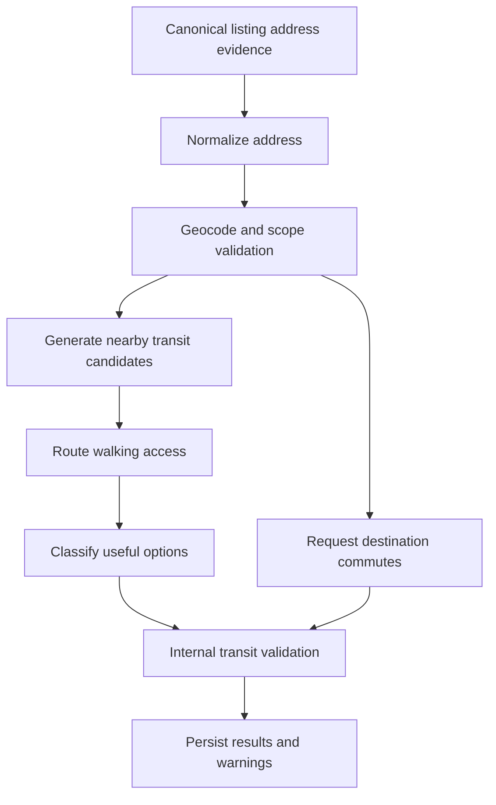
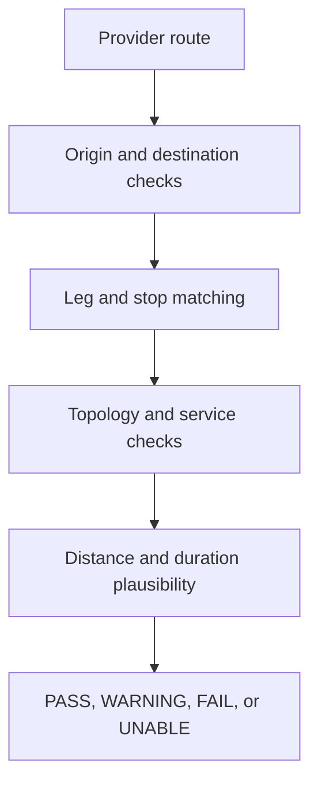

# NYC/NJ Rental Listing Agent — Location and Transit Intelligence

## 1. Document Control

| Field | Value |
| --- | --- |
| Status | Draft specification |
| Owner | CJ |
| Controlling documents | `00_PROJECT_OVERVIEW.md`, `01_PRODUCT_REQUIREMENTS.md`, `02_LISTING_DATA_SCHEMA.md`, `03_LISTING_ACQUISITION.md` |
| Primary dependents | `06_DATABASE_AND_REFRESH_PIPELINE.md`, `07_INTERNAL_UI.md`, `08_IMPLEMENTATION_PLAN.md` |

This document specifies address normalization, geocoding, geographic scope validation, nearby transit discovery, useful-transit selection, commute routing, destination anchors, internal validation, caching, and review behavior.

## 2. Requirement Traceability

This specification primarily satisfies:

- `PR-GEO-001`
- `PR-LOC-001`
- `PR-TRANSIT-001` through `PR-TRANSIT-005`
- `PR-COMMUTE-001` through `PR-COMMUTE-005`
- `PR-DATA-002` through `PR-DATA-004`
- `PR-REFRESH-002` and `PR-REFRESH-004`
- `PR-UI-002`, `PR-UI-003`, and `PR-UI-006`
- `PR-LLM-002` through `PR-LLM-005`
- `PR-NFR-002` through `PR-NFR-008`

## 3. Objectives

The location and transit subsystem must:

1. Establish whether a listing is inside the supported geography.
2. Normalize and geocode the listing location with explicit precision and provenance.
3. Identify nearby and useful transit without conflating the two.
4. Represent MTA subway, PATH, and bus access in a geography-appropriate way.
5. Emphasize useful bus service and connections for Fort Lee.
6. Obtain commute estimates from an authoritative navigation provider.
7. Cross-check provider results with internal geographic and transit validation.
8. Preserve provider results and validation outcomes separately.
9. Calculate commute information for the approved campus and major-destination registry.
10. Avoid commute, neighborhood, transit-quality, and listing-quality scores.
11. Reuse valid results to control provider/model cost without presenting stale data as current.

## 4. Non-Goals

This subsystem does not:

- Recommend listings to clients
- Rank listings by an aggregate transit or commute score
- Predict a particular person’s door-to-door commute
- Guarantee schedules, headways, accessibility, or real-time service conditions
- Replace the navigation provider’s route duration with an LLM estimate
- Treat straight-line distance as walking distance
- Imply Fort Lee has walkable subway access
- Add location text to marketing images
- Collect rider, client, or personally identifying travel data

## 5. Recommended Provider and Dataset Stack

### 5.1 Provider abstraction

All external providers must be accessed through versioned interfaces so the implementation can change providers without changing canonical entities.

Required logical interfaces:

```text
geocode(normalized_address) -> GeocodeResult
walk_route(origin, destination, time_context?) -> WalkingRouteResult
transit_route(origin, destination, departure_context) -> TransitRouteResult
load_transit_dataset(operator, version) -> TransitDataset
```

### 5.2 Recommended initial stack

Subject to account, pricing, quota, and current API verification at implementation time:

| Need | Approved default (owner decision B7, 2026-08-17) | Validation/fallback role |
| --- | --- | --- |
| Address geocoding | Source-provided coordinates plus free/open geocoding where policy permits; **no paid Google Geocoding API** | Administrative boundaries and address normalization checks |
| Walking time/distance | Local PostGIS distance computation from validated coordinates; walking-time estimates labeled as derived | Straight-line distance and pedestrian plausibility rules |
| Public-transit commute | **On-demand LLM web-research estimates** (default hosted model with approved web-search/browser tools) stored as `RESEARCHED_ESTIMATE`; see §19A | Official GTFS/static network cross-check; manual verification via free Google Maps Embed directions view |
| NYC subway/bus topology | Official MTA GTFS/static feeds | Canonical stop/route/service data |
| PATH topology | Official Port Authority/PATH schedule or GTFS-format data where available | Canonical PATH stop/service data |
| NJ bus topology | Official NJ Transit schedule/GTFS-format data under approved terms | Canonical Fort Lee/Jersey City/Hoboken bus data |
| Municipal boundaries | Authoritative NYC/NJ boundary datasets or reviewed geographic polygons | Scope validation |

No provider is approved solely by being named here. Credentials, terms, quotas, field availability, caching, and retention must be checked before implementation.

### 5.3 Authoritative responsibility

- The geocoder provides address candidates and coordinates.
- Boundary polygons determine supported geographic scope.
- Transit datasets define stops, routes, parent stations, and scheduled topology.
- The navigation provider supplies routed walking and commute results.
- Internal algorithms validate consistency and plausibility.
- The LLM interprets conflicts, source language, and review explanations; it does not fabricate authoritative geographic or routing values.

## 6. End-to-End Enrichment Flow



Enrichment stages must be independently retryable. A commute-provider failure must not invalidate a previously validated address or nearby-transit result.

## 7. Address Normalization

### 7.1 Inputs

Address normalization may use:

- Source address text
- Source structured address fields
- Building name
- Unit label
- Borough/city/municipality
- State and ZIP code
- Source-provided coordinates
- Prior reviewed building/address identity

Contact or broker information must not be included.

### 7.2 Normalized components

Produce:

- House number
- Predirectional/postdirectional where applicable
- Street name
- Street type
- Unit token, kept separately from building address
- Borough or municipality
- State
- ZIP code
- Country
- Display-formatted address
- Deterministic address fingerprint

### 7.3 Normalization rules

- Preserve the source address verbatim in `address_assertion.raw_address_text`.
- Normalize casing, punctuation, common street suffixes, and directionals for matching.
- Do not invent a missing house number, street, unit, ZIP, borough, or municipality.
- NYC neighborhood names do not replace borough/city fields.
- Unit labels are normalized separately because `4A`, `4-A`, and `APT 4A` may be equivalent while building identity remains unchanged.
- Named buildings may assist matching but do not establish an address alone.
- Withheld addresses remain withheld/approximate until supported by independent evidence or human review.

### 7.4 Address conflicts

Material conflicts include:

- Different house number or street
- Different municipality/borough
- Incompatible ZIP code
- Source coordinate outside the asserted area
- Unit label that resolves to another building

Conflicting addresses must produce assertions and review status rather than last-write-wins replacement.

## 8. Geocoding

### 8.1 Geocoding request

The request must use the most precise policy-permitted normalized building address, excluding unit where the provider does not use it reliably.

Store:

- Provider and request ID
- Normalized request fields
- Request hash
- Returned formatted address
- Coordinates
- Provider result/place ID
- Provider precision/type metadata
- Administrative components
- Retrieval time and cache expiry

### 8.2 Candidate resolution

If multiple candidates are returned, resolve using:

1. Exact house/street match
2. Municipality/borough match
3. State/ZIP consistency
4. Source-coordinate proximity when independently supplied
5. Existing reviewed building identity
6. Human review for consequential ambiguity

The LLM may explain or compare candidates but cannot supply missing coordinates.

### 8.3 Precision mapping

Provider-specific result types must map to the normative `location_precision` enum in `02_LISTING_DATA_SCHEMA.md`:

- `ROOFTOP_OR_ENTRANCE`
- `BUILDING`
- `PARCEL`
- `INTERPOLATED_ADDRESS`
- `STREET`
- `POSTAL_CODE`
- `NEIGHBORHOOD`
- `CITY`
- `UNKNOWN`

### 8.4 Precision eligibility

| Precision | Inventory scope decision | Nearby walking metrics | Destination commute |
| --- | --- | --- | --- |
| Rooftop/entrance/building | Allowed | Allowed | Allowed |
| Parcel | Allowed with validation | Allowed with warning where needed | Allowed |
| Interpolated address | Allowed with validation | Allowed, marked approximate | Allowed, marked approximate |
| Street | Review/limited | Do not display exact-looking walking metrics | Review or approximate-only |
| ZIP/neighborhood/city | Insufficient for normal active listing admission | Not allowed | Not allowed |
| Unknown | Unresolved | Not allowed | Not allowed |

Human-reviewed coordinates may override this table under explicit provenance.

### 8.5 Geocode validation

Validate:

- Coordinate ranges
- Coordinate inside expected state/municipality/borough
- ZIP and administrative consistency where data permits
- Distance from independently supplied source coordinate
- Duplicate building-address conflicts
- Provider result type versus claimed precision

Geocoder results failing validation are retained with `WARNING` or `FAILED`; they are not silently replaced with an LLM-generated point.

## 9. Geographic Scope Validation

### 9.1 Supported polygons

The boundary registry must contain versioned polygons for:

- New York City
- Jersey City
- Hoboken
- Fort Lee

NYC borough polygons may be stored separately for UI and query partitioning.

### 9.2 Boundary decision

For a sufficiently precise coordinate:

- Inside a supported polygon: `IN_SCOPE`
- Outside all supported polygons: `OUT_OF_SCOPE`
- Near boundary with low precision or conflicting address: `UNRESOLVED`

A source-provided city label cannot override a validated out-of-scope coordinate automatically.

### 9.3 Boundary tolerance

Small coordinate/geocoder differences near municipal borders must use a documented tolerance and administrative-component check. The tolerance exists for geometry/data imperfections, not to expand the supported market.

## 10. Transit Data Normalization

### 10.1 Dataset ingestion

Official transit data must be ingested into the normalized `transit_stop`, `transit_route`, and service tables with:

- Provider/operator
- Dataset version and effective dates
- Stop IDs and parent stations
- Stop/entrance coordinates when available
- Route IDs and display names
- Stop-to-route relationships
- Trips, stop sequences, calendars, and exceptions needed for validation
- Accessibility/status metadata when available and approved

### 10.2 Station complexes and entrances

- Store parent station complexes separately from platforms/stops where the dataset supports them.
- Walking access should target a usable entrance coordinate when available.
- Display may group platforms into one station complex.
- Served lines/routes must be derived from the applicable dataset/service period, not static hand-written text alone.

### 10.3 Dataset versioning

Every transit-access result records the dataset version. A materially changed stop, route, entrance, calendar, or operator dataset invalidates affected enrichment under `02_LISTING_DATA_SCHEMA.md`.

### 10.4 Static versus real-time data

The initial product uses static/scheduled topology for durable listing intelligence. Real-time disruptions may be shown later but must not redefine a listing’s persistent transit access based on a temporary incident.

## 11. Transit Candidate Generation

### 11.1 Candidate versus result

A candidate is generated from geography. It becomes a displayable access option only after walking and service validation.

### 11.2 Initial candidate radii

Initial configurable straight-line search radii:

| Mode/area | Default candidate radius | Hard review ceiling |
| --- | ---: | ---: |
| NYC subway | 1,600 m | 2,400 m |
| PATH in Jersey City/Hoboken | 2,000 m | 3,000 m |
| Bus in NYC/Jersey City/Hoboken | 800 m | 1,200 m |
| Bus in Fort Lee | 1,200 m | 1,800 m |

These radii generate candidates; they do not define “nearby” or “useful.” They must be evaluated against real listings during implementation.

### 11.3 Candidate retrieval

Use PostGIS or equivalent spatial indexing to retrieve stops. Preserve:

- Straight-line distance
- Stop/entrance identity
- Parent station
- Mode and operator
- Candidate-generation radius/version

### 11.4 Candidate exclusions

Exclude or flag:

- Inactive stops
- Temporarily closed access when current status is reliable
- Stops across geographic barriers with implausible walking access
- Opposite-direction bus stops when direction makes them irrelevant to the stated useful connection
- Duplicate platforms/entrances after parent grouping

## 12. Routed Walking Access

### 12.1 Walking-route request

For each retained candidate, request or calculate pedestrian routing from the listing origin to the usable stop/entrance.

Store:

- Provider request ID
- Origin and precision
- Destination stop/entrance
- Walking duration seconds
- Walking distance meters
- Route calculation time
- Provider status
- Validation status

### 12.2 Walking plausibility

Internal checks include:

- Walking distance must not be shorter than straight-line distance beyond a small geometry tolerance.
- Implied average speed should normally fall within a configurable pedestrian range; initial warning range is 0.5–2.2 m/s.
- Large detour ratios require explanation or warning.
- Waterways, highways, cliffs, gated campuses, and bridge/tunnel access must not be assumed traversable from straight-line proximity.
- Low-precision origin coordinates must not produce unqualified exact-looking time/distance.

### 12.3 Display rounding

To avoid false precision:

- Walking time may be displayed in whole minutes.
- Distance may be displayed in miles to one decimal or in feet/meters using UI rules.
- Raw seconds/meters remain stored.
- Approximate origins must display an approximation indicator.

## 13. Nearest and Useful Transit

### 13.1 Separate concepts

- **Nearest:** lowest validated walking distance or duration under the configured metric.
- **Useful:** passes mode-specific service and connection rules relevant to the supported market.

One stop may be both, one, or neither.

### 13.2 No composite score

The system must not create a weighted transit or commute score. Use explicit attributes and deterministic ordering instead.

Allowed ordering example:

1. `USEFUL` before unresolved candidate
2. Direct relevant connection before connection requiring transfer
3. Shorter validated walking time
4. More recent/complete service data

This lexicographic ordering is a display rule, not a quality score and not a listing ranking.

### 13.3 Usefulness reasons

Store reason codes such as:

- `DIRECT_SUBWAY_ACCESS`
- `DIRECT_PATH_ACCESS`
- `DIRECT_MAJOR_DESTINATION_SERVICE`
- `DIRECT_CAMPUS_SERVICE`
- `CONNECTS_TO_SUBWAY`
- `CONNECTS_TO_PATH`
- `CONNECTS_TO_MAJOR_HUB`
- `FREQUENT_WEEKDAY_SERVICE_DATA_AVAILABLE`
- `SHORT_VALIDATED_WALK`
- `LIMITED_SERVICE`
- `DIRECTION_MISMATCH`
- `EXCESSIVE_WALK`
- `SERVICE_UNVERIFIED`

Reason codes explain utility; they are not summed.

## 14. NYC Subway Rules

### 14.1 Required output

For NYC listings, identify at least the nearest validated subway station/complex candidate and all useful nearby subway options within the configured limits, including:

- Station/complex name
- Line(s)/route(s)
- Entrance or station access point used
- Walking time
- Walking distance
- Dataset/provider time
- Validation status

### 14.2 Line representation

- Store lines as route relationships, not comma-separated canonical text.
- Display line badges may be derived in the UI.
- Service changes and time-dependent route behavior must be handled through dataset/service context.
- Do not claim a line serves an entrance/station if the normalized dataset does not support it.

### 14.3 Distant subway access

If no subway is within the useful walking threshold:

- Do not fabricate a “nearby subway.”
- The UI may show the closest validated station as distant, clearly labeled.
- Bus or other relevant access may be displayed more prominently.

## 15. PATH Rules

### 15.1 Applicability

PATH enrichment is required for Jersey City and Hoboken where a station falls within the configured candidate range or a validated bus/light-rail connection makes PATH meaningfully relevant under later approved connection rules.

### 15.2 Required output

- PATH station
- Applicable services/directions as available
- Walking time and distance for walkable access
- Connection description when PATH is reached via another mode
- Validation and dataset version

### 15.3 Non-applicability

If no relevant PATH access exists, store no relevant option or an explicit not-applicable result. Do not fill the field with a remote station solely because PATH operates in the region.

## 16. Bus Rules for All Areas

### 16.1 Required output

For every supported area, collect useful bus options including:

- Stop name/location
- Operator
- Route number/name
- Direction/headsign when available
- Validated walking time and distance
- Meaningful direct connection or hub
- Service-data version
- Usefulness and validation reasons

### 16.2 Stop-direction handling

Opposite-direction stops with the same name are separate access options unless the dataset explicitly models them otherwise. Direction/headsign matters when claiming a useful connection.

### 16.3 Meaningful connections

Meaningful connections may include:

- Direct service to a required campus/destination
- Direct service to an MTA subway station
- Direct service to a PATH station
- Direct service to a major bus/rail hub
- Direct cross-Hudson service relevant to NYC access

Connections must be supported by route/trip topology or provider route results. The LLM may summarize validated connections but must not invent them.

### 16.4 Service usefulness

Where schedule data supports it, retain explicit attributes such as:

- Weekday service availability
- Representative headway band
- Span of service
- Peak-only or limited-service status

Do not collapse these into a score. If frequency data is unavailable or unreliable, mark it unknown.

## 17. Fort Lee-Specific Rules

### 17.1 Presentation priority

Fort Lee transit presentation priority is:

1. Useful nearby bus stops and routes
2. Direct cross-Hudson or major-hub connections
3. Connections to subway/PATH/rail when validated
4. Distant subway information only as a downstream connection, not nearby access

### 17.2 Required handling

- Use NJ Transit or other applicable official operator data.
- Identify directionally correct stops.
- Show walking time/distance to the bus stop.
- Explain the meaningful connection, such as a validated major terminal or subway connection.
- Represent transfer structure honestly.
- Do not display a Manhattan subway station as Fort Lee’s nearest walkable subway.

### 17.3 George Washington Bridge connection

When an applicable route provides validated access to the George Washington Bridge Bus Station or another major connection point, store the connection explicitly. The UI may summarize onward subway access only when supported by route/walking validation.

Route numbers must be obtained from current transit/provider data rather than permanently hard-coded in narrative specifications.

## 18. Destination Registry

### 18.1 Registry principles

- Each destination has a stable immutable code.
- Each campus has its own anchor.
- Broad neighborhoods/areas use an explicit representative anchor.
- Anchor changes create a new registry version and invalidate affected commute results.
- Coordinates are geocoded once, reviewed, stored, and then treated as controlled configuration.
- Free-text provider geocoding is not repeated for every listing commute.

### 18.2 Required university/campus anchors

The initial registry must contain:

| Code | Display name | Representative routing anchor | Notes |
| --- | --- | --- | --- |
| `NYU_WASHINGTON_SQUARE` | NYU Washington Square | Bobst Library / 70 Washington Square South, New York, NY | Main Washington Square campus anchor. |
| `NYU_TANDON` | NYU Tandon School of Engineering | 6 MetroTech Center, Brooklyn, NY | Separate from Washington Square. |
| `COLUMBIA_MORNINGSIDE` | Columbia University — Morningside | 116th Street and Broadway, New York, NY | Main Morningside campus. |
| `PRATT_BROOKLYN` | Pratt Institute — Brooklyn | 200 Willoughby Avenue, Brooklyn, NY | Main Brooklyn campus. |
| `NEW_SCHOOL_UNIVERSITY_CENTER` | Parsons / The New School | University Center, 63 Fifth Avenue, New York, NY | Controlled Parsons/New School anchor. |
| `FIT_MAIN` | Fashion Institute of Technology | 227 West 27th Street, New York, NY | Main campus. |
| `SVA_MAIN` | School of Visual Arts | 209 East 23rd Street, New York, NY | Representative main anchor; SVA has multiple buildings. |
| `BARUCH_MAIN` | Baruch College | 55 Lexington Avenue, New York, NY | Newman Vertical Campus anchor. |
| `HUNTER_MAIN` | Hunter College | 695 Park Avenue, New York, NY | Main campus. |
| `FORDHAM_ROSE_HILL` | Fordham University — Rose Hill | 441 East Fordham Road, Bronx, NY | Separate Bronx campus. |
| `FORDHAM_LINCOLN_CENTER` | Fordham University — Lincoln Center | 113 West 60th Street, New York, NY | Separate Manhattan campus. |
| `STEVENS_MAIN` | Stevens Institute of Technology | 1 Castle Point Terrace, Hoboken, NJ | Main campus. |

### 18.3 Additional colleges

Additional campuses may be added through the controlled registry without schema change. Candidate additions should be based on actual marketing relevance and may include CUNY and other NYC/NJ campuses. Adding an institution requires a specific campus anchor, not only an institution name.

### 18.4 Required major-destination anchors

| Code | Display name | Representative routing anchor | Interpretation |
| --- | --- | --- | --- |
| `WEST_VILLAGE` | West Village | Christopher Street and Seventh Avenue South | Representative central transit-access point. |
| `CENTRAL_PARK_SOUTHWEST` | Central Park | Columbus Circle / southwest park entrance | Access to Central Park, not park geometric center. |
| `UNION_SQUARE` | Union Square | Union Square transit hub / 14th Street | Major destination and transit anchor. |
| `TIMES_SQUARE` | Times Square | Times Square–42nd Street transit hub | Representative core anchor. |
| `WTC_FINANCIAL_DISTRICT` | World Trade Center / Financial District | World Trade Center Transportation Hub | Controlled combined destination anchor. |
| `GRAND_CENTRAL` | Grand Central | Grand Central Terminal | Major terminal anchor. |
| `WILLIAMSBURG_BEDFORD` | Williamsburg | Bedford Avenue and North 7th Street, Brooklyn | Representative Williamsburg anchor. |
| `DOWNTOWN_BROOKLYN` | Downtown Brooklyn | Borough Hall / Court Street transit area | Representative civic/transit anchor. |

These anchors define what the commute time means. The UI must display the friendly destination label and may expose the anchor in details.

## 19. Commute Scenario

### 19.1 Initial standard scenario

To make results comparable and reproducible, the initial standard commute scenario is:

| Field | Value |
| --- | --- |
| Travel mode | Public transit |
| Time basis | Depart at |
| Local departure time | 8:30 AM `America/New_York` |
| Service day | Next ordinary non-holiday Tuesday between 7 and 21 days after calculation |
| Route preference | Provider default/best transit route, with exact provider setting recorded |
| Results retained | Primary route; one alternate when provider returns a materially distinct usable option and policy permits |

The chosen future Tuesday and request timestamp must be stored. The system must not claim this represents all days or times.

### 19.2 Why one scenario initially

One controlled weekday-morning scenario limits provider cost and produces comparable inventory data. Additional scenarios such as evening or weekend require an explicit requirements update because they multiply calls and UI complexity.

### 19.3 Holiday handling

Maintain a calendar of excluded holidays or use a manually controlled representative-date selector. If an ordinary non-holiday Tuesday cannot be established, the request is blocked for configuration rather than using an unlabeled arbitrary date.

## 19A. Commute Research Model (owner decision B7, 2026-08-17)

This section supersedes provider-routed commute acquisition throughout this
document. Where later sections say "provider route/result", read "web-researched
estimate" under these rules:

1. **No paid APIs.** Google Geocoding, Routes, Places, and Map Tiles APIs are not
   used. The free Google Maps Embed API may display the apartment and optional
   directions on the listing-detail page for manual verification only.
2. **On-demand only.** Commute research runs for shortlisted, selected, or
   explicitly requested listings — never as bulk weekday enrichment.
3. **Research, not recall.** The default hosted model must use approved
   web-search/browser tools to research commute-time ranges, likely routes,
   transfers, and sources. Commute times must never come from model memory; an
   output without web-tool source citations is rejected by validation.
4. **Storage.** Results persist as `commute_result` rows with
   `result_type = RESEARCHED_ESTIMATE`, duration range, route summary, cited
   sources, research timestamp, confidence, and validation status. They are never
   represented as authoritative provider routes.
5. **Cross-check.** Named transit routes and stations in research output are
   cross-checked against local MTA, PATH, and NJ Transit data when loaded;
   otherwise validation records `UNABLE_TO_VALIDATE`.
6. **Cache.** Research results are reused for 14 days, invalidated earlier by
   origin, destination-anchor, or registry-version changes.
7. **Display.** The UI labels results as web-researched estimates and links the
   embedded Google Maps directions view for manual verification.
8. Geographic distance is computed locally with PostGIS whenever coordinates are
   available; straight-line distance is never presented as walking distance.

## 20. Commute Request and Storage

### 20.1 Origin

Use the reviewed building/entrance coordinate when available. Unit-specific coordinates are unnecessary. Origin precision and hash are stored with the result.

### 20.2 Destination

Use the controlled `destination.routing_anchor_point`, not a free-text destination search.

### 20.3 Provider response

Store the normalized provider result required by `commute_result`:

- Duration
- Distance if provided
- Transfer count if reliably derivable
- Walking/transit legs
- Operators/routes/stops where available
- Departure/arrival context
- Provider result/request ID
- Alternate route relationship if retained

Provider response retention must follow provider policy; normalized facts and request metadata remain auditable.

### 20.4 Result status

- `AVAILABLE`: a provider route with duration exists.
- `NO_ROUTE`: provider explicitly returns no valid route.
- `UNAVAILABLE`: request cannot be completed due to missing precision/configuration.
- `PROVIDER_ERROR`: provider request fails.

Do not substitute an LLM estimate for any non-available status.

## 21. Internal Transit and Geographic Validation Algorithm

### 21.1 Purpose

The internal algorithm cross-checks navigation results for implausible or inconsistent output. It does not attempt to reproduce the provider’s ETA exactly and does not create a score.

### 21.2 Validation pipeline



### 21.3 Origin/destination validation

Check:

- Origin hash matches current listing location.
- Origin precision permits commute calculation.
- Origin lies inside expected supported geography.
- Destination ID and registry version match the stored anchor.
- Final arrival/egress terminates within an initial 750 m routed/coordinate tolerance of the destination anchor unless provider route semantics justify otherwise.

The 750 m initial tolerance must be evaluated; campus/area-specific thresholds may be configured.

### 21.4 Leg validation

For each provider leg where details exist:

- Walking legs have nonnegative distance/duration and plausible speed.
- Transit boarding/alighting stops match normalized stops within spatial/name/provider-ID tolerance.
- Operator and mode are plausible for the geography.
- Route identifiers map to current or time-valid transit data when possible.
- Leg times are ordered and do not overlap impossibly.
- Transfer count agrees with leg structure within documented provider semantics.

### 21.5 Topology validation

When official datasets support it:

- Boarding stop precedes alighting stop on a valid trip/direction.
- Route serves both stops for the requested service period.
- Transfers occur at geographically and temporally plausible stops.
- A subway/PATH/bus connection is not asserted without a valid transfer/walking relationship.
- Cross-Hudson movement uses a plausible mode/link.

### 21.6 Duration and distance validation

Initial configurable checks:

- Total duration must be at least the sum of explicit leg durations minus provider rounding tolerance.
- Walking speed warning outside 0.5–2.2 m/s.
- Transit route duration less than straight-line distance divided by an extreme upper-bound speed is a blocking anomaly.
- Extremely long detour or wait relative to spatial distance is a warning, not automatically a failure, because real service can be indirect.
- Zero-duration nonzero-distance routes fail.
- Negative durations/distances fail.

Thresholds must be versioned configuration and calibrated on real provider results.

### 21.7 Validation outcomes

| Outcome | Meaning | UI/pipeline behavior |
| --- | --- | --- |
| `PASSED` | Checks found no material inconsistency. | Display normally with provider/time context. |
| `WARNING` | Route may be valid but has incomplete or unusual evidence. | Display warning; optionally queue review/retry. |
| `FAILED` | Material inconsistency or stale input. | Preserve provider result but do not present as trusted without warning/review. |
| `UNABLE_TO_VALIDATE` | Required official data/details unavailable. | Display provider result with validation limitation if policy allows. |

The validator never overwrites provider duration with its own duration.

## 22. LLM Role in Transit Intelligence

### 22.1 Allowed tasks

The default hosted model may:

- Interpret provider leg structures into a human-readable route summary
- Map provider stop/route labels to normalized candidates when deterministic IDs are unavailable
- Explain validation warnings
- Resolve non-authoritative naming differences
- Select appropriate approved tools in the workflow
- Compare conflicting geocoder/transit evidence and propose review actions

### 22.2 Prohibited authority

The model may not independently create:

- Coordinates
- Walking distance or time
- Commute duration
- Transit route existence
- Service frequency
- Stop sequence
- Destination anchor
- Validation pass after deterministic validation fails

### 22.3 Escalation

Use flagship escalation only when a material naming/topology ambiguity remains after deterministic provider/dataset matching and affects a required result. Provider outages, missing routes, and invalid coordinates are tool/data problems, not reasons to ask a stronger model to guess.

## 23. Caching and Refresh

### 23.1 Cache keys

Walking/transit cache keys must include, as applicable:

- Origin coordinate and precision hash
- Destination stop/anchor ID and version
- Provider
- Mode
- Time scenario/date
- Request options
- Transit dataset version
- Validation-rule version

### 23.2 Initial freshness policy

Recommended initial values, subject to provider terms:

| Result | Reuse period | Earlier invalidation |
| --- | --- | --- |
| Geocode | Until address/provider result/version changes | Address conflict, manual correction, provider invalidation |
| Nearby stop candidates | 30 days | Origin or dataset change |
| Walking access | 30 days | Origin, entrance, provider, or route-data change |
| Commute result | 7 days | Origin, destination, scenario, provider, or relevant dataset change |
| Static destination anchor | Until registry version changes | Human registry update |

Provider retention/caching rules override these maxima when more restrictive.

### 23.3 Shared computation

Listings in the same building should reuse building-origin geocode, transit access, and commute results when the effective origin is identical. Unit-level price/availability changes do not invalidate location results.

### 23.4 Weekday refresh behavior

During each weekday inventory refresh:

- New buildings/listings receive location enrichment.
- Address changes invalidate location-dependent results.
- Existing valid results are reused until stale or invalidated.
- Stale commute jobs may be distributed across the week rather than recomputed all at once, provided the UI exposes calculated time.

## 24. Cost and Quota Control

### 24.1 Provider calls

Reduce calls through:

- Building-level origin reuse
- Controlled destination registry
- Request hashing and caching
- Candidate-radius filtering before walking-route calls
- Routing only retained transit candidates
- Recomputing only changed/stale dependencies
- Rate and daily quota guards

### 24.2 Model calls

- Use deterministic IDs and structured provider data first.
- Use the default hosted model only when interpretation adds value.
- Cache route summaries by provider result plus prompt/model/schema version.
- Escalate only unresolved consequential ambiguity.

Cost controls must not create unlabeled missing commute data. Pending, unavailable, and quota-deferred states remain visible.

## 25. Failure Handling

### 25.1 Geocoder failure

- Preserve source address evidence.
- Set geocode status to failed/review.
- Do not calculate precise transit/commute results.
- Retry only under bounded provider policy or after input correction.

### 25.2 Transit dataset failure

- Preserve prior valid results with stale status when allowed.
- Do not claim refreshed service.
- Provider commute may remain available with `UNABLE_TO_VALIDATE` if policy allows.

### 25.3 Routing-provider failure

- Preserve prior result with timestamp and stale marker when allowed.
- Record provider error.
- Do not replace with straight-line or LLM duration.
- Retry with bounded backoff or approved fallback provider.

### 25.4 Partial destination failure

One failed destination does not invalidate other destination results. Enrichment status becomes partial until retry or review.

## 26. Observability

Required metrics:

- Geocoding requests, cache hits, ambiguous results, failures
- Boundary pass/out-of-scope/unresolved counts
- Transit candidates by mode/area
- Walking-route requests and cache hits
- Useful versus unresolved access options
- Commute requests by destination/provider
- Available/no-route/error results
- Validation pass/warning/fail/unable counts
- Dataset versions and freshness
- Default/flagship model calls for interpretation
- Provider/model cost and quota use
- Listings/buildings with stale or incomplete location enrichment

Operational alerts should include:

- Sharp increase in geocoding ambiguity/failure
- Transit dataset load/version failure
- Routing-provider error/rate-limit spike
- Validation failure spike
- Destination anchor mismatch
- Fort Lee records lacking any evaluated bus candidate
- NYC records incorrectly presenting distant subway as nearby

## 27. Internal UI Requirements

### 27.1 Listing display

Show:

- Normalized location and precision
- Nearby transit grouped by subway, PATH, and bus
- Walking time and distance
- Served routes/lines and meaningful connections
- “Useful” reasons or limitations
- Commute duration by campus/destination
- Requested weekday/time scenario
- Calculation date/provider context
- Validation warning/failure where applicable

### 27.2 Geography-specific emphasis

- NYC: subway plus useful bus options.
- Jersey City/Hoboken: PATH where relevant plus useful buses and other validated connections.
- Fort Lee: buses and connections first; no nearby-subway implication.

### 27.3 No score

The UI must not show stars, grades, colors, percentages, or aggregate numbers that function as a hidden commute/transit score. It may sort by an explicit raw fact such as walking minutes or one selected destination duration.

### 27.4 Review actions

The operator may:

- Flag incorrect address or coordinate
- Confirm/reject geocode candidates
- Flag wrong stop/route association
- Request recomputation
- Resolve naming/anchor issues
- View provider and validation evidence

Human corrections follow `human_override` precedence.

## 28. CSV Export Requirements

The main listing CSV may contain summary columns such as:

- `nearest_subway_name`
- `nearest_subway_lines`
- `nearest_subway_walk_minutes`
- `nearest_path_name`
- `nearest_path_walk_minutes`
- `primary_useful_bus_routes`
- `primary_useful_bus_walk_minutes`
- `transit_validation_status`
- One clearly named duration column per destination code
- Commute scenario/calculated-at fields

Full transit and commute detail should use relational companion exports keyed by `canonical_listing_id`.

No aggregate commute or transit score column is allowed.

## 29. Privacy and Security

- Routing origins are property/building locations, not user/client live locations.
- Provider keys remain in secret storage.
- Provider request logs exclude credentials and signed URLs.
- Destination registry changes require authorized internal access.
- External text/provider output is untrusted input to the LLM.
- Tool calls use allowlisted providers, domains, modes, and parameter schemas.
- Route summaries must not include hidden model reasoning.

## 30. Open Decisions

| Decision | Required before |
| --- | --- |
| Final geocoding and routing provider/account | Location integration implementation |
| Current provider features, quotas, prices, caching, and retention terms | Provider integration implementation |
| Exact official PATH and NJ Transit feed acquisition terms/process | Transit dataset ingestion |
| Boundary dataset source and version | Scope validation implementation |
| Candidate radii and usefulness thresholds after real-data calibration | Production display/reconciliation |
| Final destination anchor coordinates after geocode and human review | Destination seed migration |
| Addition of other major colleges/campuses | Destination-registry release |
| Whether alternate commute routes are retained | Commute UI/storage implementation |
| Provider fallback and failover policy | Production reliability rollout |
| Final result freshness values under provider policy | Scheduled refresh rollout |

## 31. Location and Transit Acceptance Tests

The specification is satisfied when tests demonstrate:

1. A precise supported address enters scope and an out-of-boundary address is excluded.
2. A low-precision neighborhood/ZIP geocode cannot produce exact-looking walking claims.
3. Unit variants in one building reuse the same location enrichment when appropriate.
4. Straight-line proximity across an unwalkable barrier does not become a nearby walking result.
5. NYC listings show validated subway lines, walking time, and distance when available.
6. Jersey City/Hoboken listings show relevant PATH access without forcing a distant station.
7. Every supported area evaluates useful bus access.
8. Fort Lee prioritizes bus routes/connections and does not present a Manhattan subway as walkable nearby transit.
9. Opposite-direction bus stops remain directionally distinct.
10. Nearest and useful transit can produce different options with explicit reasons.
11. No transit or commute score is calculated, stored, exported, or displayed.
12. NYU Washington Square and NYU Tandon have separate anchors and commute results.
13. Fordham Rose Hill and Lincoln Center have separate anchors and commute results.
14. All required campuses and major destinations have versioned controlled anchors.
15. Commute requests use the stored 8:30 AM representative weekday scenario.
16. Provider duration is preserved when internal validation produces a warning/failure.
17. A route with impossible stop order or duration fails validation.
18. Missing official topology produces `UNABLE_TO_VALIDATE`, not a fabricated pass.
19. Address or destination-anchor change invalidates affected commute results.
20. Price-only listing change does not invalidate location enrichment.
21. Provider failure leaves visible unavailable/stale status rather than an LLM estimate.
22. Building-level cache reuse prevents redundant destination requests.
23. Route summaries are grounded in provider/dataset legs and cannot invent services.
24. CSV exports contain raw durations/access facts and no hidden aggregate score.

## 32. Change Log

| Date | Change |
| --- | --- |
| 2026-08-16 | Initial location and transit intelligence specification created from the project overview, product requirements, canonical data schema, and acquisition specification. |
| 2026-08-17 | Owner decision B7: added §19A commute research model (on-demand LLM web-research `RESEARCHED_ESTIMATE`, no paid Google APIs, PostGIS local distance, 14-day cache, Embed-API manual verification); §5.2 stack table revised accordingly. |
