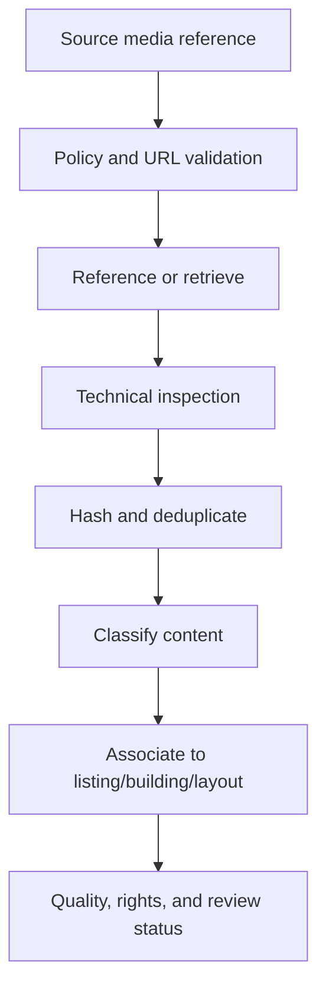

# NYC/NJ Rental Listing Agent — Media and Floor Plans

## 1. Document Control

| Field | Value |
| --- | --- |
| Status | Draft specification |
| Owner | CJ |
| Controlling documents | `00_PROJECT_OVERVIEW.md`, `01_PRODUCT_REQUIREMENTS.md`, `02_LISTING_DATA_SCHEMA.md`, `03_LISTING_ACQUISITION.md` |
| Primary dependents | `06_DATABASE_AND_REFRESH_PIPELINE.md`, `07_INTERNAL_UI.md`, `08_IMPLEMENTATION_PLAN.md` |

This document specifies acquisition, classification, storage, provenance, deduplication, quality evaluation, layout association, review, and export of listing photos and floor plans.

The system collects media for internal review. Collection does not itself establish permission to republish, alter, or use an asset in marketing. Marketing-use eligibility is a separate recorded decision.

## 2. Requirement Traceability

This specification primarily satisfies:

- `PR-ACQ-002`, `PR-ACQ-003`, `PR-ACQ-005`, and `PR-ACQ-006`
- `PR-DATA-002` through `PR-DATA-004`
- `PR-LAUNDRY-002`
- `PR-MEDIA-001` through `PR-MEDIA-003`
- `PR-REFRESH-002` through `PR-REFRESH-004`
- `PR-UI-003` through `PR-UI-005`
- `PR-EXPORT-001` and `PR-EXPORT-002`
- `PR-LLM-001` through `PR-LLM-005`
- `PR-NFR-002` through `PR-NFR-007`

## 3. Objectives

The media subsystem must:

1. Collect available apartment photos for eligible listings.
2. Collect an available floor plan for the relevant Studio, 1BR, or 2BR layout.
3. Support building/layout-class floor plans even when they do not match the exact unit.
4. Prevent building/layout floor plans from being presented as exact-unit plans.
5. Preserve source, observation, retrieval, association, and policy provenance.
6. Separate media collection from later marketing-use approval.
7. Detect exact and near-duplicate assets.
8. Classify unit, building, amenity, neighborhood, map, logo, and floor-plan media.
9. Evaluate technical quality without inventing visual facts.
10. Allow a capable multimodal hosted model to interpret media while enforcing deterministic file and metadata checks.
11. Handle inaccessible, expired, changed, or policy-restricted media without blocking textual inventory.
12. Avoid collecting or promoting broker/contact information found in image overlays or documents.

## 4. Non-Goals

This phase does not include:

- Generating new marketing images
- Adding rent, `室内洗烘`, location, or other text to images
- Writing ads or captions
- Automatically selecting a final marketing photo
- Automatically publishing media
- Removing ownership watermarks to make an asset appear unbranded
- Claiming that visual staging, dimensions, finishes, views, or appliances represent the exact unit without evidence
- Reconstructing a precise unit floor plan from photos
- Treating a building-level floor plan as an exact-unit plan

Later media composition may add monthly rent and `室内洗烘` when applicable. Location must not be added. That future workflow requires its own specification.

## 5. Key Distinctions

### 5.1 Collection versus use

| State | Meaning |
| --- | --- |
| Discovered | A source exposed a media reference. |
| Referenced | The URL/reference and provenance were recorded. |
| Stored | The bytes were retained under the source policy. |
| Reviewable | The internal UI can display a permitted rendition or source reference. |
| Marketing eligible | Policy/authorization and review permit later marketing use. |
| Selected | A human chose the asset for a later workflow. |

These states are independent. A stored or reviewable asset is not automatically marketing eligible or selected.

### 5.2 Media type versus association

- **Media type** describes what the asset appears to contain.
- **Association** describes which building, unit, listing, or layout it represents.
- **Use eligibility** describes what the system is permitted to do with it.

A floor plan may be correctly classified as `FLOOR_PLAN` but still have an uncertain layout association or lack marketing-use approval.

## 6. Media Policy Registry

Each listing source must have a versioned media policy connected to the source registry in `03_LISTING_ACQUISITION.md`.

### 6.1 Required policy fields

| Field | Required | Description |
| --- | --- | --- |
| `source_code` | Yes | Source identity. |
| `policy_version` | Yes | Versioned policy. |
| `discovery_allowed` | Yes | Whether media references may be collected. |
| `download_allowed` | Yes | Whether bytes may be retrieved. |
| `persistent_storage_allowed` | Yes | Whether bytes may be retained. |
| `reference_only` | Yes | Whether only source references may be stored. |
| `internal_display_allowed` | Yes | Whether the UI may display/cache a rendition. |
| `marketing_use_status` | Yes | `PERMITTED`, `REQUIRES_REVIEW`, `NOT_PERMITTED`, `UNKNOWN`. |
| `transformation_status` | Yes | Whether resizing/cropping/composition is permitted. |
| `attribution_requirement` | Yes | Required attribution behavior. |
| `retention_duration` | Yes | Maximum retention or reference-check period. |
| `watermark_handling` | Yes | Preserve/exclude/review rules. |
| `contact_overlay_handling` | Yes | Exclude/redact/review rules. |
| `allowed_domains` | Yes | Permitted asset hosts/CDNs. |
| `max_asset_size` | Yes | Retrieval safety limit. |
| `allowed_mime_types` | Yes | Permitted file types. |
| `approved_by` | Yes for enabled use | Internal reviewer. |
| `approved_at` | Yes for enabled use | Approval time. |

### 6.2 Policy precedence

The most restrictive applicable policy controls. An LLM, adapter, or human selection cannot override a source-level prohibition without an authorized policy change.

### 6.3 Unknown rights

If marketing-use rights are unknown:

- The asset may be referenced or displayed internally only if permitted.
- `marketing_use_status = UNKNOWN` or `REQUIRES_REVIEW`.
- The asset must not enter a later marketing-composition job automatically.

## 7. Media Data Model Extensions

The core `media_asset` and `media_association` entities are defined in `02_LISTING_DATA_SCHEMA.md`. The following extensions make media workflow state explicit.

### 7.1 Additional `media_asset` fields

| Field | Type | Required | Description |
| --- | --- | --- | --- |
| `source_media_id` | text | No | Source-native media identity. |
| `source_caption` | text | No | Source caption after contact exclusion. |
| `source_alt_text` | text | No | Source alt text after contact exclusion. |
| `final_url_hash` | text | No | Hash of canonicalized final URL. |
| `retrieval_status_code` | integer | No | HTTP-equivalent status where appropriate. |
| `original_filename` | text | No | Sanitized filename. |
| `color_space` | text | No | Detected color space. |
| `orientation` | integer | No | Normalized EXIF orientation if retained. |
| `page_count` | integer | No | PDF/multipage count. |
| `has_alpha` | boolean | No | Transparency metadata. |
| `animation_detected` | boolean | No | Whether multiple animation frames exist. |
| `technical_quality_status` | enum | Yes | `PENDING`, `PASS`, `WARNING`, `FAIL`. |
| `content_safety_status` | enum | Yes | `PENDING`, `PASS`, `WARNING`, `BLOCKED`. |
| `contact_overlay_status` | enum | Yes | `NOT_DETECTED`, `DETECTED`, `REDACTED_COPY_AVAILABLE`, `REVIEW_REQUIRED`, `BLOCKED`. |
| `watermark_status` | enum | Yes | `NONE_DETECTED`, `PRESENT`, `REVIEW_REQUIRED`, `UNKNOWN`. |
| `marketing_use_status` | enum | Yes | `PERMITTED`, `REQUIRES_REVIEW`, `NOT_PERMITTED`, `UNKNOWN`. |
| `marketing_selected` | boolean | Yes | Human-set only; default false. |
| `policy_expires_at` | timestamptz | No | When use/retention must be reevaluated. |

### 7.2 `media_variant`

Represents a non-original rendition produced for safe internal use.

| Field | Type | Required | Description |
| --- | --- | --- | --- |
| `media_variant_id` | UUID | Yes | Variant identity. |
| `media_asset_id` | UUID FK | Yes | Original asset. |
| `variant_type` | enum | Yes | `THUMBNAIL`, `PREVIEW`, `NORMALIZED`, `PDF_PAGE_RENDER`, `CONTACT_REDACTED_REVIEW_COPY`. |
| `storage_ref` | text | Yes | Stored variant reference. |
| `mime_type` | text | Yes | Variant MIME type. |
| `width_px` | integer | No | Width. |
| `height_px` | integer | No | Height. |
| `byte_size` | bigint | Yes | Size. |
| `content_hash` | text | Yes | Exact hash. |
| `transform_version` | text | Yes | Deterministic transform version. |
| `use_scope` | enum | Yes | `INTERNAL_REVIEW_ONLY`, `MARKETING_CANDIDATE`. |
| `created_at` | timestamptz | Yes | Creation. |

Creating a review copy does not change original rights or marketing-use status.

### 7.3 `media_analysis`

Stores structured rule/model analysis.

| Field | Type | Required | Description |
| --- | --- | --- | --- |
| `media_analysis_id` | UUID | Yes | Analysis identity. |
| `media_asset_id` | UUID FK | Yes | Asset. |
| `analysis_type` | enum | Yes | `TYPE_CLASSIFICATION`, `ROOM_CLASSIFICATION`, `FLOORPLAN_ANALYSIS`, `TEXT_DETECTION`, `CONTACT_DETECTION`, `QUALITY`, `DUPLICATE_SIMILARITY`. |
| `analysis_version` | text | Yes | Rule/model pipeline version. |
| `model_execution_id` | UUID FK | No | Required for model-derived analysis. |
| `result_json` | JSONB | Yes | Schema-validated result. |
| `confidence` | enum | Yes | `HIGH`, `MEDIUM`, `LOW`, `UNKNOWN`. |
| `validation_status` | enum | Yes | `PENDING`, `PASSED`, `WARNING`, `FAILED`. |
| `created_at` | timestamptz | Yes | Creation. |
| `superseded_at` | timestamptz | No | End of current analysis. |

### 7.4 `media_duplicate_group`

| Field | Type | Required | Description |
| --- | --- | --- | --- |
| `media_duplicate_group_id` | UUID | Yes | Group identity. |
| `duplicate_type` | enum | Yes | `EXACT`, `NEAR_DUPLICATE`, `DERIVATIVE`, `REVIEW_REQUIRED`. |
| `canonical_asset_id` | UUID FK | No | Preferred internal representative; not a marketing selection. |
| `method_version` | text | Yes | Hash/similarity method version. |
| `created_at` | timestamptz | Yes | Creation. |

### 7.5 `media_duplicate_member`

| Field | Type | Required | Description |
| --- | --- | --- | --- |
| `media_duplicate_group_id` | UUID FK | Yes | Group. |
| `media_asset_id` | UUID FK | Yes | Member. |
| `similarity` | numeric | No | Internal duplicate similarity, not a quality score. |
| `relationship` | enum | Yes | `EXACT`, `CROPPED`, `RESIZED`, `COMPRESSED`, `WATERMARK_VARIANT`, `COLOR_VARIANT`, `OTHER`. |
| `status` | enum | Yes | `AUTO_CONFIRMED`, `HUMAN_CONFIRMED`, `CANDIDATE`, `REJECTED`. |

## 8. Media Acquisition Workflow



### 8.1 Stage ordering

1. Persist the source media reference and observation association.
2. Resolve applicable media policy.
3. Validate scheme, domain, redirect, and size/type constraints.
4. Retrieve bytes only when permitted.
5. Quarantine and inspect the file before rendering or model input.
6. Normalize safe metadata and orientation.
7. Compute exact and perceptual signatures.
8. Detect duplicates.
9. Produce internal thumbnail/preview when permitted.
10. Classify media type and content.
11. Evaluate text/contact overlays and watermarks.
12. Associate to building/unit/listing/layout with evidence.
13. Set technical, content, policy, and marketing-use states.
14. Queue human review when required.

Each stage is independently retryable and records its input/version hash.

## 9. Discovery and Retrieval

### 9.1 Discovery inputs

The acquisition adapter may provide:

- Media source URL
- Source-native media ID
- Listing/building/unit/layout context
- Gallery order
- Caption/alt text
- CSS/DOM/structured-data locator
- Candidate type
- Source page and observation ID

### 9.2 URL validation

Before retrieval:

- Allow only `https` unless an explicit policy permits another scheme.
- Check source/CDN domain allowlist.
- Resolve redirects with a bounded maximum and revalidate each domain.
- Reject local, loopback, link-local, private-network, metadata-service, and unsupported schemes.
- Remove credentials and disallowed query secrets from stored/displayed URLs.
- Preserve identity-affecting transformation parameters.
- Enforce response size and timeout limits.

### 9.3 Retrieval behavior

- Stream to bounded temporary storage; do not trust declared content length alone.
- Determine type by file signature, not extension alone.
- Abort files exceeding policy limits.
- Compute the content hash during retrieval.
- Store original bytes only when permitted.
- Record expired, forbidden, not-found, or transient failures distinctly.
- Do not block the textual listing when media retrieval fails.

### 9.4 Reference-only sources

For a reference-only source:

- Store source URL/reference, caption metadata, provenance, and policy state.
- Do not persist bytes beyond an allowed transient inspection window.
- Internal UI display must follow the policy; hotlinking is not assumed permitted.
- Hashes/analysis requiring bytes may be unavailable.

## 10. Safe File Handling

### 10.1 Initial allowed formats

Subject to source policy:

- JPEG
- PNG
- WebP
- HEIC/HEIF only if the processing stack securely supports it
- PDF for floor plans only through sandboxed parsing/rendering

GIF, SVG, TIFF, archives, executable formats, and unknown formats are blocked initially unless separately reviewed.

### 10.2 Security controls

- Parse and render untrusted files in an isolated worker.
- Apply CPU, memory, page-count, pixel-count, and execution-time limits.
- Do not execute embedded scripts, links, forms, macros, or external resource loading.
- Strip unneeded metadata from generated internal previews.
- Do not preserve geolocation EXIF in review variants.
- Reject decompression bombs and malformed parser exploits.
- Run malware scanning when supported by the deployment.

### 10.3 PDF controls

- Render pages using a sandboxed PDF engine.
- Initial maximum page count is configurable; recommended default is 10.
- Do not follow embedded URLs.
- Extract text only for classification/contact detection under policy.
- Treat each rendered page as a variant linked to the original PDF.
- A multi-page brochure is not automatically a floor plan merely because one page contains a plan.

## 11. Exact and Near-Duplicate Detection

### 11.1 Exact duplicates

Use cryptographic content hash after byte retrieval. Identical hashes indicate identical bytes.

### 11.2 Normalized duplicates

To find recompressed/resized versions:

- Normalize orientation.
- Generate a controlled comparison rendition.
- Compute perceptual hashes or image embeddings under a versioned method.
- Compare dimensions/aspect ratio and crop relationship.

### 11.3 Candidate thresholds

Similarity thresholds must be calibrated using project media. Initial implementation must distinguish:

- Auto-confirmed exact duplicates
- High-similarity near-duplicate candidates
- Derivative/crop/watermark variants
- Visually similar but distinct rooms/plans

A stock building image shared across listings does not establish listing/unit identity by itself.

### 11.4 Duplicate representative

The canonical internal representative should prefer:

1. Policy-permitted stored asset
2. Higher technical resolution without corruption
3. Clearer source association
4. More permissive verified use status
5. Earlier stable provenance as a final tie-breaker

This choice is for storage/review efficiency, not automatic marketing selection.

## 12. Media Type Classification

### 12.1 Normative media types

- `UNIT_PHOTO`
- `BUILDING_PHOTO`
- `AMENITY_PHOTO`
- `NEIGHBORHOOD_PHOTO`
- `FLOOR_PLAN`
- `MAP`
- `LOGO`
- `OTHER`
- `UNKNOWN`

### 12.2 Classification evidence

May include:

- Source label/caption
- Gallery grouping
- Page context
- Visual model result
- OCR/text layout
- Aspect ratio and drawing features
- Repeated appearance across building listings
- Human confirmation

### 12.3 Type precedence

- Explicit source labeling plus visual consistency may be high-confidence.
- Visual classification alone may propose a type but remains model-derived.
- Conflicting source and visual evidence produces review/conflict status.
- A map-style graphic must not be classified as a floor plan merely because it contains lines and labels.

### 12.4 Room classification

Optional room labels may include living room, bedroom, kitchen, bathroom, exterior, lobby, gym, laundry room, roof, view, and other. Room labels assist review only and must not infer exact-unit association.

## 13. Multimodal LLM Role

### 13.1 Default hosted model tasks

The capable default multimodal model may:

- Classify media type
- Detect whether an image appears to be a floor plan
- Interpret source captions and page context
- Extract visible layout labels, bedroom counts, unit-type names, or dimensions
- Identify likely room/amenity content
- Detect likely text/contact overlays and watermarks
- Compare a floor plan’s visible labels with a Studio/1BR/2BR class
- Explain conflicting association evidence

### 13.2 Prohibited assumptions

The model must not:

- Claim exact-unit correspondence without explicit source evidence
- Treat staged/model-unit photos as exact-unit photos without evidence
- Infer installed in-unit washer/dryer solely from an unclear image
- Invent unreadable dimensions or room labels
- Remove or conceal ownership markings
- Determine legal marketing-use permission from visual appearance alone
- Fabricate stored-file, source, or retrieval status

### 13.3 Structured output

Media classification output must include:

```json
{
  "media_type": "FLOOR_PLAN",
  "layout_class_candidates": ["ONE_BEDROOM"],
  "visible_unit_labels": [],
  "visible_bedroom_count": 1,
  "contact_overlay_detected": false,
  "watermark_detected": true,
  "evidence": [],
  "confidence": "HIGH",
  "needs_review": true
}
```

The exact schema will be versioned. `needs_review` does not itself establish marketing eligibility.

### 13.4 Escalation

Escalate to the flagship model only when:

- Media type remains materially ambiguous.
- Floor-plan layout classification affects an in-scope association and evidence conflicts.
- Contact/watermark interpretation is unclear and affects use eligibility.
- The default model repeatedly fails the structured contract.
- A complex multipage document requires consequential visual-text comparison.

If flagship output remains uncertain, use human review. Do not repeatedly regenerate.

## 14. Technical Quality Evaluation

### 14.1 Deterministic checks

Check:

- Decodability
- MIME/file-signature agreement
- Width, height, aspect ratio, and pixel count
- File/page count and byte size
- Extreme blur using calibrated metric
- Near-blank or single-color content
- Severe corruption/truncation
- Upscaling indicators where detectable
- Orientation
- Duplicate status

### 14.2 Model-assisted checks

The model may identify:

- Obstruction
- Screenshot/browser chrome
- Collage or contact sheet
- Heavy text overlay
- Unusable crop
- Visually misleading content type
- Floor-plan legibility

### 14.3 Quality outcome

| Status | Meaning |
| --- | --- |
| `PASS` | Technically usable for internal review. |
| `WARNING` | Reviewable but has material limitation. |
| `FAIL` | Cannot be safely decoded or is unusable. |
| `PENDING` | Not evaluated. |

Quality status is not a listing score and does not establish marketing permission.

### 14.4 Initial display thresholds

Thresholds are calibration inputs, not final hard promises:

- Minimum review thumbnail source dimension: 400 px on shortest side where available
- Marketing-candidate warning below 1,200 px on longest side
- Floor-plan legibility depends on readable labels/lines, not only dimensions
- PDF page render target: sufficient resolution for internal review without preserving unsafe active content

Assets below thresholds may remain reviewable with warnings if they are the only available evidence.

## 15. Contact Overlays, Watermarks, and Attribution

### 15.1 Contact overlay detection

Detect visible:

- Phone numbers
- Email addresses
- Agent/broker contact blocks
- QR codes likely leading to contact/lead pages
- Social/contact handles when clearly presented for outreach

Detection may use OCR, pattern rules, QR inspection in a safe isolated process, and visual classification.

### 15.2 Handling

- Do not extract contact details into canonical/search/export fields.
- Mark the asset’s contact-overlay status.
- Exclude the original from automatic later marketing handoff when contact overlay is detected.
- A redacted internal review copy may be created only if policy permits.
- Redaction for later marketing requires separate authorization and must not remove required ownership attribution.

### 15.3 Watermarks

- Preserve source watermark status.
- Do not automatically remove ownership/source watermarks.
- A watermark may be permitted, required, disqualifying, or review-required under the source policy.
- Watermark presence does not establish exact-unit association.

### 15.4 QR codes

Do not automatically navigate to QR destinations during classification. If inspection is required, decode in isolation, validate domain, and record only safe classification metadata—not contact details.

## 16. Photo Association Rules

### 16.1 Association levels

Use the normative values from `media_association.association_level`:

- `EXACT_UNIT_SOURCE_CONFIRMED`
- `SOURCE_UNIT_TYPE_CONFIRMED`
- `BUILDING_LAYOUT_CLASS`
- `BUILDING_GENERAL`
- `LISTING_SOURCE_ASSOCIATED`
- `UNCERTAIN_CANDIDATE`

### 16.2 Exact-unit photo

An asset may be exact-unit confirmed only when the source explicitly connects the gallery/asset to the identified unit and there is no material contradictory disclaimer such as “photos of similar unit.”

### 16.3 Listing-associated photo

A photo on a listing page may use `LISTING_SOURCE_ASSOCIATED` when it is unclear whether it depicts the precise unit, a model unit, or the building. The UI must not strengthen that claim.

### 16.4 Building/general photo

Exterior, lobby, gym, roof, lounge, and other building amenities use building/general scope unless explicit unit evidence exists.

### 16.5 Similar/model-unit disclaimer

Source language such as “photos may be of a similar unit,” “representative,” “model residence,” or “virtually staged” must be retained as association evidence and displayed where relevant.

## 17. Floor-Plan Model

### 17.1 Project-specific rule

The project intentionally accepts a floor plan as a marketing asset when it corresponds to the relevant Studio, 1BR, or 2BR layout in the same building, even if it does not match the exact unit.

The association level and disclaimer must remain explicit.

### 17.2 Floor-plan association hierarchy

From strongest to weakest:

1. `EXACT_UNIT_SOURCE_CONFIRMED`
2. `SOURCE_UNIT_TYPE_CONFIRMED`
3. `BUILDING_LAYOUT_CLASS`
4. `UNCERTAIN_CANDIDATE`

`BUILDING_GENERAL` without a layout class is insufficient for normal floor-plan marketing handoff.

### 17.3 Exact-unit evidence

Exact-unit association requires at least one explicit source link such as:

- Unit number printed on the plan and matching the canonical unit
- Source structured field tying the asset to the unit
- Unit-specific page/gallery explicitly identifying the plan
- Human-confirmed authoritative building document

Visual similarity, bedroom count, price, or page proximity alone is insufficient.

### 17.4 Source unit-type evidence

May include:

- Named floor-plan type linked by the source to the listing
- Source unit-type ID shared by listing and plan
- Building availability table linking a unit to a plan/type

### 17.5 Building-layout evidence

Requires:

- Same confirmed building
- Visible or source-stated Studio/1BR/2BR compatibility
- No conflicting bedroom count
- No evidence that the plan belongs to another property
- Source/provenance retained

Exact dimensions, orientation, line, floor, view, or finishes may differ and must not be represented as the listed unit’s attributes.

## 18. Floor-Plan Extraction and Validation

### 18.1 Candidate detection

A floor-plan candidate may come from:

- Listing gallery
- Building gallery
- Source floor-plan tab
- Source unit-type page
- Approved property/building site
- PDF brochure
- Manually approved import

### 18.2 Extracted fields

Where visible and reliable:

- Printed unit/floor-plan type name
- Printed unit number
- Bedroom count
- Bathroom count
- Room labels
- Stated area/square footage
- Stated dimensions
- Balcony/terrace notation
- Washer/dryer symbol/text as visual evidence only
- Orientation/floor labels
- Source disclaimer

These are assertions tied to the media asset. They do not automatically overwrite canonical listing facts.

### 18.3 Layout compatibility

| Canonical listing layout | Normally compatible floor-plan class |
| --- | --- |
| `STUDIO` | Studio/alcove-studio plan |
| `ONE_BEDROOM` | One-bedroom plan |
| `TWO_BEDROOM` | Two-bedroom plan |

Home office, den, flex, junior, railroad, and convertible labels require retained qualifiers and may require review.

### 18.4 Conflict rules

Blocking association conflicts include:

- Different building/property
- Different normalized bedroom class
- Printed unit number inconsistent with an exact-unit claim
- Source disclaimer explicitly saying a different unit/type
- Plan is actually a site map, amenity map, or evacuation plan

Dimension or orientation differences do not necessarily block a building-layout association, but they prevent exact-unit claims unless explicitly resolved.

### 18.5 Confidence and status

| Association | Minimum normal confidence | Review expectation |
| --- | --- | --- |
| Exact unit | High with explicit evidence | Review if any conflict/disclaimer |
| Source unit type | High/medium with structured source link | Review on mismatch |
| Building layout class | Medium or high | Acceptable for internal review; later marketing eligibility still separate |
| Uncertain candidate | Low/unknown | Human review required before later use |

## 19. Floor-Plan Selection for a Listing

### 19.1 Candidate ordering

Use deterministic lexicographic ordering, not a hidden score:

1. Marketing-use status: permitted before review-required/unknown
2. Association level: exact unit, source unit type, building layout
3. Association status: confirmed before provisional/candidate
4. Layout compatibility without conflict
5. Technical quality and legibility
6. Source recency/provenance completeness
7. Stable tie-breaker

### 19.2 Human selection

The UI may label one plan as the current preferred candidate only after human selection or under an explicitly reviewable default. Automatic candidate ordering must not be confused with approval for marketing use.

### 19.3 Required disclaimer

For `BUILDING_LAYOUT_CLASS`, display and export:

> Representative floor plan for this building and layout class; it may not match the exact unit.

Equivalent concise wording may be used in the UI, but the meaning must remain.

### 19.4 Missing plan

If no compatible floor plan is available:

- Store floor-plan enrichment as unavailable/not found with search time and sources checked.
- Do not generate or infer a plan.
- Allow later retry when source media changes.
- Do not block the listing from inventory or manual selection.

## 20. Laundry Evidence from Media

### 20.1 Evidence status

Media may contribute a laundry assertion only when:

- The asset association is sufficiently reliable.
- Washer/dryer equipment or notation is clearly visible.
- The model output includes localized evidence and confidence.
- Deterministic/business validation accepts the assertion.

### 20.2 Badge restriction

Media-only evidence does not initially set `IN_UNIT_WASHER_DRYER_CONFIRMED` or `indoor_laundry_badge_eligible` automatically. It creates a reviewable supporting assertion.

This conservative rule may be changed only after a labeled visual evaluation proves acceptable precision and the affected documents are updated.

### 20.3 Floor-plan symbols

A `W/D` symbol or appliance drawing may support an in-unit laundry candidate, but it does not prove installed equipment for the listed unit when the plan is only building-layout associated.

## 21. Marketing Eligibility and Selection

### 21.1 Eligibility states

| Status | Meaning |
| --- | --- |
| `PERMITTED` | Recorded policy/authorization permits intended later use. |
| `REQUIRES_REVIEW` | Use may be possible but needs human/policy confirmation. |
| `NOT_PERMITTED` | Must not be passed to marketing workflow. |
| `UNKNOWN` | No reliable use determination exists. |

### 21.2 Eligibility conditions

An asset may be `PERMITTED` only when:

- Source/media policy allows the intended use.
- Attribution/watermark obligations can be met.
- Contact overlay does not block use.
- The asset is technically usable.
- Association/disclaimer requirements are satisfied.
- No active blocking review issue exists.

### 21.3 Human selection invariant

`marketing_selected = true` is a human action. Acquisition, media classification, candidate ordering, or LLM analysis must never select an asset automatically.

### 21.4 Future handoff boundary

A future composition workflow may receive only:

- Human-selected listing
- Human-selected or explicitly approved media
- Verified monthly rent
- `indoor_laundry_badge_eligible`
- Required provenance/disclaimer/attribution metadata

Location text must not be included in the generated image.

## 22. Storage Architecture

### 22.1 Object storage

Subject to policy, persistent media bytes should use private object storage associated with Supabase or another approved provider. PostgreSQL stores metadata and object references, not large image bytes.

### 22.2 Suggested object key pattern

```text
media/{source_code}/{yyyy}/{mm}/{media_asset_id}/original
media/{source_code}/{yyyy}/{mm}/{media_asset_id}/variants/{variant_type}/{transform_version}
```

Object keys must not contain addresses, unit numbers, contact data, signed URL tokens, or unsanitized source filenames.

### 22.3 Access

- Buckets are private by default.
- UI obtains short-lived authorized access.
- Signed URLs are not stored in canonical rows or exported.
- Original and variant permissions may differ.
- Service roles follow least privilege.

### 22.4 Integrity

- Verify stored byte count and content hash.
- Use idempotent object writes.
- Prevent one asset record from silently pointing to changed bytes.
- If source content changes at the same URL, create a new asset/version relationship rather than overwriting history.

## 23. Refresh and Change Detection

### 23.1 Media set comparison

Compare source media using:

- Source media ID
- Canonicalized URL/reference
- Content hash when retrievable
- Perceptual relationship
- Source order/caption changes

### 23.2 Change classes

- `MEDIA_ADDED`
- `MEDIA_REMOVED_FROM_SOURCE`
- `MEDIA_BYTES_CHANGED`
- `MEDIA_ORDER_CHANGED`
- `MEDIA_CAPTION_CHANGED`
- `MEDIA_ASSOCIATION_CHANGED`
- `MEDIA_POLICY_CHANGED`
- `MEDIA_UNCHANGED`

Order-only changes are normally non-material for enrichment unless the primary/source-designated image changes.

### 23.3 Removal

When a source removes an asset:

- Mark source availability appropriately.
- Retain metadata/history under policy.
- Delete bytes only when retention policy requires it.
- Do not silently transfer association to another listing.
- Warn if a selected/eligible asset becomes unavailable or prohibited.

### 23.4 Re-enrichment

Trigger targeted work when:

- New media appears
- Bytes at a source URL change
- Layout/listing/building identity changes
- Media policy changes
- Analysis/model version requires reevaluation
- Human requests review

Price-only or commute-only listing changes do not trigger media reprocessing.

## 24. Failure Handling

### 24.1 Retrieval failures

Distinguish:

- Not found/expired
- Access forbidden
- Policy restricted
- Unsupported type
- Oversized asset
- Timeout/network error
- Redirect/domain violation
- Malformed/corrupt file
- Storage failure

### 24.2 Analysis failures

- Deterministic decode failure: block analysis and mark technical failure.
- Default-model schema failure: one repair attempt.
- Consequential classification ambiguity: flagship escalation once.
- Remaining ambiguity: human review.
- OCR/contact uncertainty: block automatic marketing eligibility until reviewed.

### 24.3 Partial success

One failed asset must not fail the listing’s remaining media. A listing with some photos and no floor plan remains a valid partially enriched listing.

## 25. Job and Idempotency Contract

Media job types use the `job` entity:

- `MEDIA_FETCH`
- `MEDIA_CLASSIFY`
- `FLOORPLAN_MATCH`

Additional implementation subtypes may include inspect, hash, preview, OCR/contact detection, and policy evaluation.

Idempotency keys must include:

- Media reference/content identity
- Source policy version
- Transform/analysis version
- Model/prompt/schema version where applicable
- Relevant listing/building/layout association version

An unchanged asset must not be re-downloaded or reanalyzed merely because another weekday refresh ran.

## 26. Observability

### 26.1 Required metrics

- Media references discovered by source/type
- Reference-only versus retrieval-eligible assets
- Retrieval attempts, cache hits, failures, and bytes
- Exact/near-duplicate counts
- Type-classification outcomes and confidence
- Floor-plan candidates by association level
- Listings with no photos or no compatible floor plan
- Contact-overlay and watermark detections
- Technical-quality failures/warnings
- Marketing permitted/review/blocked/unknown counts
- Default and flagship model calls/cost
- Human review backlog
- Expired/policy-invalidated selected assets

### 26.2 Alerts

Alert on:

- Sudden media-reference disappearance for one source
- Retrieval denial spike
- Unexpected type/MIME change
- Malformed-file spike
- Contact-detection failure
- Floor-plan classification drift
- Storage quota/error threshold
- Selected asset becoming unavailable or not permitted

## 27. Internal UI Requirements

### 27.1 Gallery

The listing detail UI must:

- Group or filter unit, building, amenity, neighborhood, floor-plan, and unknown media
- Show source and observation provenance
- Show association level and status
- Show technical/policy warnings
- Avoid exposing contact details detected in assets where a safe review copy is required
- Distinguish unavailable/reference-only media

### 27.2 Floor-plan display

Show:

- Plan preview when permitted
- Layout class
- Exact-unit/source-unit-type/building-layout association
- Source and date
- Confidence/review status
- Dimensions/area only as source/media assertions
- Required representative-plan disclaimer
- Marketing-use status

### 27.3 Review actions

The operator may:

- Confirm or correct media type
- Confirm/reject association
- Select preferred floor-plan candidate
- Flag incorrect building/layout match
- Set or confirm marketing-use status only with appropriate permission
- Select/deselect marketing media
- Request retry/reclassification
- Add an internal note

Actions must be auditable and survive refresh.

### 27.4 No automatic marketing selection

Gallery order, technical quality, LLM confidence, duplicate representative, or candidate ordering must not automatically select media for marketing.

## 28. CSV and Export Behavior

### 28.1 Listing summary export

May include:

- Photo count
- Unit-photo candidate count
- Floor-plan availability
- Preferred floor-plan association level
- Media enrichment status
- Contact/watermark warning flags
- Marketing-eligible/selected media counts

### 28.2 Media companion export

Keyed by `canonical_listing_id`, include policy-permitted:

- `media_asset_id`
- Media type
- Source reference or stable internal identifier
- Association level/status
- Layout class
- Technical quality
- Contact/watermark status
- Marketing-use and selection status
- Provenance timestamps
- Required disclaimer

Do not export temporary signed URLs, raw contact detections, secrets, or unapproved original bytes.

## 29. Retention and Cleanup

- Metadata/history follow canonical retention requirements.
- Original bytes and variants follow the source media policy.
- Expired assets retain metadata tombstones where permitted.
- Temporary retrieval/quarantine files are deleted after bounded processing.
- Orphaned variants are detected and cleaned under audited jobs.
- A policy change may require deletion of stored bytes while retaining the permitted provenance record.
- Hard deletion must be scoped to explicit asset IDs and policy reason; it must not cascade-delete canonical listing history.

## 30. Security and Prompt-Injection Resistance

- Treat images, OCR text, captions, PDF text, metadata, filenames, and QR content as untrusted data.
- Never execute or follow instructions embedded in media.
- Do not allow media content to request tools, reveal secrets, change policy, contact anyone, or navigate outside approved domains.
- Validate all model tool arguments outside the model.
- Use sandboxed parsing and rendering.
- Strip unsafe metadata from generated internal variants.
- Keep originals private.
- Prevent model output from setting policy or marketing permission without validation.

## 31. Open Decisions

| Decision | Required before |
| --- | --- |
| Source-by-source media storage and marketing-use policy | Enabling each source adapter |
| Supabase Storage versus another object store | Media persistence implementation |
| Exact MIME, byte, pixel, and PDF-page limits | Retrieval worker implementation |
| Perceptual hash/embedding methods and thresholds | Near-duplicate rollout |
| Default and flagship multimodal model IDs | Media classification implementation |
| OCR and QR-detection components | Contact-overlay implementation |
| Human authority for setting marketing-use status | Internal UI implementation |
| Calibration thresholds for floor-plan classification/association | Production floor-plan matching |
| Whether media-only laundry can ever confirm badge eligibility | Future evaluation; initially no |
| Exact retention durations | Production operations |

## 32. Media Acceptance Tests

The specification is satisfied when tests demonstrate:

1. A source media reference is persisted with source observation and policy provenance.
2. Reference-only policy prevents persistent byte storage.
3. Disallowed domains, redirects, formats, oversized files, and private-network URLs are blocked.
4. Corrupt or malicious media cannot execute active content or crash the pipeline outside bounded isolation.
5. Exact duplicate assets are grouped without losing source associations.
6. Cropped/resized variants can become reviewable near-duplicate candidates without merging distinct rooms automatically.
7. Unit, building, amenity, neighborhood, map, logo, floor-plan, and unknown types remain distinguishable.
8. A listing can enter inventory even when every media fetch fails.
9. One failed media asset does not block other assets.
10. Exact-unit photo/plan status requires explicit source evidence.
11. A listing-page photo with “similar unit” language is not labeled exact-unit.
12. A same-building same-layout floor plan can attach as `BUILDING_LAYOUT_CLASS`.
13. A 1BR listing cannot receive a conflicting 2BR plan without blocking/review status.
14. A building-layout plan displays the representative-plan disclaimer.
15. A site map or evacuation plan is not accepted as an apartment floor plan.
16. Visible floor-plan dimensions remain media assertions and do not silently overwrite listing facts.
17. Media-only washer/dryer evidence cannot automatically enable `室内洗烘`.
18. Contact overlays do not create contact fields and block automatic marketing handoff.
19. Watermarks are not automatically removed.
20. Marketing-use permission is independent of storage and technical quality.
21. Only a human can set marketing media selected state.
22. Unchanged media is not downloaded/reanalyzed every weekday.
23. Changed bytes at the same source URL create versioned history rather than silent overwrite.
24. Source removal or policy change can invalidate an asset without deleting listing history.
25. Default-model ambiguity can escalate once to a flagship model, then reaches human review.
26. PDF floor-plan rendering is sandboxed and does not execute links/scripts.
27. UI and CSV expose association/use warnings but no temporary signed URLs or contact data.
28. Later handoff contains rent and confirmed indoor-laundry eligibility but excludes location text and performs no composition in this phase.

## 33. Change Log

| Date | Change |
| --- | --- |
| 2026-08-16 | Initial media and floor-plan specification created from the project overview, product requirements, canonical data schema, and acquisition specification. |
