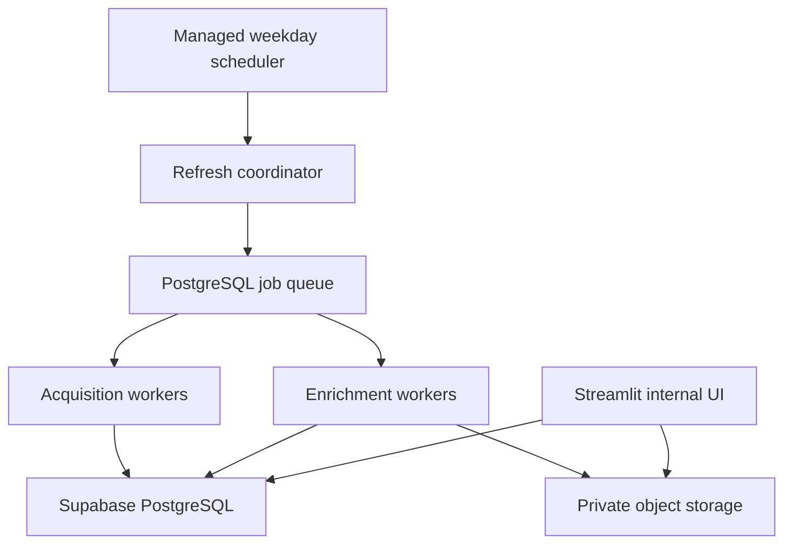
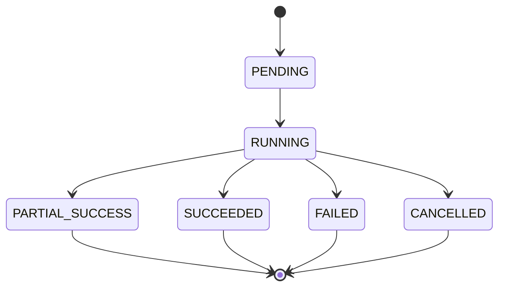
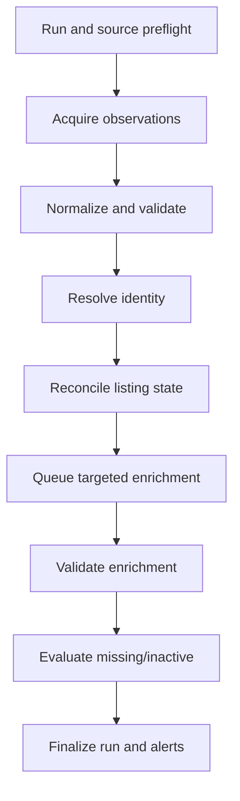
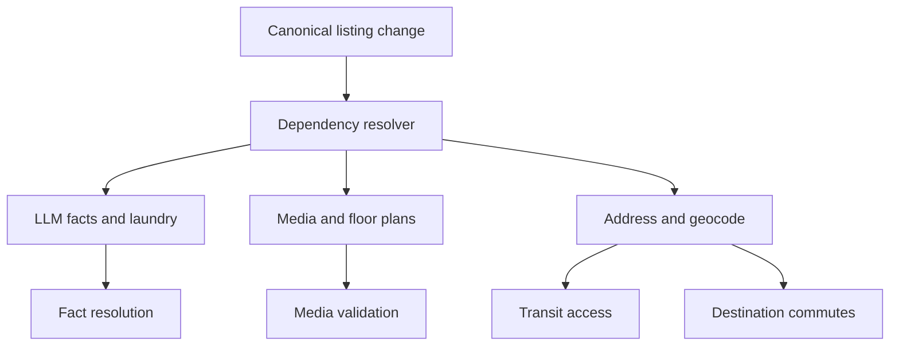

# NYC/NJ Rental Listing Agent — Database and Refresh Pipeline

## 1. Document Control

| Field | Value |
| --- | --- |
| Status | Draft specification |
| Owner | CJ |
| Controlling documents | `00_PROJECT_OVERVIEW.md` through `05_MEDIA_AND_FLOORPLANS.md` |
| Primary dependents | `07_INTERNAL_UI.md`, `08_IMPLEMENTATION_PLAN.md` |
| Primary database | PostgreSQL / Supabase |

This document defines the physical persistence approach, database responsibilities, weekday scheduling, pipeline orchestration, job execution, reconciliation, inactivity policy, retries, observability, exports, access control, backup, and operational recovery.

## 2. Requirement Traceability

This specification primarily satisfies:

- `PR-ACQ-002` through `PR-ACQ-006`
- `PR-DATA-001` through `PR-DATA-004`
- `PR-MEDIA-001` through `PR-MEDIA-003`
- `PR-LOC-001`
- `PR-TRANSIT-001` through `PR-TRANSIT-005`
- `PR-COMMUTE-001` through `PR-COMMUTE-005`
- `PR-REFRESH-001` through `PR-REFRESH-004`
- `PR-UI-004` through `PR-UI-006`
- `PR-EXPORT-001` and `PR-EXPORT-002`
- `PR-LLM-001` through `PR-LLM-005`
- `PR-NFR-001` through `PR-NFR-008`

## 3. Architecture Decision

### 3.1 Recommended initial architecture

Use:

- **Supabase PostgreSQL** as the authoritative relational database.
- **PostGIS** in PostgreSQL for geographic points, boundaries, and nearby-stop queries.
- **Private object storage**, preferably Supabase Storage initially, for policy-permitted media and raw artifacts.
- **Containerized Python coordinator/workers** for acquisition, browser automation, LLM calls, media processing, routing, and reconciliation.
- **One managed weekday scheduler** to start the refresh coordinator.
- **PostgreSQL-backed job queue** for the initial internal system, avoiding a separate broker until measured load requires one.
- **Streamlit** as the internal review client, reading/writing through a controlled data-access layer.

### 3.2 Why this architecture

- PostgreSQL supports canonical identity, history, provenance, transactions, spatial queries, and operational state in one system.
- Supabase reduces database, authentication, and object-storage setup.
- A scheduled container can run browser and media workloads that are unsuitable for short edge-function limits.
- A PostgreSQL queue is sufficient for one internal tool and preserves auditability without early infrastructure complexity.
- Components remain replaceable: scheduler, compute host, model provider, routing provider, and object store are behind interfaces.

### 3.3 Deployment boundary



The implementation may run coordinator and workers in one container initially, but their code and persisted states must remain logically separated.

## 4. Environment Separation

Maintain at least:

- `development`: local/sandbox database, fixtures, no production scheduler.
- `staging`: production-like schema and minimal approved live-source smoke tests.
- `production`: authoritative internal inventory and weekday schedule.

Each environment must use separate:

- Database project/schema
- Object-storage buckets
- API/model/provider credentials
- Browser sessions where applicable
- Scheduler configuration
- Webhook/alert destinations

Production data must not be copied into development without an approved sanitized export.

## 5. PostgreSQL Extensions and Conventions

### 5.1 Required or recommended extensions

Subject to Supabase availability:

- `pgcrypto` or native UUID generation
- `postgis`
- `pg_trgm` for controlled fuzzy address/name candidate generation
- `citext` only where case-insensitive identity semantics are appropriate
- `pg_cron` optionally for database housekeeping, not as the browser-acquisition runtime

### 5.2 Schema namespaces

Recommended logical namespaces:

| Schema | Responsibility |
| --- | --- |
| `app` | Canonical listings, sources, facts, media metadata, transit, destinations, selections, reviews |
| `ops` | Refresh runs, source runs, jobs, attempts, errors, alerts, exports |
| `raw` | Policy-permitted source/provider artifact metadata or references |
| `config` | Versioned source, model, destination, policy, and validation configuration |
| `audit` | Append-only human/admin change records |

If the MVP uses one schema, table naming must preserve these boundaries and migrations must allow later separation.

### 5.3 General column conventions

- UUID primary keys
- `timestamptz` stored in UTC
- `created_at` and `updated_at` on mutable records
- Append-only records use `recorded_at` and do not rely on `updated_at`
- Integer minor units for money
- Integer seconds/meters for durations/distances
- JSONB only for versioned variable payloads, not as a substitute for queryable core columns
- Foreign keys for canonical relationships
- Check constraints for invariants

## 6. Physical Table Groups

The physical schema implements the logical entities in `02_LISTING_DATA_SCHEMA.md` and media extensions in `05_MEDIA_AND_FLOORPLANS.md`.

### 6.1 Configuration tables

- `config.source_policy`
- `config.media_policy`
- `config.model_task_policy`
- `config.routing_provider_policy`
- `config.destination_registry_version`
- `config.validation_rule_version`
- `config.schedule_configuration`

Configuration changes are versioned and audited. Production runs snapshot applicable configuration versions.

### 6.2 Acquisition and raw observation tables

- `app.source`
- `ops.refresh_run`
- `ops.source_run`
- `raw.source_observation`
- `raw.source_capture`
- `raw.source_media_reference`
- `ops.adapter_checkpoint`

Raw bytes may live in private object storage; database rows hold permitted metadata and references.

### 6.3 Canonical inventory tables

- `app.address`
- `app.address_assertion`
- `app.building`
- `app.unit`
- `app.canonical_listing`
- `app.listing_source_link`
- `app.canonical_merge`
- `app.duplicate_candidate`

### 6.4 Facts and history tables

- `app.fact_assertion`
- `app.fact_resolution`
- `app.amenity_definition`
- `app.amenity_assertion`
- `app.listing_event`
- `app.listing_field_history`

### 6.5 Model and provider tables

- `ops.model_execution`
- `ops.provider_request`
- `ops.job`
- `ops.job_attempt`
- `ops.job_dependency`

### 6.6 Media tables

- `app.media_asset`
- `app.media_variant`
- `app.media_association`
- `app.media_analysis`
- `app.media_duplicate_group`
- `app.media_duplicate_member`

### 6.7 Transit and commute tables

- `app.transit_stop`
- `app.transit_route`
- `app.transit_stop_route`
- `app.transit_service_calendar`
- `app.transit_access`
- `app.transit_access_route`
- `app.destination`
- `app.commute_result`

### 6.8 Review and export tables

- `app.human_override`
- `app.review_issue`
- `app.marketing_selection`
- `audit.action_log`
- `ops.export_run`
- `ops.export_artifact`

## 7. Indexing Strategy

### 7.1 Canonical identity indexes

- Unique `source.source_code`
- Conditional unique source-native identity on `listing_source_link`
- B-tree on normalized address fingerprint
- B-tree on `(building_id, unit_fingerprint)`
- Trigram indexes on approved normalized address/building fields used for candidate generation
- B-tree on current canonical listing lifecycle/layout/rent/last-seen fields

Fuzzy indexes generate candidates only. They do not bypass identity validation.

### 7.2 Geographic indexes

- GiST/SP-GiST index on `address.location_point`
- GiST index on municipal/borough boundary geometries
- GiST/SP-GiST index on `transit_stop.location_point`
- GiST/SP-GiST index on `destination.routing_anchor_point`

### 7.3 Operational indexes

- Partial index on claimable `ops.job(status, priority, next_attempt_at)`
- Index on `ops.job(canonical_listing_id, job_type)`
- Index on `source_run(refresh_run_id, source_id)`
- Index on observations by `(source_id, source_native_id, observed_at desc)`
- Index on source links by `(source_id, link_status, last_seen_at)`
- Index on open review issues by severity/status
- Index on current marketing selection state

### 7.4 History and provenance indexes

- Listing events by `(canonical_listing_id, event_time desc)`
- Fact assertions by `(entity_type, entity_id, fact_key, asserted_at desc)`
- Partial unique current fact resolution
- Model execution cache key
- Provider request cache key
- Media exact hash and perceptual candidate indexes

### 7.5 Index review

Do not add every possible index initially. Capture slow queries and table growth, then add or adjust indexes through migrations. Indexes that enforce identity/invariants are mandatory from the first applicable migration.

## 8. Partitioning and Retention Layout

### 8.1 Initial approach

Do not partition small tables prematurely. Consider time-based monthly partitioning when measured volume justifies it for:

- Source observations/captures
- Model executions
- Provider requests
- Job attempts
- Listing events
- Audit logs

### 8.2 Partitioning trigger

Partitioning becomes an implementation task when one or more apply:

- Table size materially affects weekday refresh or UI queries
- Retention/deletion by time becomes operationally expensive
- Index maintenance becomes excessive
- Backup/restore tests show unacceptable recovery time

### 8.3 Retention

Retention durations are controlled by source/provider/media policies. Canonical listings, source-link history, listing events, human overrides, selections, and merge history are retained unless explicitly deleted through an authorized administrative process.

## 9. Scheduler Specification

### 9.1 Fixed weekday schedule

Initial production schedule:

| Setting | Value |
| --- | --- |
| Days | Monday through Friday |
| Start time | 6:00 AM |
| Time zone | `America/New_York` |
| Normal completion target | 9:00 AM |
| Hard run deadline | 11:30 AM |
| Weekend scheduled run | None |
| Holiday behavior | Run on weekdays unless explicitly paused in configuration |

This is a proposed operational default chosen to make refreshed inventory available in the morning. It remains configuration and may be changed without schema changes.

### 9.2 Daylight saving time

Use the IANA time zone, not a fixed UTC offset. The scheduler must preserve 6:00 AM local time across daylight-saving changes.

### 9.3 Scheduler ownership

Exactly one production scheduler owns recurring refresh creation. Database cron, CI schedules, and cloud schedules must not all independently trigger the same logical run.

### 9.4 Scheduled-run idempotency

Use a unique logical key such as:

```text
weekday_inventory_refresh:{America/New_York local date}:{schedule_version}
```

Duplicate triggers return the existing run rather than creating a second refresh.

### 9.5 Manual runs

Manual runs may target:

- Full inventory
- One source
- One source partition
- One canonical listing
- One enrichment type
- One failed job/replay

Manual runs must be labeled and must not interfere with the active scheduled run. A concurrency policy determines whether they queue, join, or are rejected.

## 10. Refresh Run State Machine



### 10.1 Run creation

The coordinator transactionally:

1. Acquires the schedule idempotency key.
2. Creates `refresh_run`.
3. Snapshots enabled sources and configuration versions.
4. Creates one `source_run` per enabled source.
5. Enqueues preflight/source planning jobs.

### 10.2 Terminal status

- `SUCCEEDED`: every required source/stage succeeded or was explicitly not applicable; no blocking operational failure remains.
- `PARTIAL_SUCCESS`: useful inventory was updated but one or more sources/enrichments failed/deferred.
- `FAILED`: the run could not safely perform its core inventory function.
- `CANCELLED`: authorized cancellation stopped further work.

Partial success must never be displayed as full success.

## 11. Pipeline Stages



### 11.1 Stage barriers

Hard global barriers are avoided when safe. One source may proceed to canonical reconciliation while another is retrying. However:

- Source health must be terminal before its absence evidence is evaluated.
- Identity resolution must precede listing-level enrichment.
- Valid address/geocode must precede transit/commute enrichment.
- Media retrieval must precede byte-level classification.
- All required source-run summaries must be terminal before final refresh status.

### 11.2 Partial progress

Every completed observation and enrichment commits independently under transaction/idempotency rules. A late failure must not roll back unrelated successful sources.

## 12. PostgreSQL-Backed Job Queue

### 12.1 Claiming jobs

Workers claim jobs transactionally using a pattern equivalent to:

```sql
SELECT job_id
FROM ops.job
WHERE status IN ('PENDING', 'FAILED_RETRYABLE')
  AND next_attempt_at <= now()
  AND (lease_expires_at IS NULL OR lease_expires_at < now())
ORDER BY priority DESC, created_at ASC
FOR UPDATE SKIP LOCKED
LIMIT :batch_size;
```

Claim updates status, worker identity, lease token, lease expiration, and attempt record in the same transaction.

### 12.2 Required queue fields

In addition to `02_LISTING_DATA_SCHEMA.md`:

- `lease_token`
- `leased_by`
- `lease_expires_at`
- `heartbeat_at`
- `cancellation_requested_at`
- `terminal_reason`

### 12.3 Lease behavior

- Workers heartbeat before lease expiry.
- A lost worker’s expired lease returns the job to retryable state under attempt limits.
- Completion requires the current lease token.
- Long LLM/browser/media calls must use a lease longer than expected call duration or heartbeat safely.

### 12.4 Job priorities

Initial priority order:

1. Run/source preflight and acquisition blockers
2. New listing normalization/identity/reconciliation
3. New listing core enrichment
4. Changed listing dependency enrichment
5. Missing/inactivity verification
6. Retryable failures
7. Stale refresh/backfill
8. Optional maintenance/export

Priority is operational only and must not function as listing quality or marketing ranking.

### 12.5 Dependencies

Use explicit `job_dependency` rows or versioned prerequisite checks. A blocked prerequisite leaves the dependent job `BLOCKED`, not repeatedly retrying.

## 13. Transaction Boundaries

### 13.1 Observation persistence

One transaction should persist:

- Source observation envelope
- Parsed payload/evidence references
- Media references
- Observation validation outcome
- Canonical-handoff job

Raw object upload may occur before the transaction; use staged object state and cleanup on transaction failure.

### 13.2 Canonical reconciliation

One listing reconciliation transaction should:

- Lock relevant source link/canonical listing rows
- Apply or create identity link
- Insert new fact assertions
- Resolve effective facts
- Update materialized current fields
- Append listing event/history rows
- Update freshness/lifecycle candidates
- Enqueue dependency-invalidated jobs through an outbox or same-transaction queue insert

### 13.3 External calls

Do not hold database transactions open while calling listing sites, LLMs, routing providers, geocoders, or downloading media.

Persist request intent/idempotency state, perform the external call, then commit normalized result in a new short transaction.

### 13.4 Outbox rule

Canonical changes and their downstream jobs must not separate due to process failure. Use either:

- Same-transaction insertion into `ops.job`, or
- Transactional outbox processed idempotently

The initial implementation should use same-transaction queue inserts unless measured needs justify an outbox.

## 14. Idempotency

### 14.1 Idempotency scope

Required for:

- Scheduled run creation
- Source observations
- Canonical source links
- Listing events
- Fact assertions/resolutions
- Model executions/cache
- Provider requests/cache
- Media storage and analysis
- Jobs and retries
- Exports

### 14.2 Key construction

Keys must include all semantic versions that can change output, such as:

- Source and observation identity/content hash
- Adapter/schema version
- Prompt/model/output-schema version
- Rule and dataset version
- Provider request parameters
- Origin/destination/time scenario
- Media content/policy/analysis version

### 14.3 Duplicate request behavior

A duplicate request returns/reuses the prior valid result or safely resumes an incomplete operation. It must not create duplicate history or model/provider charges when an eligible cached result exists.

## 15. Canonical Reconciliation

### 15.1 Observation classification

Each valid/partial observation becomes:

- `NEW`
- `UNCHANGED`
- `NON_MATERIAL_CHANGE`
- `MATERIAL_CHANGE`
- `REAPPEARED_CANDIDATE`
- `UNRESOLVED`

### 15.2 New observation

For a new source identity:

1. Resolve normalized address/building candidate.
2. Resolve unit candidate if available.
3. Generate canonical listing matches.
4. Link automatically only under approved high-confidence rules.
5. Otherwise create a canonical provisional listing or duplicate candidate under identity policy.
6. Insert assertions and effective facts.
7. Set lifecycle/admission status.
8. Queue required enrichment.

### 15.3 Unchanged observation

- Update source-link and canonical freshness only when the observation came from a healthy expected source path.
- Do not append material history.
- Do not rerun valid enrichment unless stale or version-invalidated.

### 15.4 Material change

- Append field/event history.
- Preserve prior fact assertions/resolutions.
- Recompute only affected canonical facts.
- Enqueue jobs from the dependency matrix.
- Flag selected listings if the change affects marketing readiness.

### 15.5 Cross-source conflicts

Use fact-specific source priority, recency, consensus, validation, LLM proposal, and human override rules. Do not use universal last-write-wins.

## 16. Lifecycle and Disappearance Policy

### 16.1 Core principle

Absence is evidence only when the listing was expected in a healthy completed source scope. One source failure cannot make its listings inactive.

### 16.2 Source-link states

- `ACTIVE`
- `MISSING`
- `REMOVED`
- `SUPERSEDED`
- `CONFLICTING`

Canonical lifecycle is calculated from all supporting links plus explicit source evidence and overrides.

### 16.3 Initial missing policy

A source link transitions from `ACTIVE` to `MISSING` when:

- The listing was absent from one completed expected partition in a `HEALTHY` source run.
- It was not found through an approved direct-detail verification or the verification was inconclusive.
- No source-specific rule explains the omission.

Record the miss; do not immediately make the canonical listing inactive.

### 16.4 Initial removal threshold

A source link may transition to `REMOVED` when either:

1. The source explicitly states unavailable/removed and the evidence validates; or
2. The source listing is absent from **two consecutive healthy scheduled runs**, at least **36 elapsed hours** have passed since last healthy observation, and approved direct-detail verification confirms removal/unavailability or remains consistently absent under the source policy.

Manual runs do not count toward consecutive scheduled misses unless explicitly authorized for lifecycle repair.

These are initial defaults and must be calibrated per source before disappearance processing is enabled.

### 16.5 Canonical inactivation

A canonical listing transitions to `INACTIVE` only when:

- Every current supporting source link is removed, superseded, expired beyond its source freshness policy, or explicitly unavailable; and
- No active human override requires continued active status; and
- Source-health and grace rules pass; and
- No blocking identity conflict makes the decision unsafe.

The transition appends `INACTIVATED` history and retains all data.

### 16.6 Fast explicit unavailability

An explicit validated source status can remove that source link in the same run. Canonical inactivation may occur immediately only if no other valid active source supports availability and no override/conflict blocks the transition.

### 16.7 Reappearance

When a removed/inactive source identity returns:

- Link it to prior canonical identity when continuity validates.
- Transition source link active.
- Set canonical lifecycle `REAPPEARED` during validation.
- Refresh material facts and required enrichment.
- Transition to `ACTIVE` after admission checks.
- Preserve prior inactive history.

## 17. Source Health Gate

### 17.1 Gate inputs

Use the dimensions in `03_LISTING_ACQUISITION.md`, including:

- Preflight
- Partition completion
- Pagination integrity
- Response/parse validity
- Volume/distribution baseline
- Structural markers
- Rate-limit/challenge incidence
- Contact-redaction success
- Policy/version compatibility

### 17.2 Partition-level health

Where possible, health is evaluated at partition level. A healthy NYC Studio partition may support absence evidence even if a separate NJ 2BR partition failed, provided source semantics and adapter coverage prove independence.

### 17.3 Gate storage

Persist:

- Gate outcome
- Rule version
- Inputs and thresholds
- Baseline period
- Reason codes
- Evaluated time
- Partitions eligible for disappearance processing

### 17.4 Safety default

Unknown health is not healthy. Any uncertain result-cap, challenge, abnormal zero count, missing pagination, or structure change disables absence processing for the affected scope.

## 18. Enrichment Dependency Pipeline

### 18.1 Core job graph



### 18.2 Required new-listing enrichment

For an admitted new listing:

- Description/structured fact interpretation
- Laundry normalization
- Media discovery/fetch/classification under policy
- Floor-plan matching
- Address normalization/geocoding/scope validation
- Nearby subway/PATH/bus enrichment as applicable
- Commute results for all active required destinations
- Internal validation

### 18.3 Targeted invalidation

Use the dependency matrix in Section 21 of `02_LISTING_DATA_SCHEMA.md`. Examples:

- Price-only change: history/UI/export only.
- Address change: geocode, transit, all commute results.
- Description change: LLM facts, laundry, amenities.
- Media change: media classification/floor-plan association.
- Destination version change: affected destination commutes.

### 18.4 Enrichment completion

Listing enrichment status:

- `NOT_STARTED`
- `PENDING`
- `PARTIAL`
- `COMPLETE`
- `STALE`
- `FAILED`
- `REVIEW_REQUIRED`

`COMPLETE` means all currently required jobs have valid terminal results or explicit not-applicable/not-found states. It does not mean every optional fact exists.

## 19. LLM Execution and Cost Pipeline

### 19.1 Model task policy

Each task type defines:

- Default hosted model
- Flagship escalation model
- Optional evaluated local model eligibility
- Prompt and output schema version
- Confidence/validation thresholds
- Retry and escalation triggers
- Maximum input/output limits
- Cache policy

### 19.2 Balanced default

Routine end-to-end interpretation uses the capable mid-tier hosted model. Flagship calls occur only under documented escalation conditions. The local model may handle only evaluated task types.

### 19.3 Execution lifecycle

1. Build normalized input references and hash.
2. Check eligible cache.
3. Create model execution intent.
4. Call model outside database transaction.
5. Validate schema and business rules.
6. Persist structured output and usage.
7. Create assertions/jobs or escalate.

### 19.4 Spend controls

- Record provider-reported tokens and cost when available.
- Track default, flagship, local, cached, repair, and failed calls.
- Configure warning thresholds by day/run/task.
- A spend threshold may defer noncritical stale backfill.
- It must not mark deferred required enrichment complete.
- Required unfinished work remains `PENDING`, `BLOCKED`, or `FAILED` visibly.
- Do not retry generation indefinitely.

## 20. Provider and Commute Refresh

### 20.1 Geocode

Reuse until input/provider validity changes, subject to provider policy.

### 20.2 Nearby transit

Initial freshness: 30 days, invalidated earlier by origin or transit dataset/version changes.

### 20.3 Commute results (revised — owner decision B7, 2026-08-17)

Commute research is **on-demand**: a persisted `COMMUTE_RESEARCH` job is created
only for shortlisted, selected, or explicitly operator-requested listings. It is
not part of bulk weekday enrichment. Freshness: **14 days**, invalidated earlier
by origin/destination/registry changes. Reuse at building-origin level where
applicable. Results are `RESEARCHED_ESTIMATE` rows per `02` §16.3 and `04` §19A;
no paid routing-provider calls occur.

### 20.4 Distributed stale refresh

To avoid one daily provider spike, stale building/destination pairs may be deterministically distributed across weekdays. Every displayed result includes its calculation time and scenario.

## 21. Media Persistence and Jobs

### 21.1 Database/object consistency

Use staged state:

1. Create/reference media asset in database.
2. Retrieve and inspect to temporary isolated storage.
3. Upload permitted bytes under deterministic object key.
4. Verify hash/size.
5. Mark asset stored in database.

Cleanup orphan staged objects and incomplete rows through audited maintenance jobs.

### 21.2 Policy expiration

Daily/weekly maintenance evaluates media policy expiration and source removal. It may mark bytes for deletion while preserving permitted metadata/history.

### 21.3 Selected asset change

If a selected asset becomes unavailable, policy-blocked, corrupt, or association-invalid:

- Preserve selection history.
- Mark current selection warning/blocking state.
- Open review issue.
- Do not automatically select another asset.

## 22. Retry Policy

### 22.1 Standard retry classes

| Failure | Initial policy |
| --- | --- |
| Temporary network/provider error | Up to 3 attempts with exponential backoff and jitter |
| Rate limit | Retry at provider/source reset; reduce concurrency |
| Authentication/configuration | Terminal blocked until corrected |
| CAPTCHA/access challenge | Terminal blocked; no bypass |
| Source structure change | Terminal/degraded pending adapter review |
| Database serialization/deadlock | Bounded immediate/backoff retry |
| LLM syntax/schema failure | One repair call |
| LLM semantic ambiguity | Flagship escalation once if trigger applies |
| Media malformed/unsupported | Terminal for asset |
| Human-review dependency | Blocked, not retrying |

### 22.2 Backoff

Backoff configuration is per job/provider. Retries must not extend beyond the hard run deadline unless the job is explicitly detached into post-run recovery.

### 22.3 Post-run recovery

Retryable unfinished enrichment may continue after run finalization as linked recovery jobs. The refresh remains `PARTIAL_SUCCESS`; it is not rewritten as if initially successful. Recovery completion is separately auditable.

## 23. Cancellation and Deadlines

### 23.1 Graceful cancellation

Cancellation:

- Stops new job claims for the run.
- Signals cooperative cancellation to workers.
- Allows short atomic commits/cleanup.
- Does not roll back already committed valid inventory.
- Marks unstarted jobs cancelled or deferred.

### 23.2 Hard deadline

At 11:30 AM local:

- Coordinator stops normal new work for the scheduled run.
- Safe in-flight operations finish or become retryable according to lease policy.
- Run finalizes `PARTIAL_SUCCESS` or `FAILED` based on core outcome.
- Required unfinished items remain visible.

## 24. Observability and Alerts

### 24.1 Structured logs

Every log event includes where applicable:

- Environment
- Refresh/source/job/attempt IDs
- Listing/observation/media IDs
- Stage and error code
- Adapter/model/provider/rule version
- Duration and status

Logs exclude credentials, session tokens, signed URLs, raw contact data, and hidden model reasoning.

### 24.2 Metrics

Required metrics include:

- Run/source duration and terminal status
- Source observations and changes
- Canonical new/changed/unchanged/missing/inactive/reappeared counts
- Source-health gates
- Job queue depth/age/attempts
- Enrichment completeness/staleness
- Model calls/escalations/cache/cost
- Routing/geocoding calls/cache/cost
- Media bytes/failures/classification/review
- Database query latency, locks, connections, storage growth
- Export success/failure

### 24.3 Alerts

Alert the operator when:

- Scheduled run does not start within 15 minutes.
- No run reaches terminal status by 11:30 AM.
- Any source is failed/blocked or has not been healthy for its configured interval.
- Disappearance processing is unexpectedly disabled or mass-inactivation threshold is approached.
- New/active inventory changes beyond configured anomaly limits.
- Required enrichment backlog exceeds age threshold.
- Flagship escalation or model/provider cost spikes.
- Database/storage quota, connection, backup, or migration issue occurs.
- Selected listing/media becomes inactive or invalid.

### 24.4 Mass-inactivation circuit breaker

Before committing lifecycle transitions, compare proposed inactivations to:

- Absolute configured maximum
- Percentage of current active inventory
- Source/geography/layout distribution
- Recent healthy baseline

If any circuit breaker triggers:

- Do not apply affected inactivations.
- Create blocking review issue/alert.
- Preserve proposed decisions for diagnosis.
- Continue unrelated safe updates.

Initial thresholds are calibrated during staging and cannot be silently hard-coded.

## 25. Internal UI Query Model

### 25.1 Read views

Create stable database views or data-access queries for:

- Active/current inventory summary
- Listing detail with current facts
- Source freshness and history
- Media/floor-plan review
- Transit/commute summary
- Open review issues
- Marketing selections
- Refresh/source/job health

### 25.2 Materialized views

Use materialized views only after query measurement. If introduced:

- Refresh them after relevant commits or on a documented cadence.
- Display freshness.
- Do not make them the sole source of mutable truth.

### 25.3 Pagination

Use keyset pagination for large inventory/history views. Offset pagination is acceptable only for bounded internal lists.

## 26. Human Writes and Audit

Human actions include:

- Apply/revoke override
- Resolve review issue
- Confirm/reject duplicate
- Confirm media/floor-plan association
- Set marketing-use status with authority
- Select/deselect listing or media
- Trigger manual refresh/retry
- Change approved configuration

Every action records:

- Authenticated actor
- Action type
- Target
- Before/after values or referenced event
- Reason/note where required
- Timestamp
- Request/session correlation ID

Refresh jobs must respect active overrides and selections.

## 27. Authentication and Database Roles

### 27.1 Roles

Recommended roles:

- `reviewer`: read inventory, create permitted review actions, select listings/media.
- `operator`: reviewer permissions plus retries/manual refresh and operational views.
- `admin`: source/policy/configuration and destructive administrative operations.
- `worker_service`: scoped pipeline read/write.
- `ui_service`: controlled UI data access if direct user RLS is not used.
- `read_only_export`: optional scoped export role.

The initial user may hold operator/admin capabilities, but role separation must exist in policy.

### 27.2 Row-level security

Enable RLS on user-accessible tables/views where supported. Service-role keys must never be exposed to Streamlit browser clients.

### 27.3 Secret handling

Secrets live in managed environment/secret storage. They are never stored in configuration JSON, database logs, exports, source observations, or the repository.

## 28. CSV Export Pipeline

### 28.1 Export request

An export records:

- Export run ID
- Actor
- Requested filter/selection scope
- Schema/export version
- Requested/started/completed times
- Status and row counts
- Snapshot/cutoff timestamp
- Artifact reference and expiry

### 28.2 Snapshot consistency

Use a repeatable-read transaction or explicit cutoff semantics so related CSV files represent a coherent point in time.

### 28.3 Export types

- Filtered listing summary
- Selected listings
- Operational review
- Optional relational companion bundle for sources, events, media, transit, and commutes

### 28.4 File delivery

- Store export temporarily in private object storage or stream securely.
- Use short-lived access.
- Never store signed URLs in canonical data.
- Apply retention cleanup.
- Include no contact fields, secrets, or hidden reasoning.

### 28.5 CSV safety

Prevent spreadsheet formula injection by escaping or prefixing cells beginning with dangerous formula characters where the field can contain untrusted source text. Use UTF-8 and a documented newline/quoting convention.

## 29. Migrations

### 29.1 Migration rules

- All schema/config seed changes use version-controlled migrations.
- Migrations are forward-tested on staging.
- Destructive changes require backup and explicit review.
- Production migration and worker/UI versions must be compatible during rollout.
- Data backfills run as resumable jobs, not one uncontrolled transaction.

### 29.2 Expand-and-contract

For incompatible changes:

1. Add new columns/tables and dual-read/write if needed.
2. Backfill and validate.
3. Switch readers.
4. Stop old writes.
5. Remove old structures in a later migration.

## 30. Backup and Recovery

### 30.1 Required protection

- Use Supabase/provider automated database backups appropriate to the plan.
- Confirm point-in-time recovery availability before production reliance.
- Back up versioned configuration and destination seeds.
- Object storage uses provider durability plus a documented recovery/retention approach.
- Repository contains migrations and code, not secrets or raw production exports.

### 30.2 Recovery objectives

Initial internal targets, subject to selected plan capability:

- Database recovery point objective: 24 hours or better
- Database recovery time objective: 8 hours or better
- Configuration/migration recovery: from repository plus backup
- Media: recover when policy and storage backup support it; otherwise retain metadata and permit reacquisition

These targets must be verified against the purchased Supabase/storage plan.

### 30.3 Restore testing

Perform a documented staging restore test before production launch and periodically afterward. A backup that has never been restored is not considered fully validated.

## 31. Data Cleanup and Maintenance

Scheduled maintenance includes:

- Expired cache/provider records under policy
- Media retention/policy cleanup
- Temporary export deletion
- Stale job lease recovery
- Orphan object/row detection
- Database vacuum/analyze through managed/default mechanisms
- Index health review
- Closed operational log retention
- Destination/transit dataset version cleanup only after references permit it

Cleanup must use explicit bounded IDs/time partitions. It must not delete canonical listings because they are inactive.

## 32. Failure and Disaster Scenarios

### 32.1 Database unavailable

- Stop source acquisition before collecting unpersistable work.
- Do not buffer unlimited sensitive/raw content locally.
- Retry connectivity under bounded policy.
- Alert and mark run failed/partial.

### 32.2 Object storage unavailable

- Continue textual inventory where safe.
- Mark media jobs retryable.
- Do not mark media stored until verified.

### 32.3 Worker crash

- Lease expires.
- Job becomes claimable within attempt limits.
- External-call idempotency/cache prevents duplicate charges/effects where possible.

### 32.4 Coordinator crash

- Persisted run/job state allows a replacement coordinator to resume/finalize.
- Singleton/advisory lock prevents competing active coordinators.

### 32.5 Bad deployment

- Disable scheduler/source kill switches.
- Stop new claims.
- Preserve committed data.
- Roll back application version when schema compatibility permits.
- Use forward repair migration rather than destructive database reset.

## 33. Open Decisions

| Decision | Required before |
| --- | --- |
| Exact Supabase plan and backup/PITR capability | Production launch |
| Scheduled container host and trigger service | Deployment implementation |
| Supabase Storage versus alternative object store | Media implementation |
| Exact source-specific freshness and removal thresholds | Enabling disappearance processing per source |
| Calibrated source-health and mass-inactivation thresholds | Production lifecycle automation |
| Default/flagship model provider IDs and spend warning values | Model integration |
| Exact queue batch/lease/concurrency values | Load testing |
| Alert delivery channel | Production operations |
| Export retention duration | Export implementation |
| Final RLS policy matrix | UI/production authentication |

## 34. Database and Pipeline Acceptance Tests

The specification is satisfied when tests demonstrate:

1. One scheduled run is created at 6:00 AM local on each weekday despite duplicate scheduler delivery.
2. Daylight-saving transition preserves the local schedule.
3. Multiple workers claim jobs without duplicate ownership.
4. Expired leases recover safely after worker failure.
5. External calls do not hold database transactions open.
6. Replaying an observation does not duplicate canonical listings, facts, events, jobs, or model charges.
7. One source failure does not roll back another source’s valid updates.
8. Unknown/degraded source health cannot support missing/inactive transitions.
9. One healthy miss creates `MISSING`, not immediate inactivation.
10. Two qualifying healthy scheduled misses plus 36 hours can remove a source link under verification rules.
11. One remaining active source link prevents canonical inactivation.
12. Explicit validated unavailability can remove a source link without waiting two runs.
13. Reappeared listings retain prior inactive history.
14. The mass-inactivation circuit breaker blocks anomalous lifecycle changes.
15. Price-only changes do not trigger media, transit, or commute recomputation.
16. Address changes invalidate transit and all commute results.
17. New listings receive every required enrichment job.
18. Building-level location/commute cache avoids duplicate unit calls.
19. Required incomplete enrichment cannot be marked complete when spend/quota is deferred.
20. Routine model tasks use the default tier and only documented cases escalate.
21. Selected listings/media remain manual and survive refresh history.
22. A selected asset invalidation opens review rather than auto-selecting a replacement.
23. Human overrides survive conflicting source observations and produce review issues.
24. CSV exports are snapshot-consistent, formula-safe, and contain no contact data or secrets.
25. Streamlit browser clients never receive service-role credentials or unrestricted signed URLs.
26. Database restore succeeds in staging from the configured backup process.
27. Media cleanup can delete policy-expired bytes without deleting canonical history.
28. Hard run deadline produces visible partial status and recoverable unfinished jobs.
29. Cancellation stops new work without undoing valid committed inventory.
30. No database field, view, export, or queue priority implements a commute/listing score.

## 35. Change Log

| Date | Change |
| --- | --- |
| 2026-08-16 | Initial database and refresh pipeline specification created from the project overview, product requirements, data schema, acquisition, location/transit, and media specifications. |
| 2026-08-17 | Owner decision B7: §20.3 revised — commute research is on-demand (`COMMUTE_RESEARCH` jobs for shortlisted/selected/requested listings), 14-day freshness, no paid routing providers. |
