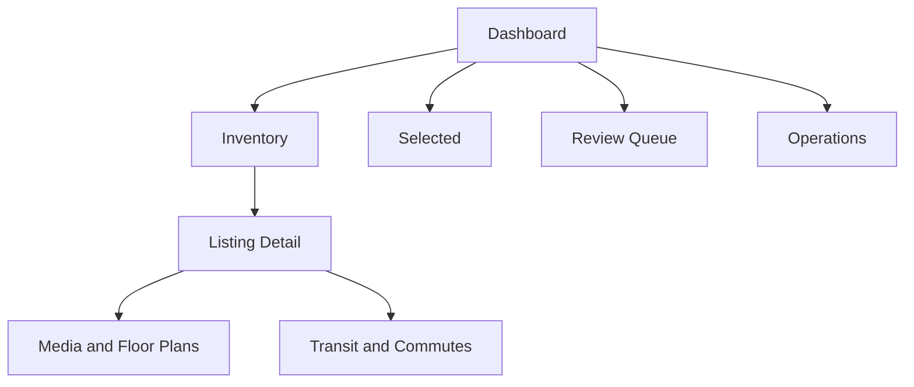

# NYC/NJ Rental Listing Agent — Internal UI

## 1. Document Control

| Field | Value |
| --- | --- |
| Status | Draft specification |
| Owner | CJ |
| Controlling documents | `00_PROJECT_OVERVIEW.md` through `06_DATABASE_AND_REFRESH_PIPELINE.md` |
| Primary dependent | `08_IMPLEMENTATION_PLAN.md` |
| Initial framework | Local Streamlit |

This document specifies the single-user local review interface for browsing canonical rental inventory, inspecting evidence and enrichment, resolving issues, manually selecting apartments and media, monitoring refresh operations, and generating local CSV exports.

## 2. Requirement Traceability

This specification primarily satisfies:

- `PR-GEO-001` through `PR-GEO-003`
- `PR-DATA-001` through `PR-DATA-004`
- `PR-LAUNDRY-001` and `PR-LAUNDRY-002`
- `PR-MEDIA-001` through `PR-MEDIA-003`
- `PR-LOC-001`
- `PR-TRANSIT-001` through `PR-TRANSIT-005`
- `PR-COMMUTE-001` through `PR-COMMUTE-005`
- `PR-REFRESH-001` through `PR-REFRESH-004`
- `PR-UI-001` through `PR-UI-006`
- `PR-EXPORT-001` and `PR-EXPORT-002`
- `PR-LLM-005`
- `PR-NFR-003` through `PR-NFR-008`

## 3. UI Objectives

The interface must let the local operator:

1. See whether inventory is current and the weekday refresh succeeded.
2. Find relevant Studio, 1BR, and 2BR listings quickly.
3. Compare canonical facts without hiding uncertainty or conflicts.
4. Review apartment photos and representative floor plans.
5. Distinguish in-unit washer/dryer from building laundry.
6. Review subway, PATH, bus, and commute facts appropriate to each geography.
7. Manually select apartments and media for a later marketing workflow.
8. Resolve duplicate, evidence, location, media, and validation issues.
9. Retry or refresh failed items intentionally.
10. Export filtered or selected data to local CSV files.

## 4. Non-Goals

The interface is not:

- A public rental marketplace
- A client-facing portal
- A mobile-first consumer application
- A multi-user collaboration product
- A commercial SaaS application
- An ad-writing interface
- An image-generation or image-composition interface
- An automatic apartment recommendation system
- A place to collect broker/contact data
- A commute, neighborhood, or listing scoring interface

## 5. Local Runtime

### 5.1 Launch model

The initial UI runs on the user’s desktop with a command equivalent to:

```text
streamlit run app.py --server.address 127.0.0.1
```

The final launch command and working directory are defined in `08_IMPLEMENTATION_PLAN.md`.

### 5.2 Local dependencies

The UI connects to:

- Local PostgreSQL/PostGIS
- Local media data root
- Local export directory
- Local coordinator command or database job queue for manual operations

### 5.3 No application login

The initial application has one local operator and requires no login, RLS, user administration, or tenant selection. Audit rows use one configured local operator identifier such as `local_operator`.

### 5.4 Process separation

The Streamlit process must not perform long acquisition, routing, LLM, or media jobs inline. It creates persisted jobs/requests and displays their progress. Short local read queries and validated human-write transactions may execute synchronously.

## 6. Information Architecture



Primary pages:

1. **Dashboard**
2. **Inventory**
3. **Listing Detail**
4. **Selected**
5. **Review Queue**
6. **Operations**
7. **Local Settings**

Settings is intentionally limited. It is not a full administration portal.

## 7. Global Navigation and Status

### 7.1 Sidebar

The sidebar must contain:

- Page navigation
- Current local date/time
- Last completed refresh status and completion time
- Active inventory count
- Selected active listing count
- Open blocking-review count
- Refresh-in-progress indicator
- Local profile indicator: `development` or `production`

### 7.2 Global stale-data banner

Show a prominent banner when:

- No successful or partial weekday refresh exists for the expected local day.
- One or more required sources are stale/failed/blocked.
- The current run passed its 11:30 AM deadline without acceptable completion.
- A mass-inactivation circuit breaker is open.

The banner must state the affected source/scope and last healthy time. It must not merely say “something went wrong.”

### 7.3 Status vocabulary

Use the exact canonical states from the data schema. UI labels may be friendlier but must map one-to-one.

Examples:

| Canonical state | UI label |
| --- | --- |
| `ACTIVE` | Active |
| `MISSING` | Missing from latest healthy check |
| `INACTIVE` | Inactive |
| `REAPPEARED` | Reappeared—being revalidated |
| `REVIEW_REQUIRED` | Review required |
| `PARTIAL` enrichment | Partially enriched |
| `CONFLICTING` | Conflicting evidence |

Colors/icons may reinforce state but text must always be present.

## 8. Dashboard

### 8.1 Purpose

The dashboard answers:

- Is today’s inventory usable?
- What changed?
- What needs attention?
- How many listings are ready for review/selection?

### 8.2 Summary cards

Show:

- Active listings
- New listings since latest completed refresh
- Materially changed listings
- Missing listings
- Listings inactivated
- Reappeared listings
- Selected active listings
- Listings with blocking review issues

Cards display counts, not quality scores.

### 8.3 Refresh panel

Show:

- Scheduled time: 6:00 AM Eastern
- Run start/end/duration
- Overall status
- Per-source status
- Source health gate
- Observation counts
- New/changed/unchanged/missing counts
- Enrichment pending/failed counts
- Model/provider usage summary
- Whether disappearance processing was enabled

### 8.4 Change feed

Show recent material events:

- New listing
- Price change
- Availability change
- Laundry classification change
- Media/floor-plan change
- Missing/inactive/reappeared transition
- Manual override

Each item links to listing detail or operations evidence.

### 8.5 Attention queue preview

Show highest-severity open issues with:

- Issue type
- Listing/source/job
- Severity
- Age
- Brief reason
- Link to resolve

Ordering by severity and age is operational ordering, not listing ranking.

## 9. Inventory Page

### 9.1 Default view

The default inventory view shows active Studio, 1BR, and 2BR listings from all supported areas, newest material change first.

It must not automatically hide partially enriched listings. Their status remains visible.

### 9.2 Required filters

#### Geography

- NYC
- Jersey City
- Hoboken
- Fort Lee
- NYC borough
- Normalized neighborhood where available

#### Listing

- Lifecycle status
- Layout class: Studio, 1BR, 2BR
- Monthly-rent range
- Bedroom/bathroom values
- Available-from date
- First-seen and last-seen date
- Source
- New/changed since date/latest refresh

#### Laundry

- Confirmed in-unit washer and dryer
- In-unit washer only
- In-unit dryer only
- Hookup only
- Building/shared laundry
- Offsite/nearby laundry
- No laundry stated
- Explicitly no laundry
- Conflicting
- Unknown

#### Media

- Has apartment-photo candidate
- Has compatible floor plan
- Floor-plan association level
- Marketing-eligible media available
- Contact/watermark warning
- Media enrichment incomplete

#### Transit

- Has useful subway access
- Has relevant PATH access
- Has useful bus access
- Maximum walking minutes to a selected transit option
- Specific subway/PATH line or bus route
- Transit validation state

#### Commute

- Selected campus/destination
- Maximum raw commute duration for that one selected destination
- Commute result status
- Validation status
- Result freshness

Filtering by one destination duration is allowed. No multi-destination score or weighted commute filter is allowed.

#### Review and selection

- Marketing selection status
- Review status
- Open issue type/severity
- Enrichment status
- Human override present

### 9.3 Filter behavior

- Filters compose with AND across categories and OR within multi-select values unless labeled otherwise.
- Active filters appear as removable chips/summary text.
- A “Reset filters” action restores defaults.
- The result count updates after filter application.
- Filter state may remain in Streamlit session state during the current local session.
- Saved filter presets are optional and local; they are not client profiles.

### 9.4 Inventory columns

Required compact table/card fields:

- Manual selection checkbox/state
- Primary photo thumbnail when permitted
- Layout
- Monthly rent
- Short normalized location
- Lifecycle and freshness
- Laundry label
- Primary relevant transit summary
- One user-selected commute destination/duration
- Photo/floor-plan availability
- Enrichment/review warnings
- First/last seen

Do not display broker/contact columns.

### 9.5 Geography-aware transit summary

- NYC: primary useful subway plus useful bus indicator.
- Jersey City/Hoboken: PATH when relevant plus bus indicator.
- Fort Lee: useful bus stop/routes and meaningful connection first.
- A distant subway connection must not be formatted as Fort Lee’s nearby subway.

### 9.6 Laundry label

Only `IN_UNIT_WASHER_DRYER_CONFIRMED` with a valid effective resolution may display `室内洗烘`.

Other states display explicit English/internal labels such as:

- Building laundry
- Hookups only
- Laundry unknown
- Conflicting laundry evidence

The UI must not translate “laundry available” into `室内洗烘`.

### 9.7 Sorting

Allowed sorts:

- Rent
- First seen
- Last seen
- Last material change
- Selected destination duration
- Walking time to a selected transit option
- Layout
- Review severity/age

Sorting by a raw fact is not a score. The default does not imply quality ranking.

### 9.8 Table versus cards

The user may switch between:

- Dense table for filtering/comparison
- Media cards for visual review

Both views use the same database query/filter contract.

## 10. Manual Listing Selection

### 10.1 Selection behavior

The operator manually selects listings using:

- A listing-row/card checkbox or button
- A listing-detail action
- An explicit bulk action on checked rows

Bulk selection is still manual because the operator chooses the rows and confirms the action.

### 10.2 Confirmation and persistence

- Selection writes `marketing_selection` transactionally.
- Record local operator identifier and time.
- Selection survives UI restart and weekday refresh.
- A newly acquired listing is never selected automatically.
- Unselect/removal preserves audit history.

### 10.3 Selection blockers and warnings

Block selection only for conditions explicitly defined as blocking, such as:

- Listing outside scope
- Canonical merge/superseded record
- Unresolved identity that makes the listing unusable

Warn but allow deliberate selection for:

- Partial enrichment
- Missing floor plan
- Media-use review pending
- Transit/commute warning

The confirmation records that the warning was visible. Exact blocking policy is configurable and versioned.

### 10.4 Inactive selected listing

When a selected listing becomes missing/inactive:

- Preserve historical selection.
- Show a prominent status warning.
- Exclude it from the default “selected active” export unless the operator includes inactive records.
- Do not automatically replace or deselect it.

## 11. Listing Detail Page

### 11.1 Header

Show:

- Layout and monthly rent
- Normalized address/location
- Lifecycle and availability status
- First seen, last seen, and last material change
- Selection state and action
- Enrichment/review status
- Source count

### 11.2 Tabs/sections

1. Overview
2. Photos
3. Floor Plans
4. Transit
5. Commutes
6. Evidence and History
7. Review Actions

### 11.3 Overview

Show:

- Bedrooms/bathrooms/layout qualifiers
- Price type and concession context where relevant
- Available-from date
- Laundry classification with evidence state
- Unit and building amenities kept distinct
- Non-contact description
- Source links and last observation times
- Active manual overrides

### 11.4 Fact provenance

Every important fact should offer a “Why?” or evidence expander containing:

- Effective value/status
- Source/observation
- Evidence text or structured field
- Derived versus source-stated status
- Model/rule version when relevant
- Confidence and validation
- Conflicting assertions
- Manual override

Do not expose hidden chain-of-thought. Display structured evidence and concise explanations.

## 12. Photo Gallery

### 12.1 Gallery grouping

Group/filter by:

- Unit/listing photos
- Building photos
- Amenities
- Neighborhood
- Floor plans
- Unknown/other

### 12.2 Asset card

Show:

- Local preview or policy-permitted reference state
- Media type
- Association level
- Source and retrieval/observation time
- Exact/near-duplicate state
- Technical-quality warning
- Contact/watermark state
- Marketing-use status
- Human media-selection state

### 12.3 Media actions

- Confirm/correct type
- Confirm/reject association
- Mark review note
- Select/deselect for later marketing where allowed
- Request reclassification/retrieval
- Open source page/reference

The UI must not offer automatic image composition or watermark removal.

### 12.4 Contact overlays

When an asset has a detected contact overlay:

- Show a warning without extracting contact details into the UI.
- Prefer a policy-permitted local review copy when available.
- Block automatic marketing handoff.

## 13. Floor-Plan Review

### 13.1 Floor-plan card

Show:

- Preview
- Source
- Layout class
- Association level
- Printed unit/type name when available
- Bedroom/bathroom/area assertions
- Technical legibility
- Marketing-use status
- Confidence and review state

### 13.2 Required association wording

| Association | Display wording |
| --- | --- |
| Exact unit | Exact-unit plan—source confirmed |
| Source unit type | Source-linked unit-type plan |
| Building layout | Representative plan for this building and layout; may not match the exact unit |
| Uncertain | Candidate plan—review required |

### 13.3 Preferred plan

The operator may select one preferred compatible plan for later use. Candidate ordering may suggest the strongest evidence, but it cannot approve or select the plan automatically.

### 13.4 Missing plan

Display:

- No compatible plan found
- Search time
- Sources checked
- Retry action

Do not generate a substitute plan.

## 14. Transit View

### 14.1 Grouping

Show applicable sections:

- MTA subway
- PATH
- Bus
- Meaningful connections

### 14.2 Transit option fields

- Stop/station
- Operator and route/line
- Direction/headsign for buses when available
- Walking minutes and distance
- Nearest/useful status
- Usefulness reasons
- Meaningful connection
- Dataset/calculation time
- Validation status/reasons

### 14.3 Fort Lee behavior

For Fort Lee:

- Bus section appears first.
- Show useful routes, direction, and validated connections.
- Subway reached after bus/transfer is labeled as a connection.
- Do not show a Manhattan subway as walkable nearby subway access.

### 14.4 Map

A local map is optional. If implemented, it may show:

- Listing/building point
- Transit candidates
- Selected walking route
- Destination anchors

Map markers supplement, not replace, exact textual fields and validation.

## 15. Commute View

### 15.1 Scenario banner (revised — owner decision B7, 2026-08-17)

Display once above results:

> Web-researched commute estimate for a typical weekday-morning trip. Not a live
> routing result; actual travel varies by date and service conditions.

Show the research date, cited sources, and confidence. Commute research is
on-demand for shortlisted, selected, or explicitly requested listings; other
listings show a "not yet researched" state with a request action. The
listing-detail page embeds the free Google Maps Embed API view of the apartment
with optional directions so the operator can manually verify estimates.

### 15.2 Campus grouping

Show separate rows for:

- NYU Washington Square
- NYU Tandon
- Columbia Morningside
- Pratt Brooklyn
- Parsons / The New School
- FIT
- SVA
- Baruch
- Hunter
- Fordham Rose Hill
- Fordham Lincoln Center
- Stevens
- Other active registry campuses

### 15.3 Major destination grouping

- West Village
- Central Park
- Union Square
- Times Square
- World Trade Center / Financial District
- Grand Central
- Williamsburg
- Downtown Brooklyn

### 15.4 Commute row

Show:

- Destination
- Duration
- Transfer count when supported
- Route summary
- Calculated time/scenario
- Result freshness
- Validation state/reason
- Retry/recalculate action where appropriate

### 15.5 Validation warning

If internal validation warns/fails:

- Preserve and label the provider duration.
- Show the validation reason.
- Do not substitute an internally estimated or LLM-generated duration.

### 15.6 No score

Do not display:

- Aggregate commute score
- Campus-access score
- Transit grade
- Color-coded good/bad judgment based on hidden thresholds
- Weighted average across destinations

Raw duration may use neutral formatting and explicit sorting.

## 16. Evidence and History

### 16.1 Source observations

Show:

- Source
- Source-native ID when applicable
- Source URL
- Observed/retrieved time
- Parse/validation status
- Material fields
- Evidence expanders

Contact sections are not displayed.

### 16.2 Change history

Timeline/table includes:

- Price
- Availability/lifecycle
- Layout
- Laundry
- Address
- Media/floor-plan set
- Selection
- Manual override

### 16.3 Canonical merge/duplicate history

Show whether the listing:

- Has duplicate candidates
- Was merged into another canonical listing
- Was split/reversed manually
- Has conflicting identity evidence

## 17. Review Queue

### 17.1 Purpose

Centralize cases requiring human judgment instead of hiding them within individual listings.

### 17.2 Issue categories

- Duplicate candidate
- Address/geocode conflict
- Layout ambiguity
- Laundry conflict/low confidence
- Media type/association conflict
- Floor-plan match review
- Contact/watermark review
- Transit/commute validation failure
- Source failure/structure change
- Stale required enrichment
- Manual override conflict

### 17.3 Queue columns

- Severity
- Issue type
- Listing/source/job
- Created/age
- Brief reason
- Blocking status
- Assigned state is unnecessary for one user
- Resolution action

### 17.4 Issue resolution

Resolution requires:

- Selected resolution outcome
- Optional/required corrected value
- Reason note for consequential changes
- Confirmation

The UI writes the appropriate override, duplicate resolution, association decision, or issue status transactionally.

### 17.5 No silent dismissal

Blocking issues require a reason to dismiss. Resolved issues remain in history.

## 18. Selected Page

### 18.1 Default scope

Show selected active listings first, with separate sections/filter for missing or inactive selections.

### 18.2 Readiness indicators

Display explicit facts:

- Current active status
- Current rent
- Laundry/badge eligibility
- Photo availability and selected media
- Floor-plan availability and association
- Media-use warnings
- Transit/commute completion
- Open blocking issues

Do not collapse these into a readiness score.

### 18.3 Selection notes

Allow an internal note on why the apartment was selected or what remains to review. Notes are not ad copy and are not sent to a content-generation agent in this phase.

### 18.4 Export

Provide:

- Export selected active listings
- Optional include inactive selected history
- Optional companion CSVs
- Preview export columns and row count

## 19. Operations Page

### 19.1 Refresh runs

List:

- Run ID/trigger
- Scheduled/start/end time
- Status
- Source summary
- Inventory change counts
- Enrichment counts
- Error count
- Cost/provider summary

### 19.2 Source runs

Show:

- Source and adapter/policy version
- Preflight
- Partition progress
- Counts
- Health gate and reasons
- Disappearance eligibility
- Errors/challenges/rate limits
- Last healthy run

### 19.3 Job queue

Filters:

- Job type
- Status
- Source/listing
- Age
- Attempts
- Error code

Actions:

- Retry eligible job
- Cancel pending/retryable job
- Request one-listing refresh
- Open related listing/evidence

Long jobs run outside the Streamlit request.

### 19.4 Manual refresh actions

Allow:

- Full manual refresh
- One-source refresh
- One-listing refresh
- One enrichment type/listing retry

Before starting, show current active run and scope. Prevent accidental duplicate full runs through scheduler/run idempotency.

### 19.5 Cost panel

Show per run/task/model/provider:

- Default-model calls
- Flagship escalations
- Local-model calls
- Cache hits
- Input/output tokens when reported
- Estimated/reported cost
- Routing/geocoding request counts/cost

Cost is operational information, not a reason to mark unfinished work complete.

## 20. Local Settings Page

### 20.1 Allowed settings

- Local profile display
- Schedule display and enabled/paused state
- Local data-root/export path display
- Enabled source list and status
- Default commute destination shown in inventory
- Default inventory filters
- UI page size/layout preference
- Optional desktop notification preference

### 20.2 Restricted changes

Source policies, schema migrations, model credentials, database connection strings, and destructive operations are not edited through ordinary UI forms in the initial version. They use local configuration/migration workflows.

### 20.3 Scheduler pause

The UI may request a local scheduler pause/resume only if implemented safely and visibly. Otherwise, it displays instructions/status for Windows Task Scheduler without pretending the action succeeded.

## 21. Human Corrections and Overrides

### 21.1 Editable facts

Initial overridable fields may include:

- Normalized address/geocode candidate
- Building/unit identity
- Layout/bedrooms/bathrooms
- Laundry classification
- Media type and association
- Floor-plan association/preferred candidate
- Review resolution

Price and availability may be overridden only with a reason and should normally remain source-driven.

### 21.2 Override form

Show:

- Current effective value
- Source/model assertions
- Proposed override
- Reason code
- Required explanation
- Effect on dependent enrichment

Confirmation writes an active override and queues required re-enrichment.

### 21.3 New conflicting evidence

An override remains effective. New conflicting source evidence opens or updates a review issue; it does not silently overwrite the correction.

### 21.4 Revoke override

Revocation shows what value will become effective and which enrichments will be invalidated.

## 22. Streamlit State and Caching

### 22.1 Session state

Use session state for:

- Current filters
- Selected table rows before confirmation
- Current page/listing
- Display preferences
- Draft form values

Do not treat session state as durable selection, override, job, or export state.

### 22.2 Read caching

Streamlit read caching may be used for:

- Controlled reference/configuration data
- Destination registry
- Transit route labels
- Bounded inventory queries

Cache keys include relevant database/config versions or use short TTLs.

### 22.3 Cache invalidation

After a human write:

- Commit database transaction.
- Clear affected cached query data.
- Rerun/render from database.
- Show committed success or actionable error.

Never update the visible state optimistically if the database write failed.

## 23. Database Access Pattern

### 23.1 Data-access layer

UI code must call a local repository/service layer rather than embedding business rules in page components.

Responsibilities:

- Parameterized queries
- Transactions
- Validation of writes
- Override/selection/audit creation
- Job enqueueing
- Stable read models

### 23.2 Direct table editing

Do not expose arbitrary editable dataframes connected directly to canonical tables. Human actions use explicit forms and service functions so evidence, audit, and dependency invalidation remain consistent.

### 23.3 Query limits

- Paginate inventory and history.
- Load thumbnails before originals.
- Lazy-load full media and evidence sections.
- Fetch commute detail only when the tab/section is opened.

## 24. Local Media Rendering

### 24.1 Path handling

- Database stores relative paths.
- Application resolves them beneath the configured local data root.
- Reject path traversal and paths outside the data root.
- Missing files display unavailable status and retry/reconcile action.

### 24.2 Preview behavior

- Prefer generated thumbnails/previews.
- Do not render unprocessed SVG, active PDF, or unsupported original formats directly.
- PDF floor plans display sandbox-generated page previews.
- Large originals load only on explicit action.

## 25. Local CSV Export UX

### 25.1 Export flow

1. Select export type.
2. Review filters, row count, and included companion files.
3. Create persisted export job/run.
4. Generate snapshot-consistent CSV locally.
5. Display completion, local filename, created time, and open-folder/download action supported by Streamlit/runtime.

### 25.2 Export names

Suggested pattern:

```text
exports/{yyyy-mm-dd_HHMM}_{export_type}_{export_run_id_short}/listings.csv
```

Companion files use stable names such as `media.csv`, `transit.csv`, `commutes.csv`, `sources.csv`, and `history.csv`.

### 25.3 Column preview

Before generation, show key fields and warn when:

- Inactive records are included
- Results contain unresolved conflicts
- Media/floor-plan references are not marketing eligible
- Commute results are stale/failed

### 25.4 Formula safety and encoding

Exports use UTF-8, documented CSV quoting, and formula-injection protection for untrusted text.

## 26. Error and Empty States

### 26.1 Error message structure

Show:

- What failed
- Affected listing/source/job
- Whether data was committed
- Whether retry is safe
- Recommended next action
- Link to operations/evidence when available

Do not expose raw stack traces by default. A local diagnostics expander may show sanitized technical details.

### 26.2 Empty inventory

Distinguish:

- No listings match filters
- No acquisition run has completed
- Source run failed/blocked
- Database is empty/new

### 26.3 Missing media

Show typed placeholders such as:

- No photo found
- Media retrieval failed
- Reference-only asset
- No compatible floor plan found
- Media policy review required

### 26.4 Unavailable commute

Show no-route, provider error, stale, pending, or unable-to-validate distinctly. Never display zero minutes as missing data.

## 27. Visual Design Guidelines

### 27.1 Design character

The UI should be practical, information-dense, and calm. It is a workbench, not a marketing site.

### 27.2 Priority hierarchy

1. Current availability and rent
2. Layout and location
3. Laundry
4. Photos/floor plan
5. Transit and commutes
6. Freshness, provenance, and warnings
7. Selection/review actions

### 27.3 Status colors

Use a small consistent palette:

- Neutral: unknown/informational
- Green: validated/active/success
- Amber: partial/warning/missing
- Red: blocking/failed/inactive where attention is required
- Blue: selected/manual action

Color cannot be the only status indicator.

### 27.4 Density

- Dense tables for inventory and operations
- Cards/gallery for visual comparison
- Expanders for evidence and technical details
- Tabs for listing detail
- Avoid oversized decorative elements

## 28. Accessibility and Usability

- All actions have text labels.
- Keyboard navigation is supported where Streamlit permits.
- Images have generated internal alt descriptions or concise type labels when reliable.
- Status is not encoded by color alone.
- Confirmation is required for consequential bulk actions.
- Long operations show persisted status rather than a blocking spinner only.
- Timestamps clearly indicate Eastern/local time where displayed.

## 29. Performance Targets

Initial local targets under expected inventory volume:

- Dashboard useful content visible within 2 seconds after warm local start.
- Inventory filter/sort response within 2 seconds for normal queries.
- Listing detail core facts within 2 seconds; media may lazy-load.
- Human write confirmation within 2 seconds excluding queued background work.
- UI remains responsive while weekday refresh workers run.

Targets are validated on the user’s desktop and adjusted from measured inventory size.

## 30. Testing Strategy

### 30.1 Component tests

- Status formatting
- Laundry/badge mapping
- Representative floor-plan disclaimer
- Geography-specific transit summary
- Export warning logic
- Selection and override validation

### 30.2 Data-access tests

- Parameterized filters
- Pagination
- Selection transactions
- Override precedence
- Job enqueueing
- Audit creation
- Cache invalidation

### 30.3 UI integration tests

- Dashboard from fixture run data
- Inventory filtering
- Listing detail tabs
- Media/floor-plan review actions
- Transit/commute warning display
- Review issue resolution
- Selected export
- Operations retry

### 30.4 Critical regression cases

- Building laundry never displays `室内洗烘`.
- Fort Lee never presents Manhattan subway as nearby walkable access.
- Building-layout plan always displays representative disclaimer.
- Inactive selected listing remains visible with warning.
- Failed write does not appear successful.
- No contact fields appear.
- No commute/listing score appears.

## 31. Open Decisions

| Decision | Required before |
| --- | --- |
| Final Streamlit page layout and component theme | UI implementation |
| Table library: native Streamlit dataframe versus approved grid component | Inventory implementation |
| Local map component/provider | Optional map implementation |
| Exact selection blockers versus warnings | Selection workflow implementation |
| Whether local saved filter presets are needed | Post-MVP usability review |
| Desktop notification method | Operations rollout |
| Final local launch shortcut/script | Local deployment |
| Default local operator identifier | Database/UI setup |

## 32. UI Acceptance Tests

The UI specification is satisfied when tests demonstrate:

1. Streamlit starts locally and reads the configured local PostgreSQL profile without login or Supabase.
2. Dashboard clearly shows latest refresh, source health, changes, and stale-data warnings.
3. Inventory filters cover geography, layout, rent, lifecycle, laundry, media, transit, commute, review, and selection.
4. Unknown/conflicting values remain distinguishable from negative values.
5. Only confirmed in-unit washer and dryer displays `室内洗烘`.
6. Inventory table/card views use the same filtered result contract.
7. NYC, Jersey City/Hoboken, and Fort Lee display geography-appropriate transit summaries.
8. Filtering/sorting by one raw commute duration does not create an aggregate score.
9. Listing detail exposes evidence, provenance, validation, and conflicts without hidden reasoning.
10. Photos are grouped by type and display association/use warnings.
11. Building-layout floor plans display the representative-plan disclaimer.
12. Exact-unit status cannot be selected without supporting evidence/review validation.
13. Contact-overlay assets do not expose extracted contact details or enter automatic handoff.
14. Listing selection is manual, durable, and audited.
15. Explicit checked-row bulk selection remains manual and requires confirmation.
16. New listings are never selected automatically.
17. Inactive selected listings remain visible and are excluded from default active export.
18. Media selection is separate from listing selection and remains human-controlled.
19. Review resolutions create proper overrides/decisions and invalidate dependencies.
20. Active overrides survive UI restart and later refresh.
21. Operations actions enqueue jobs rather than running long work inline.
22. Duplicate full refresh requests are prevented or joined visibly.
23. Model/provider cost and escalation are visible operational facts.
24. CSV exports are local, snapshot-consistent, formula-safe, and omit contact data.
25. UI resolves media only beneath the configured local data root.
26. Failed database writes cannot appear as successful UI state.
27. No ad writing, image composition, location-image text, or marketing publication UI exists.
28. No commute, neighborhood, transit-quality, or listing-quality score exists.

## 33. Change Log

| Date | Change |
| --- | --- |
| 2026-08-16 | Initial local Streamlit internal UI specification created from the project overview, product requirements, schema, acquisition, location/transit, media, and local database/refresh specifications. |
| 2026-08-17 | Owner decision B7: §15.1 revised — commute rows show web-researched estimates (sources, confidence, research date), on-demand research request action, Google Maps Embed view for manual verification. Primary map remains Leaflet via streamlit-folium. |
