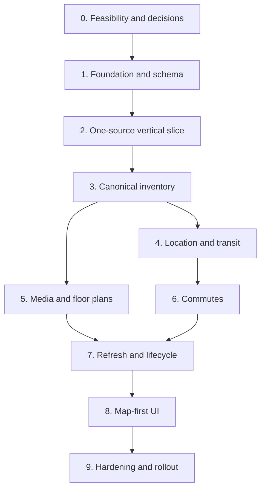

# NYC/NJ Rental Listing Agent — Implementation Plan

## 1. Document Control

| Field | Value |
| --- | --- |
| Status | Draft implementation specification |
| Owner | CJ |
| Depends on | `00_PROJECT_OVERVIEW.md` through `07_INTERNAL_UI.md` |
| Purpose | Define build order, gates, verification, and local rollout; no implementation is performed by this document |
| Initial operating environment | Single-user Windows desktop |

## 2. Implementation Objective

Build a reliable local system that acquires supported NYC/NJ rental listings, maintains a canonical PostgreSQL/PostGIS inventory, enriches listings with media, floor plans, transit, and commute information, refreshes every weekday, and presents the results through a World Monitor-inspired map-first Streamlit interface.

The implementation must optimize for dependable task completion while controlling provider and model cost. It must not broaden scope into ad generation, automatic client matching, publication, broker/contact collection, or a commercial multi-user product.

## 3. Controlling Principles

1. Implement vertical slices behind stable interfaces rather than building every subsystem in isolation.
2. Keep local PostgreSQL/PostGIS authoritative; CSV is export-only.
3. Preserve raw observations, canonical facts, provenance, validation, and human overrides as separate layers.
4. Keep source, routing, geocoding, map, and model providers replaceable.
5. Use deterministic parsing and validation where reliable, with a capable hosted model for ambiguous extraction and workflow reasoning.
6. Escalate to a flagship model only when the default model fails validation or cannot resolve material ambiguity.
7. Never let a source failure trigger mass inactivation.
8. Make incomplete, stale, conflicting, and unavailable states visible.
9. Persist selection, shortlist, review, and job state; do not rely on Streamlit session state for durable decisions.
10. Require a passing gate before dependent phases begin.

## 4. Recommended Initial Technology Stack

| Concern | Initial choice | Rationale |
| --- | --- | --- |
| Language | Python 3.12 | Strong browser, data, geospatial, media, LLM, and Streamlit ecosystem |
| Environment/package management | `uv` with a locked project file | Fast, reproducible local setup |
| Database | PostgreSQL 16+ with PostGIS | Canonical relational, temporal, JSONB, and spatial queries |
| Database access | SQLAlchemy 2.x + psycopg 3 | Explicit repository layer and testable transactions |
| Migrations | Alembic | Versioned forward migrations and local rollback procedure |
| Validation/contracts | Pydantic v2 | Versioned adapter and model-output contracts |
| UI | Streamlit | Confirmed local internal frontend |
| Initial interactive map | Leaflet through `streamlit-folium`, behind a map adapter | Supports markers, clustering, visible bounds, and drawn geometries with low MVP complexity |
| Tabular comparison | Native Streamlit first; evaluate an approved grid only if required interactions cannot be met | Avoid unnecessary dependency before usability evidence |
| Acquisition | HTTP/API/feed adapters where approved; Playwright only for sources whose approved access method requires browser rendering | One adapter contract across access modes |
| Scheduler | Windows Task Scheduler | Confirmed weekday local execution owner |
| Job queue | PostgreSQL-backed leased jobs | Durable local retries without a separate broker |
| Media | Local filesystem plus database metadata | Confirmed local persistence boundary |
| Image processing | Pillow/OpenCV plus perceptual hashing | Local validation, thumbnails, and duplicate detection |
| PDF handling | pypdf/pdfplumber plus rendered previews | Floor-plan discovery and review |
| Testing | pytest, pytest-postgresql/test database, Playwright fixtures, and UI integration tests | Covers contracts, persistence, acquisition, and workflows |
| Logging | Structured JSON logs plus database run/job summaries | Local troubleshooting and UI status |

The final provider/model identifiers, API terms, and credentials remain configuration decisions. No code may embed a provider-specific identifier into canonical business logic.

## 5. Proposed Repository Layout

```text
/
├── docs/
├── pyproject.toml
├── uv.lock
├── alembic.ini
├── migrations/
├── src/rental_agent/
│   ├── config/
│   ├── contracts/
│   ├── db/
│   ├── acquisition/
│   │   └── adapters/
│   ├── canonical/
│   ├── enrichment/
│   │   ├── llm/
│   │   ├── location/
│   │   ├── transit/
│   │   ├── commute/
│   │   └── media/
│   ├── validation/
│   ├── jobs/
│   ├── exports/
│   └── ui/
├── scripts/
├── tests/
│   ├── unit/
│   ├── contract/
│   ├── integration/
│   ├── fixtures/
│   └── acceptance/
└── local_data/
    ├── media/
    ├── raw/
    ├── exports/
    ├── logs/
    └── backups/
```

`local_data/` paths must be configurable and excluded from source control. The implementation may adjust package names, but it must preserve the architectural boundaries.

## 6. Environments and Configuration

Use two local profiles:

- `development`: fixture sources, test database/schema, reduced provider calls, and visible debug details.
- `production`: approved live sources, production local database, scheduled runs, and production caches.

Configuration must cover:

- Database connection
- Local data roots
- Enabled source registry versions
- Source access policies and rate limits
- Model routing and escalation policy
- Geocoding/routing provider
- Transit dataset locations/versions
- Destination registry version
- Cache and freshness values
- Health thresholds
- Scheduler/run deadlines
- Spend warnings

Secrets are loaded from local environment configuration and are never committed or persisted in listing evidence. This is ordinary operational configuration, not an enterprise security workstream.

## 7. Phase and Dependency Map



Phases may overlap only after their dependency gate passes. Additional source adapters may be developed in parallel after the first vertical-slice adapter and contract tests are stable.

## 8. Phase 0 — Feasibility Spikes and Blocking Decisions

### 8.1 Work

1. Create the source-policy registry and evaluate candidate sources one at a time.
2. Confirm an approved access mode, fields, pagination behavior, media handling, and retention policy for the first source.
3. Evaluate geocoding/routing providers for public-transit departure-time routes, walking routes, route legs, quota, price, and caching restrictions.
4. Validate current MTA, PATH, and NJ Transit data acquisition and update procedures.
5. Benchmark the default hosted model on a labeled set of real listing descriptions.
6. Benchmark flagship escalation on default-model failures.
7. Prototype the Streamlit map component with marker clustering, visible-bounds events, drawing, and marker/result selection.
8. Confirm local PostgreSQL/PostGIS and Windows Task Scheduler prerequisites.

### 8.2 Required decisions

- First enabled listing source and access method
- Initial geocoder/routing provider and fallback behavior
- Initial default and flagship model/provider IDs
- Initial map/tile provider and its terms
- Local data root and database name
- Development fixture capture/redaction policy

### 8.3 Exit gate

- At least one listing source can be accessed through an approved, reproducible method.
- The selected routing provider returns the required public-transit and walking fields.
- Transit datasets load successfully.
- The default model reaches the initial precision target on critical fields; unresolved examples have a working escalation route.
- A local map spike proves clustering, map-bounds filtering, drawn geometry, and synchronized selection.
- No blocking term, quota, or unsupported capability remains hidden.

If the first candidate source fails this gate, evaluate the next source; do not build around an unapproved workaround.

## 9. Phase 1 — Foundation, Database, and Contracts

### 9.1 Deliverables

- Python project and locked dependencies
- Typed configuration loader and profile validation
- PostgreSQL/PostGIS bootstrap instructions
- Alembic baseline migrations for all schema entities
- Repository/service transaction layer
- Canonical enums or constrained reference tables
- Structured run/job logging
- Fixture factories and isolated test database

### 9.2 Schema scope

Implement source observations, canonical listings, addresses/buildings/units, source links, assertions/evidence, history, LLM/provider executions, media metadata, transit/destination/commute records, review issues, overrides, marketing selection, client search presets, client shortlist entries, refresh runs, and jobs.

### 9.3 Gate

- Migrations apply to an empty database and upgrade from the prior migration in tests.
- Required uniqueness, foreign-key, temporal, and PostGIS constraints pass schema acceptance tests.
- Criteria matches cannot create shortlist entries automatically.
- Marketing selection remains independent from shortlist membership.
- No broker/contact fields appear in canonical or export schemas.

## 10. Phase 2 — First-Source End-to-End Vertical Slice

### 10.1 Scope

Implement one approved source through discovery, detail acquisition, normalized observation, evidence, local persistence, media-reference discovery, and replayable fixtures.

### 10.2 Workflow

1. Discover listing identifiers/URLs through bounded partitions.
2. Fetch details using the approved adapter mode.
3. Remove/exclude contact sections from extraction inputs.
4. Parse authoritative structured fields first.
5. Invoke the default model only for unresolved supported fields.
6. Validate schema, evidence spans, layout, price, laundry, and geography.
7. Persist the observation idempotently.
8. Replay saved fixtures without live calls.

### 10.3 Gate

- Adapter contract tests cover pagination, duplicate discovery, removed listings, retries, partial pages, structure changes, and prompt-injection text.
- Replaying identical input creates no duplicate observation effects or repeat model charge.
- Studio/1BR/2BR, price, availability, address, laundry, and media references retain evidence and confidence.
- Contact data is neither promoted nor exported.
- The source-health result prevents disappearance processing when acquisition is incomplete.

## 11. Phase 3 — Canonicalization, Deduplication, and History

### 11.1 Deliverables

- Within-source identity reconciliation
- Cross-source duplicate-candidate generation
- Conservative canonical merge rules
- Manual merge/split/reversal workflow service
- Effective-fact resolution and override precedence
- Material-change event generation
- Targeted dependency invalidation

### 11.2 Gate

- Known duplicates merge while ambiguous cases enter review.
- Price/status/fact history remains temporal and attributable.
- Human overrides survive later refreshes.
- Address changes invalidate location/transit/commute data without invalidating unrelated media unnecessarily.
- Canonical activity remains supported while at least one valid source link remains active.

After this gate, additional approved source adapters may be added against the stable contract.

## 12. Phase 4 — Address, Geography, and Nearby Transit

### 12.1 Deliverables

- Address normalization and precision classification
- Provider-backed geocoding adapter
- Supported-market PostGIS boundary validation
- Versioned MTA/PATH/NJ Transit loaders
- Nearby stop/station candidate generation
- Routed walking validation
- Nearest-versus-useful transit logic
- NYC, Jersey City/Hoboken, and Fort Lee presentation facts

### 12.2 Gate

- Border and low-precision cases behave according to the geography specification.
- NYC subway, PATH, and buses retain distinct operator/mode semantics.
- Fort Lee produces bus-first access and treats subway as a connection when appropriate.
- Walking times come from the routing provider and retain calculation metadata.
- No transit or neighborhood score exists.

## 13. Phase 5 — Media and Floor Plans

### 13.1 Deliverables

- Policy-aware media retrieval/reference handling
- Local file layout and safe decode pipeline
- MIME/dimension/hash validation
- Thumbnail and preview generation
- Exact and perceptual duplicate groups
- Media type and association classification
- Contact-overlay, QR, watermark, attribution, and quality statuses
- Floor-plan text/layout extraction and compatibility rules
- Marketing-use and human-selection states

### 13.2 Gate

- Unit photos, building/amenity photos, maps, logos, and floor plans are distinguishable or visibly unresolved.
- Exact-unit floor-plan claims require exact-unit evidence.
- Building/layout plans display the representative-plan disclaimer.
- Media cannot independently establish `室内洗烘` without the specified corroboration.
- Contact-overlay assets are blocked from automatic handoff.
- Media selection remains manual and separate from listing selection.

## 14. Phase 6 — Destination Commutes and Validation

### 14.1 Deliverables

- Seeded, versioned campus and major-destination registry
- Separate NYU Washington Square/NYU Tandon and Fordham campus anchors
- Provider request caching and building-level reuse
- Standard Tuesday 8:30 AM public-transit scenario
- Required and alternate route normalization
- Geographic, access/egress, topology, leg, and duration plausibility checks
- Neutral validation outcomes and route summaries

### 14.2 Gate

- Every active destination has a validated anchor and version.
- Provider durations are preserved even when validation warns/fails.
- No LLM-generated duration replaces a provider result.
- Cache invalidation responds to origin, destination, provider, scenario, or dataset changes.
- No aggregate commute score, grade, or weighted ranking is produced.

## 15. Phase 7 — Scheduled Refresh, Jobs, and Lifecycle

### 15.1 Deliverables

- Refresh coordinator and persisted state machine
- PostgreSQL job leasing, heartbeat, retry, cancellation, and recovery
- Per-source checkpoints and health gates
- New/changed/unchanged/missing reconciliation
- Two-healthy-miss and 36-hour inactivity rule
- Mass-inactivation circuit breaker
- Targeted enrichment scheduling
- Cost and provider usage summaries
- Local CSV export jobs
- Windows Task Scheduler installation/status scripts or documented commands

### 15.2 Gate

- A duplicate scheduled trigger creates or joins one logical run.
- The weekday run starts at 6:00 AM `America/New_York`, targets 9:00 AM completion, and stops normal scheduling at the 11:30 AM deadline.
- One healthy miss marks a source listing `MISSING`; removal requires the specified threshold unless explicit unavailability is confirmed.
- Failed/unhealthy sources cannot mass-inactivate inventory.
- Interrupted jobs recover from durable state without duplicate effects.
- New/changed listings receive only required enrichment work.
- CSV exports are point-in-time, formula-safe, and contact-free.

## 16. Phase 8 — Map-First Streamlit UI

### 16.1 Build order

1. Repository/service query layer
2. Dashboard and stale-data status
3. Map/list/card synchronized inventory workspace
4. Filters, map bounds, drawn geometry, clustering, and preview panel
5. Listing detail and evidence/history
6. Photo and floor-plan review
7. Transit and commute views
8. Marketing selection
9. Client search presets and manual shortlists
10. Review queue and human overrides
11. Operations and exports

### 16.2 Map query contract

The backend accepts a versioned filter object containing ordinary filters plus optional visible bounds or drawn PostGIS geometry. One query contract returns:

- Matching canonical listing IDs and total count
- Marker projection with coordinate precision and state
- Paginated card/table projection
- Active filter summary

The map, cards, table, and exports must derive from the same normalized filter definition. UI code cannot independently reproduce database filtering rules.

### 16.3 Client workflow

- Save a label/pseudonym, filter definition, and optional geometry.
- Display live matches separately from manually included shortlist entries.
- Allow explicit inclusion, exclusion, removal, note, and export.
- Preserve inactive/changed entries with warnings.
- Never infer or store client contact information.
- Never turn shortlist membership into marketing selection automatically.

### 16.4 Gate

- The UI acceptance tests in `07_INTERNAL_UI.md` pass.
- Marker/card/table IDs and counts remain synchronized under every supported filter.
- Map-bound and drawn-area filters return correct PostGIS results.
- Rent, layout, laundry, useful transit, selected commute, media/floor-plan state, freshness, and warnings are visible without opening raw evidence.
- Detailed provenance remains accessible.
- The interface remains usable at the measured production inventory volume.

## 17. Phase 9 — Hardening, Baseline Calibration, and Local Rollout

### 17.1 Calibration

Use several shadow and manual runs before enabling disappearance actions:

- Measure listing volume and partition distribution.
- Establish expected source counts and failure ratios.
- Set source-health anomaly thresholds.
- Measure runtime by stage and provider call volume.
- Measure default-to-flagship escalation rate and spend.
- Validate commute/provider caches.
- Review false-positive rates for duplicates, laundry, floor plans, and contact overlays.

### 17.2 Rollout stages

1. Fixture-only development
2. Live acquisition with no canonical writes
3. Canonical writes with disappearance disabled
4. Full enrichment with manual inspection
5. Scheduled shadow runs
6. Scheduled production runs with inactivation circuit breaker armed
7. Inactivation enabled after healthy-baseline approval

### 17.3 Final gate

- All document acceptance suites pass.
- At least five consecutive weekday shadow/production runs complete without unexplained inventory loss.
- Source-health thresholds are based on measured baselines.
- Manual review confirms critical-field precision is acceptable.
- Cost and runtime stay within configured warning thresholds.
- Restore/recovery from an interrupted run is demonstrated.
- The user can filter on the map, create a client shortlist, select apartments for ad writing, and export the intended set.

## 18. Testing Strategy

### 18.1 Unit tests

- Parsers and normalization
- Rent/layout/laundry rules
- Identity features and comparison rules
- Dependency hashes and cache keys
- Geographic predicates
- Transit usefulness and validation rules
- Media hashing/classification post-processing
- Filter serialization and shortlist state transitions

### 18.2 Contract tests

- Every source adapter against recorded fixtures
- LLM structured-output schemas and evidence requirements
- Geocoder/routing provider normalization
- Transit dataset loaders
- Map filter request/response contract
- CSV projections

### 18.3 Integration tests

- Database transactions, constraints, and migrations
- Acquisition through canonicalization
- Enrichment invalidation and job retries
- Source-health and inactivity processing
- Media files plus database metadata
- Streamlit services against fixture inventory

### 18.4 End-to-end acceptance scenarios

At minimum:

1. New NYC 1BR with confirmed in-unit washer/dryer, photos, exact-unit floor plan, subway/bus access, and campus commutes.
2. Fort Lee 2BR with useful buses and a meaningful subway connection, but no false nearby-subway claim.
3. Jersey City Studio where PATH is relevant.
4. Building laundry that never yields `室内洗烘`.
5. Representative building/layout floor plan with the required disclaimer.
6. Same apartment observed from two sources and conservatively merged.
7. Ambiguous duplicate routed to review.
8. Source outage that does not inactivate its inventory.
9. Listing missing across the required healthy checks and becoming inactive.
10. Map polygon filtering plus manual client shortlist creation.
11. Shortlisted apartment selected separately for ad writing.
12. Inactive shortlisted/selected apartment preserved with warnings.

## 19. Model Evaluation and Cost Policy

### 19.1 Initial routing (model IDs fixed by owner decision B5, 2026-08-17)

- Default hosted model: **`gpt-5.6-terra`** (reasoning effort `low`) — routine structured extraction, evidence mapping, ambiguity resolution, media classification where needed, workflow decisions, and on-demand commute web research.
- Escalation model: **`gpt-5.6-sol`** (reasoning effort `medium`) — used only when Terra repeatedly fails validation or cannot resolve material conflicts.
- Caching and usage/cost tracking are preserved for both tiers per `02` §11.
- Local Qwen2.5-7B-Instruct Q4_K_M: optional evaluated fallback or later optimization; it does not replace the default until it passes the same task-specific test set.

### 19.2 Promotion rule

A cheaper/local model may own a task only after its critical-field precision, schema success rate, evidence accuracy, and retry rate meet the accepted baseline. Critical laundry and identity fields prioritize precision over recall.

### 19.3 Cost controls

- Hash and cache unchanged inputs.
- Use structured source fields before model calls.
- Send only relevant public listing text/media.
- Constrain output schemas and token budgets.
- Batch only where failure isolation remains clear.
- Track cost by run, source, task, model, and escalation reason.
- Warn visibly rather than silently skipping required work when a configured spend threshold is approached.

## 20. Operational Runbook Deliverables

Before production scheduling, create concise local instructions for:

- Installing/upgrading PostgreSQL/PostGIS
- Creating and migrating the database
- Configuring providers and local paths
- Starting Streamlit
- Running one manual refresh
- Installing, verifying, pausing, and resuming the Windows scheduled task
- Inspecting a failed run/job
- Replaying an adapter fixture
- Retrying safe jobs
- Exporting CSV
- Creating an optional local database dump before major migrations
- Restoring the application after process interruption

## 21. Deferred Until Evidence Requires It

- Multi-user access or authentication
- Cloud deployment, Supabase, or cloud object storage
- Redis/Celery or another external job broker
- Kubernetes or distributed workers
- Automated client recommendations
- Client contact/profile storage
- Ad writing or image composition
- Automatic marketing selection or publication
- A custom React frontend replacing Streamlit
- Real-time refresh more frequent than the weekday schedule
- Additional commute scenarios
- Aggregate listing, transit, neighborhood, or commute scores

## 22. Implementation Risks and Controls

| Risk | Control |
| --- | --- |
| Source access changes or becomes disallowed | Policy registry, adapter isolation, structure-change health gate, multiple approved sources |
| Duplicate or incomplete listings | Evidence-preserving canonicalization and conservative review queue |
| Mass false disappearance | Healthy-run requirements, consecutive misses, time threshold, circuit breaker |
| Model extracts unsupported facts | Evidence spans, structured schema, deterministic validation, escalation/review |
| Routing cost grows with destinations | Building-level reuse, seven-day cache, controlled scenario, targeted invalidation |
| Media storage grows rapidly | Hash deduplication, variants, policy-aware retention, cleanup reporting |
| Streamlit reruns cause duplicate writes/jobs | Repository services, idempotency keys, explicit forms/actions, persisted job state |
| Map and list disagree | One backend filter contract and integration tests over canonical listing IDs |
| Live criteria match mistaken for shortlist | Separate computed and persisted states with distinct UI treatment |
| Local desktop is off at 6:00 AM | Configure Task Scheduler start-when-available behavior and show late/stale status |

## 23. Remaining Decisions Register

These decisions are intentionally made immediately before their dependent implementation, using current provider terms and small feasibility tests:

| Decision | Owner phase |
| --- | --- |
| Enabled listing sources, access modes, and retention | Phase 0 / each adapter |
| Geocoding/routing provider and fallback | Phase 0 |
| Default/flagship model IDs and spend warnings | Phase 0 |
| Map/tile provider and cache policy | Phase 0 |
| Source-health thresholds | Phase 9 baseline |
| Exact duplicate thresholds | Phase 3 labeled evaluation |
| OCR/QR/contact-overlay components | Phase 5 spike |
| Final destination anchor coordinates | Phase 6 registry review |
| Table component beyond native Streamlit | Phase 8 usability check |
| Exact selection blockers versus warnings | Phase 8 review workflow |
| Final Task Scheduler command/account/working directory | Phase 7 local setup |
| Retention durations and cleanup thresholds | Phase 9 measured storage review |

No unresolved decision permits bypassing a governing requirement.

## 24. Definition of Done

Implementation is complete for this phase only when:

1. All nine specification documents remain mutually consistent.
2. At least one approved source runs end to end and the adapter architecture supports additional sources.
3. PostgreSQL/PostGIS contains canonical, historical, provenance, enrichment, job, selection, and shortlist state.
4. The weekday refresh is idempotent, observable, recoverable, and protected from false mass inactivation.
5. Required media, floor-plan, laundry, transit, and commute behavior passes acceptance tests.
6. The local Streamlit UI provides synchronized map, cards, table, filters, detail, review, client shortlists, marketing selection, and exports.
7. No broker/contact collection, automatic client matching, ad generation, automatic marketing selection, or score has entered scope.
8. Model/provider calls are evidence-backed, cached, validated, and cost-visible.
9. A complete local runbook exists.
10. CJ completes a manual acceptance run using representative NYC, Jersey City/Hoboken, and Fort Lee listings.

## 25. Change Log

| Date | Change |
| --- | --- |
| 2026-08-16 | Initial implementation plan created from the completed project, product, schema, acquisition, location/transit, media, local database/refresh, and map-first UI specifications. |
| 2026-08-17 | Owner decisions B3/B5/B7 recorded: StreetEasy via search-index discovery; models fixed to gpt-5.6-terra (low) / gpt-5.6-sol (medium); no paid Google APIs — free Embed API for detail-page verification, PostGIS local distance, on-demand LLM commute research (`RESEARCHED_ESTIMATE`, 14-day cache). |
